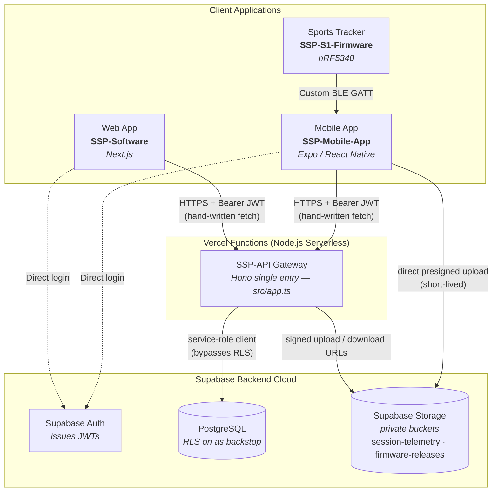
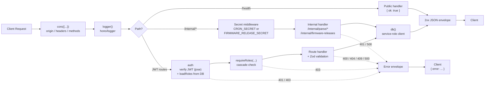

# Backend Architecture

The **SSP-API** is the application-data gateway for the **SSP Sports Tracker** ecosystem. It is a **[Hono](https://hono.dev)** service configured for **Vercel Functions**, written in TypeScript and built with **Zod** + **`@hono/zod-validator`** for validation and **`jose`** for JWT verification. Current clients use local, hand-written `fetch` wrappers; authentication goes directly to Supabase Auth, and the web app has additional server-owned onboarding/access-request paths. Hardware talks to the mobile app over a custom BLE GATT service, never to the gateway.



The gateway **verifies** JWTs locally with `jose` (no per-request network hop to Supabase Auth), then loads the caller's roles from the `user_roles` table on every request. See [Auth & Security](./auth-and-security) for the verification flow and role cascade.

---

## Gateway Topology

Source: `src/app.ts`, `src/index.ts`, `README.md`.

### Single Hono entry, zero-config Vercel adapter

The API is one Hono application assembled in `src/app.ts` and exported as the Vercel Functions entry point. There is **no Dockerfile** and no custom server bootstrap; Hono's zero-configuration Vercel adapter publishes the app. The file exports exactly what the runtime and the client contract need:

```ts
export const app = routedApp;
export default app;          // Vercel entry — one default export
export type AppType = typeof app;  // typed client contract
```

- **One default export** (`export default app`) is what Vercel Functions invoke.
- **`AppType`** is a published typed contract available to `hono/client`. Neither current app imports it, so route drift does not presently surface as a client compile-time error.
- `src/index.ts` is the package surface `tsup` bundles into `dist/`. It re-exports `AppType` from `./app.js` plus the role model (`SSP_ROLES`, `ROLE_HIERARCHY`, helpers, `SspRole`) from `./schemas/roles.js`.

### The route-registration chain must stay intact

`routedApp` is built as a **single chained expression**: each `.use()` / `.get()` / `.route()` returns a new typed Hono instance, and the final assignment is what gets exported. `app.ts` carries an explicit caution (quoted verbatim):

> Keep the route registration chain intact: Hono accumulates its typed client schema through each returned instance. Mutating a separately-declared Hono would make the published AppType collapse to BlankSchema.

Do not refactor the chain into `const app = new Hono(); app.use(...); app.route(...)` style mutations; that breaks `AppType`, which is the whole point of the gateway's typed-client contract.

---

## Route Mount Order

The route registration chain, in the exact order it appears in `src/app.ts`:

| # | Call | Mount | Effect |
| :-: | :--- | :--- | :--- |
| 1 | `.use('*', cors({...}))` | `*` | CORS on every request (see config below) |
| 2 | `.use('*', logger())` | `*` | `hono/logger` request logging |
| 3 | `.get('/health', (c) => c.json({ ok: true }))` | `/health` | **Public** liveness check |
| 4 | `.route('/internal', internal)` | `/internal` | Secret-auth (CRON_SECRET / FIRMWARE_RELEASE_SECRET), **no JWT** |
| 5 | `.route('/', users)` | `/` | → `/me` |
| 6 | `.route('/organisations', organisations)` | `/organisations` | |
| 7 | `.route('/teams', teams)` | `/teams` | |
| 8 | `.route('/athletes', athletes)` | `/athletes` | |
| 9 | `.route('/coaches', coaches)` | `/coaches` | |
| 10 | `.route('/devices', devices)` | `/devices` | |
| 11 | `.route('/firmware-releases', firmwareReleases)` | `/firmware-releases` | JWT + `requireRoles('ssp_super_admin')` |
| 12 | `.route('/sessions', sessions)` | `/sessions` | |
| 13 | `.route('/', metrics)` | `/` (root) | → `/sessions/:id/metrics`, `/sessions/:id/summary`, `/sessions/:id/targets` |
| 14 | `.route('/', workload)` | `/` (root) | → `/athletes/:id/workload` |
| 15 | `.route('/goals', goals)` | `/goals` | |
| 16 | `.route('/benchmarks', benchmarks)` | `/benchmarks` | |
| 17 | `.route('/notifications', notifications)` | `/notifications` | |
| 18 | `.route('/', analytics)` | `/` (root) | → `/teams/:id/analytics`, `/athletes/:id/analytics` |
| 19 | `.route('/', ingest)` | `/` (root) | → `/sessions/:id/ingest-url\|complete\|sync\|telemetry` |

`routedApp.onError(onError)` is registered after the chain. Then `app`, `default`, and `AppType` are exported.

### Why `/health` and `/internal` are mounted before the JWT routers

Ordering is deliberate. Every JWT-protected route file applies its own `auth` middleware to `'*'` (wildcard). If `/health` or `/internal` were mounted *after* a root-mounted protected router, a wildcard `auth` middleware could intercept them and demand a valid Supabase JWT, defeating the purpose of a public liveness probe and breaking secret-based cron auth.

Mounting them **before** the protected routers guarantees:

- `/health` is a standalone handler registered directly on `routedApp`; no `auth` middleware runs for it. Returns `{ ok: true }` with no auth header required.
- `/internal` defines its **own** middleware that checks `CRON_SECRET` or `FIRMWARE_RELEASE_SECRET` (via the `x-cron-secret` header or `Authorization: Bearer <secret>`). It never imports or applies `auth`. Mounting it before the JWT routers means the wildcard JWT middleware downstream can never claim `/internal/*`.

### Root-mounted routers overlap the `/sessions` prefix

`metrics` and `ingest` are mounted at `/` and define handlers under `/sessions/:id/...`, while the `sessions` router is mounted at `/sessions`. There is no collision because the sub-paths differ, but it means e.g. `/sessions/:id/metrics` lives in `routes/metrics.ts`, not `routes/sessions.ts`. See the [API Reference](./api-reference) for the source owner of each path.

---

## CORS Configuration

CORS is applied as the first `'*'` middleware, before `logger()`. The config from `app.ts`:

| Option | Value |
| :--- | :--- |
| `origin` | **Function** (see below) |
| `allowHeaders` | `['Authorization', 'Content-Type']` |
| `allowMethods` | `['GET', 'POST', 'PATCH', 'DELETE', 'OPTIONS']` |
| `exposeHeaders` | `['Content-Length']` |
| `maxAge` | `600` |

The `origin` function:

1. If no `Origin` header → return `null`.
2. If the origin is in `allowedOrigins()` → return the origin.
3. Else, if `NODE_ENV !== 'production'` **and** the origin matches `/^https?:\/\/(localhost|127\.0\.0\.1)(:\d+)?$/` → return the origin (dev localhost allowance).
4. Otherwise → return `null`.

`allowedOrigins()` is a module-level helper that reads `process.env.CORS_ORIGINS ?? ''`, splits on `,`, trims, and filters empties:

```ts
function allowedOrigins(): string[] {
  return (process.env.CORS_ORIGINS ?? '')
    .split(',')
    .map((origin) => origin.trim())
    .filter(Boolean);
}
```

**No caching.** `allowedOrigins()` re-parses `process.env.CORS_ORIGINS` on every request, and the dev-localhost allowance is re-evaluated against `NODE_ENV` on every request. There is no static allowlist built at startup.

---

## Middleware Pipeline

The effective per-request pipeline, in order:



1. **`cors({...})`**: applied to `'*'`, first in the chain (config above).
2. **`logger()`**: from `hono/logger`, applied to `'*'`.
3. **`/health`**: public handler, registered before any auth-protected router.
4. **`/internal`**: its own secret-based middleware (no JWT), registered before the JWT routers.
5. **JWT-protected routers**: each route file applies `auth` to `'*'`. `auth` verifies the Supabase JWT (HS256 via `SUPABASE_JWT_SECRET`, or ES256/RS256 via JWKS fetched from `${SUPABASE_URL}/auth/v1/.well-known/jwks.json`), reads `sub` + `email`, then **loads roles from the `user_roles` table** (joined to `roles(name)`, `revoked_at IS NULL`), never from `app_metadata.roles`. On any DB query failure it fails closed to `roles: []`, so role-gated routes return 403.
6. **`requireRoles(...)`**: where applied, reads the `AuthUser` from context and checks `hasAnyRole` with the cascade (`ssp_super_admin > organisation_admin > coach > sub_coach > athlete`; `isAthlete` does **not** cascade). 401 if not authenticated, 403 if forbidden.
7. **Handler**: runs Zod validation where present. Bodies use `zValidator` or manual `safeParse`; telemetry queries use `safeParse`; `GET /sessions` uses throwing `.parse`; several other query strings are unvalidated.
8. **`db()`**: the cached service-role Supabase client (see Lib layer).
9. **`routedApp.onError(onError)`**: catches anything unhandled: `console.error('Unhandled error:', err)`, then `c.json({ error: message }, 500)` where `message` is `err.message` or `'Internal server error'`.

### Error envelopes

| Case | Status | Body |
| :--- | :---: | :--- |
| Unhandled error (`onError`) | 500 | `{ error: "<message>" }` |
| `zValidator('json', …)` failure | 400 | structured body (from `@hono/zod-validator`) |
| Manual `safeParse` body failure | 400 | `{ error: 'Invalid body', issues: [...] }` |
| Manual `safeParse` query failure | 400 | `{ error: 'Invalid query', issues: [...] }` |
| `GET /sessions` `sessionListQuery.parse` failure | 500 | Zod error reaches `onError`; no query-safeParse wrapper |
| Missing/malformed `Authorization` | 401 | `{ error: 'Missing or malformed Authorization header' }` |
| Invalid/expired token | 401 | `{ error: 'Invalid or expired token' }` |
| `requireRoles` not authenticated | 401 | `{ error: 'Not authenticated' }` |
| `requireRoles` forbidden | 403 | `{ error: 'Forbidden' }` |

`onError` handles thrown failures only. Many Supabase calls return `{ data, error }`; handlers that ignore `error` can return empty/404/partial success instead of 500. See [Auth & Security](./auth-and-security) for the full boundary.

---

## Lib Layer

Source: `src/lib/*.ts`. The lib layer holds the shared database client and all access-control / domain helpers used by route handlers.

| File | Responsibility |
| :--- | :--- |
| `lib/supabase.ts` | **Cached service-role client.** `db()` returns a memoized `SupabaseClient<Database>` built with `SUPABASE_URL` + `SUPABASE_SERVICE_ROLE_KEY` and `auth: { persistSession: false, autoRefreshToken: false }`. Throws `'SUPABASE_URL and SUPABASE_SERVICE_ROLE_KEY must be set'` if either env var is missing. Service-role bypasses RLS; gateway authz is authoritative. The `Database` generic (from `database.types.ts`) gives concrete row types that flow into `AppType`. |
| `lib/context.ts` | **Caller context.** `loadCallerContext(user)` returns `{ user, primaryOrganisationId, teamIds }`. `primaryOrganisationId` comes from `users.primary_organisation_id`; `teamIds` comes from `loadTeamIds` which combines athlete + coach `team_memberships` (incl. `sub_coach_id`), dedupes, ignores null `team_id`. |
| `lib/session-access.ts` | Session authorization: exports `loadSessionAccess` (returns the `AccessibleSession` or 403/404). The `ensureSessionAccess` / `filterVisibleSessions` helpers are route-local, defined in `routes/metrics.ts` and `routes/sessions.ts` respectively, not lib exports. Reads `sessions`, `athletes`, `session_participants`. |
| `lib/team-access.ts` | Team resource access: `hasTeamResourceAccess`, used by teams/devices/analytics routes. Reads `teams`. |
| `lib/telemetry.ts` | Raw telemetry decode (`decodeTelemetryBlob` for json/ndjson/msgpack + gzip), point normalization, haversine distance, per-athlete `aggregateTelemetry` (sprints at ≥7 m/s, `data_quality_status`). `DEFAULT_MAX_POINTS = 100_000`. |
| `lib/firmware.ts` | Firmware storage: `storeFirmwareRelease(body, createdByUserId)` decodes base64, computes sha256, uploads to the `FIRMWARE_BUCKET`, inserts the `firmware_releases` row, rolls back the upload on insert failure. `DEFAULT_BUCKET = 'firmware-releases'`. Does **not** compare versions. |
| `lib/database.types.ts` | **Generated** via `supabase gen types typescript` and **committed** to the repo. Regenerate after any schema migration so `c.json(data)` response types stay accurate in `AppType`. |

---

## Deployment & Environment

`SSP-API` deploys as a Vercel Functions project: Hono's zero-config adapter, no Dockerfile, no custom server. The Vercel project supplies the environment variables. The gateway is the **sole** DB client: it uses the Supabase `service_role` key, which bypasses Row-Level Security. **RLS stays enabled in Postgres as a defense-in-depth backstop**, but the gateway's `auth` + `requireRoles` + per-handler access checks are the authoritative access-control layer.

### Environment variables

| Var | Used in | Purpose | Default / notes |
| :--- | :--- | :--- | :--- |
| `SUPABASE_URL` | `lib/supabase.ts`, `middleware/auth.ts` | Supabase project URL; base for JWKS (`${URL}/auth/v1/.well-known/jwks.json`) and JWT issuer (`${URL}/auth/v1`). | none (throws if absent) |
| `SUPABASE_SERVICE_ROLE_KEY` | `lib/supabase.ts` | Service-role key for this gateway; bypasses RLS. | none (throws if absent) |
| `SUPABASE_JWT_SECRET` | `middleware/auth.ts` | HS256 verification secret. | none (only required when HS256 tokens arrive; ES256/RS256 tokens use JWKS) |
| `CRON_SECRET` | `routes/internal.ts` | Shared secret for `/internal/parse/:sessionId` and `/internal/parse/pending`. Checked against `x-cron-secret` header or `Authorization: Bearer <secret>`. | none (if unset, internal parse routes always 401) |
| `FIRMWARE_RELEASE_SECRET` | `routes/internal.ts` | Shared secret for `POST /internal/firmware-releases` (selected when `c.req.path.endsWith('/firmware-releases')`). | none (if unset, publish route always 401) |
| `FIRMWARE_BUCKET` | `lib/firmware.ts` | Private Storage bucket for firmware artifacts. | `'firmware-releases'` |
| `TELEMETRY_BUCKET` | `routes/ingest.ts`, `routes/internal.ts` | Private Storage bucket for raw session telemetry. | `'session-telemetry'` |
| `TELEMETRY_MAX_POINTS` | `lib/telemetry.ts` | Max points accepted in one decoded telemetry envelope; enforced at decode time, not at upload-URL time. | `100000` (env used only if `Number.isSafeInteger(value) && value > 0`) |
| `CORS_ORIGINS` | `src/app.ts` | Comma-separated allowed browser origins; re-parsed every request. | empty string (only localhost dev origins allowed in non-production) |
| `NODE_ENV` | `src/app.ts` | When `!== 'production'`, allows `http(s)://(localhost\|127.0.0.1)[:port]` CORS origins. | none |

### RLS and the gateway authz model

The gateway is the only service that talks to Postgres, and it does so with the service-role key, so RLS is bypassed on every query. RLS policies remain enabled in the database purely as a backstop for any accidental direct DB access; they are **not** the primary access-control layer. The authoritative gate is in-process:

1. `auth` verifies the JWT and loads roles from `user_roles` (fail-closed to `[]` on DB error → 403 on role-gated routes).
2. `requireRoles` applies the cascade.
3. Per-handler checks (`hasOrgAccess`, `hasTeamResourceAccess`, `loadSessionAccess`, `ensureAthleteAccess`, etc.) provide most tenant/session/object scoping. Several handlers omit a required scope check; see [Known source-level authorization gaps](./auth-and-security#known-source-level-authorization-gaps).

---

## Technology Stack

| Layer | Technology | Key Purpose |
| :--- | :--- | :--- |
| Framework | [Hono](https://hono.dev) | Routing, middleware, typed RPC client (`hono/client`). |
| Validation | [Zod](https://zod.dev) + `@hono/zod-validator` | Request body schema enforcement (bodies only; query strings parsed manually). |
| Auth & Crypto | [jose](https://github.com/panva/jose) | Local JWT verification: HS256 (secret) or ES256/RS256 (remote JWKS). |
| Database client | `@supabase/supabase-js` | Service-role Supabase client (cached singleton). |
| Runtime | Vercel Functions (Node.js) | Zero-config Hono adapter; one default export, no Dockerfile. |
| Build | `tsup` | Bundles `src/index.ts` → `dist/` as the published client contract (`AppType` + role model). |
| Testing | `vitest` | Unit + HTTP handler tests against an in-memory query double; no live Supabase needed. |

---

## Directory Structure

```
SSP-API/
├── src/
│   ├── app.ts             Hono app: CORS, logger, /health, /internal, route mount chain, onError, AppType export
│   ├── index.ts           Contract entry — re-exports AppType + role model (tsup bundles to dist/)
│   ├── lib/
│   │   ├── supabase.ts        Cached service-role Supabase client (persistSession:false, autoRefreshToken:false)
│   │   ├── context.ts         CallerContext: primary_organisation_id + teamIds
│   │   ├── session-access.ts  Session authorization / visibility helpers
│   │   ├── team-access.ts     Team resource access helpers
│   │   ├── telemetry.ts       Telemetry decode, normalization, aggregation
│   │   ├── firmware.ts        Firmware artifact storage + sha256
│   │   └── database.types.ts  Generated Supabase types (committed)
│   ├── middleware/
│   │   ├── auth.ts            JWT verification (jose) + live role loading from user_roles
│   │   ├── requireRoles.ts    Cascading role gate (401 unauth / 403 forbidden)
│   │   └── error.ts           onError — { error } envelope, 500
│   ├── routes/                One file per resource (users, organisations, teams, athletes, coaches,
│   │                          devices, firmware-releases, sessions, metrics, workload, goals,
│   │                          benchmarks, notifications, analytics, ingest, internal)
│   └── schemas/               Zod schemas + canonical gateway SspRole model (exported for optional client reuse)
├── test/                  vitest suites + mock DB
├── supabase/              Database migrations
├── tsup.config.ts         Client contract build config
└── vercel.json            Vercel routing config
```

## Cross-References

- [Auth & Security](./auth-and-security): JWT verification, role cascade, error envelopes.
- [Client Contract](./client-contract): published `AppType` and the current non-adoption status in both clients.
- [Database Schema](./database-schema): tables, row types, migrations.
- [API Reference](./api-reference): per-resource route reference.
- [Ingestion Pipeline](./ingestion-pipeline): telemetry upload, retry-safe upserts, and parser concurrency boundary.
- [Firmware OTA](./firmware-ota): release publishing and device update flow.
