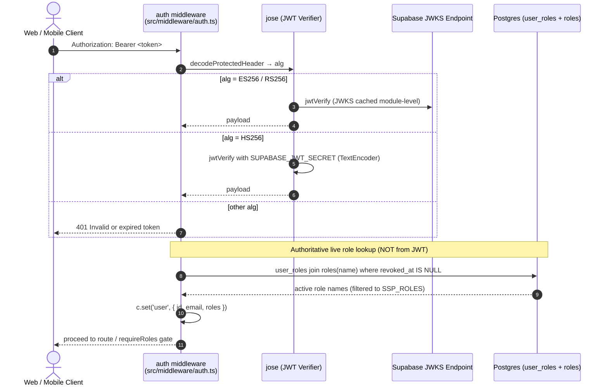
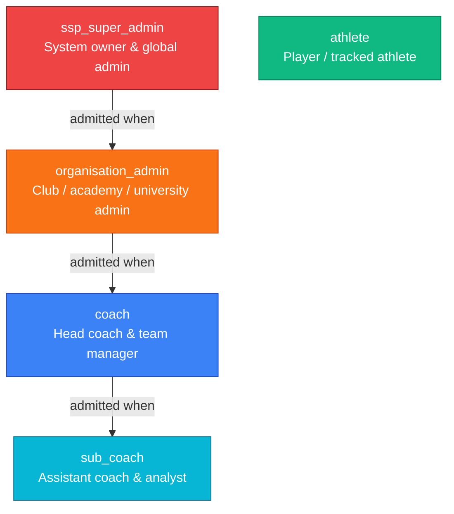

# Authentication & Security

SSP-API is the single API gateway for the SSP ecosystem: the `SSP-Software`
(Next.js) web app and `SSP-Mobile-App` (Expo) mobile app may only reach Postgres
through it. Security is built on two pillars: **cryptographic JWT verification**
with `jose` (no per-request network hop for HS256), and **authoritative
role and tenant enforcement** loaded live from the database on every request.

---

## Authentication Architecture

Clients authenticate directly against **Supabase Auth** and receive a signed
JWT access token, which they send in the standard header:

```http
Authorization: Bearer <supabase_jwt_token>
```

The gateway verifies the token, extracts `sub` and `email`, loads roles from
the `user_roles` table, attaches an `AuthUser` to the Hono context, and forwards
to the route handler.



### JWT verification (`src/middleware/auth.ts`)

1. **Bearer parsing.** Reads the `Authorization` header. If missing or not
   starting with `Bearer ` → `401 { error: 'Missing or malformed Authorization
   header' }`. The token is the substring after `Bearer `, trimmed.
2. **Algorithm dispatch.** `decodeProtectedHeader(token)` reads `alg`, then:
   - **`HS256`** — verified locally with `jwtVerify(token, getSecret(), {
     algorithms: ['HS256'], issuer, audience: 'authenticated' })`.
     `getSecret()` = `new TextEncoder().encode(process.env.SUPABASE_JWT_SECRET)`
     and throws `'SUPABASE_JWT_SECRET is not set'` if the env var is unset.
   - **`ES256` / `RS256`** — verified against the remote JWKS at
     `${SUPABASE_URL}/auth/v1/.well-known/jwks.json` via `createRemoteJWKSet`.
     The JWKS instance is cached **module-level** (keyed by URL) so subsequent
     requests do not re-fetch the well-known document. `getSupabaseUrl()`
     strips trailing slashes from `process.env.SUPABASE_URL` and throws
     `'SUPABASE_URL is not set'` if absent.
   - **Any other `alg`** → throws `'Unsupported JWT algorithm'`.
   - **Issuer** = `${SUPABASE_URL}/auth/v1`; **audience** = `'authenticated'`.
3. **Failure handling.** Any verify failure (catch) →
   `401 { error: 'Invalid or expired token' }`.
4. **Subject.** `id = payload.sub`; if missing →
   `401 { error: 'Token missing subject' }`.
5. **Email.** `email = (payload.email as string | undefined) ?? null`.
6. **AuthUser.** `const user: AuthUser = { id, email, roles }; c.set('user', user)`
   then `await next()`. The exported `AuthUser` interface is
   `{ id: string; email: string | null; roles: SspRole[] }`.

```ts
export interface AuthUser {
  id: string;
  email: string | null;
  roles: SspRole[];
}
```

---

## Roles: loaded from the database on every request

Roles are **not** read from the JWT `app_metadata.roles` claim. On every
authenticated request, `loadRoles(id)` queries:

```ts
db().from('user_roles')
  .select('role_id, roles(name)')
  .eq('user_id', id)
  .is('revoked_at', null);
```

then filters the returned `roles.name` values to those in `KNOWN_ROLES`
(`= SSP_ROLES`, the five canonical SSP roles). The result is the user's
`SspRole[]`.

**Consequences:**

- **Freshly approved roles take effect immediately** — no JWT re-issuance is
  required. When the web app's access-request approval flow inserts a
  `user_roles` row, the very next API call sees the new role. This mirrors the
  web app's `getCurrentUser()`.
- **Revocation takes effect immediately** — setting `revoked_at` removes the
  role on the next request.
- **Fail-closed.** On any query error or null data, `loadRoles` returns `[]`.
  Because `requireRoles` denies when the caller lacks the required role, a DB
  outage **silently denies** role-gated routes (403) rather than failing open.
  Non-role-gated routes still proceed for an authenticated user.

```ts
async function loadRoles(userId: string): Promise<SspRole[]> {
  const { data, error } = await db()
    .from('user_roles')
    .select('role_id, roles(name)')
    .eq('user_id', userId)
    .is('revoked_at', null);

  if (error || !data) return []; // fail-closed

  const roles: SspRole[] = [];
  for (const row of data) {
    const name = (row.roles as { name?: string } | null)?.name;
    if (name && KNOWN_ROLES.has(name)) {
      roles.push(name as SspRole);
    }
  }
  return roles;
}
```

---

## Role Model & Cascade Hierarchy

Five canonical roles are defined in `src/schemas/roles.ts` (the single source
of truth, mirrored from `SSP-Software/src/lib/auth/roles.ts`):

```ts
export const SSP_ROLES = [
  'ssp_super_admin',
  'organisation_admin',
  'coach',
  'sub_coach',
  'athlete',
] as const;
export type SspRole = (typeof SSP_ROLES)[number];
```



> The arrows read as: a higher role is *admitted* when a lower role is
> *required*. There is **no** arrow into `athlete` — `isAthlete` does not
> cascade (see below).

### `ROLE_HIERARCHY` (lower number = higher privilege)

```ts
export const ROLE_HIERARCHY: Record<SspRole, number> = {
  ssp_super_admin: 1,
  organisation_admin: 2,
  coach: 3,
  sub_coach: 4,
  athlete: 5,
};
```

| Role | Level | Description |
| :--- | :---: | :--- |
| `ssp_super_admin` | 1 | Unrestricted global cross-tenant access. Can publish firmware releases, list all organisations, and manage any resource. |
| `organisation_admin` | 2 | Full administrative control over their organisation. Can create teams, register coaches/devices, and manage roster memberships. |
| `coach` | 3 | Head coach. Can create sessions, set targets, enroll participants, and view team analytics. |
| `sub_coach` | 4 | Assistant coach. Lower privilege than `coach`. |
| `athlete` | 5 | Player. Can pair devices, start/pause/stop their own sessions, and view their own metrics and goals. |

### Cascade semantics (the critical rule)

The cascade flows **downward from higher privilege**: requiring a lower-privilege
role admits any higher-privilege role. `ssp_super_admin > organisation_admin >
coach > sub_coach > athlete`.

- `requireRoles('coach')` admits `coach`, `organisation_admin`, and
  `ssp_super_admin` — but **NOT** `sub_coach` (sub_coach is lower privilege and
  does not cascade up).
- `requireRoles('sub_coach')` admits everyone except `athlete`.
- `requireRoles('organisation_admin')` admits `organisation_admin` and
  `ssp_super_admin`.
- `requireRoles('ssp_super_admin')` admits only `ssp_super_admin`.
- **`requireRoles('athlete')` admits only literal `athlete` holders.**
  `isAthlete` does **not** cascade — a `coach` is not an athlete by this
  function. Routes that need to admit both athletes and coaches list both
  explicitly (e.g. session start/pause/stop, device pair).

### `requireRoles` (`src/middleware/requireRoles.ts`)

```ts
export function requireRoles(...required: readonly SspRole[]): MiddlewareHandler {
  return async (c, next) => {
    const user = c.get('user') as AuthUser | undefined;
    if (!user) return c.json({ error: 'Not authenticated' }, 401);
    if (!hasAnyRole(user.roles, required)) return c.json({ error: 'Forbidden' }, 403);
    await next();
  };
}
```

- No `user` on context → `401 { error: 'Not authenticated' }`.
- `!hasAnyRole(user.roles, required)` → `403 { error: 'Forbidden' }`.
- Otherwise proceeds.

```ts
import { requireRoles } from '../middleware/requireRoles.js';

// Admits coach + organisation_admin + ssp_super_admin (cascade), NOT sub_coach.
sessions.post('/', requireRoles('coach'), async (c) => { /* ... */ });

// Admits athletes AND coaches (both listed because isAthlete does not cascade).
sessions.post('/:id/start', requireRoles('coach', 'athlete'), async (c) => { /* ... */ });
```

### Roles helpers (verbatim from `src/schemas/roles.ts`)

All helpers are exported and re-exported from `src/index.ts` (the published
client contract). `roles` is always the caller's `SspRole[]` loaded by `auth`.

| Helper | Returns | Notes |
| :--- | :--- | :--- |
| `isSspSuperAdmin(roles)` | `roles.includes('ssp_super_admin')` | |
| `isOrganisationAdmin(roles)` | `roles.includes('organisation_admin') \|\| isSspSuperAdmin(roles)` | Super admins count as org admins. |
| `isCoach(roles)` | `roles.includes('coach') \|\| isOrganisationAdmin(roles)` | Org admins + super admins count as coaches. |
| `isSubCoach(roles)` | `roles.includes('sub_coach') \|\| isCoach(roles)` | Coaches + org admins + super admins count as sub_coaches. |
| `isAthlete(roles)` | `roles.includes('athlete')` | **Does NOT cascade.** A coach is not an athlete here. |
| `hasOrgAccess(roles, userOrganisationId, targetOrganisationId)` | `false` if `!userOrganisationId`; `true` if `isSspSuperAdmin`; else `userOrganisationId === targetOrganisationId` | Organisation boundary check. |
| `hasTeamAccess(roles, userTeamIds, targetTeamId)` | `true` if `isOrganisationAdmin(roles)` (super admins + org admins); else `userTeamIds.includes(targetTeamId)` | Team boundary check. |
| `getPrimaryRole(roles)` | `null` if empty, else the role with the **lowest** `ROLE_HIERARCHY` number (highest privilege) | |
| `hasAnyRole(roles, required)` | `required.some(r => …)` using the cascade helpers: `'ssp_super_admin'→isSspSuperAdmin`, `'organisation_admin'→isOrganisationAdmin`, `'coach'→isCoach`, `'sub_coach'→isSubCoach`, `'athlete'→isAthlete` | This is the function `requireRoles` uses. |

> `isSubCoach` is exported (and re-exported to clients) but is **not used by
> any route's `requireRoles`**. It exists for client-side and symmetry use.

---

## Multi-Tenant Isolation

Data is isolated by **Organisation** and **Team**. The gateway is the
authoritative enforcer (RLS remains on in Postgres as a defense-in-depth
backstop, but the service-role key bypasses it; gateway authz is what matters).

### Caller context (`src/lib/context.ts`)

`loadCallerContext(user)` resolves the caller's tenant boundaries:

```ts
export interface CallerContext {
  user: AuthUser;
  primaryOrganisationId: string | null; // users.primary_organisation_id
  teamIds: string[]; // active team_memberships (athlete + coach, left_at IS NULL, deduped)
}
```

### Organisation boundaries (`hasOrgAccess`)

- `ssp_super_admin` — access any organisation.
- All other roles — only resources where
  `resource.organisation_id === caller.primaryOrganisationId`.
- `null` `primaryOrganisationId` → access denied (`hasOrgAccess` returns false).

### Team boundaries (`hasTeamAccess`)

- `organisation_admin` and `ssp_super_admin` — any team in their organisation.
- `coach`, `sub_coach`, `athlete` — only teams where they have an active
  `team_memberships` row (`left_at IS NULL`).

### Session boundaries (`src/lib/session-access.ts`)

- `loadSessionAccess` / `ensureSessionAccess` gate session reads and writes.
- `GET /sessions` is filtered to sessions on the caller's teams or that they
  created (super admins see all; org admins see org matches).
- `GET /sessions/:id` validates team/org membership before returning details.

---

## Two Auth Modes

SSP-API has two authentication modes, plus a public health check.

### 1. JWT (Supabase token) — default

Every route router except `internal.ts` applies the `auth` middleware to `'*'`.
The `firmware-releases` router additionally applies `requireRoles('ssp_super_admin')`.

### 2. Shared-secret — `/internal/*` only

`/internal` (`src/routes/internal.ts`) does **not** use `auth` at all. It
defines its own middleware that selects a secret per request:

- If `c.req.path.endsWith('/firmware-releases')` → `FIRMWARE_RELEASE_SECRET`
  (used by `POST /internal/firmware-releases`).
- Otherwise → `CRON_SECRET` (used by `POST /internal/parse/:sessionId` and
  `GET /internal/parse/pending`).

A request is authorized if and only if:

```ts
const authorized =
  !!secret &&
  (c.req.header('x-cron-secret') === secret ||
   c.req.header('authorization') === `Bearer ${secret}`);
if (!authorized) return c.json({ error: 'Unauthorized' }, 401);
```

**Consequences:**

- If the relevant secret env var is **unset**, `!!secret` is false and the
  route **always returns 401** — there is no fallback. A misconfigured deploy
  silently locks out the internal worker/CI.
- The secret is compared as a literal string against the `x-cron-secret`
  header or the `Authorization: Bearer <secret>` header.

### 3. Public — `/health`

`/health` is a standalone handler registered on `routedApp` **before** any
auth-protected router:

```ts
.get('/health', (c) => c.json({ ok: true }))
```

It returns `{ ok: true }` with no authentication. The mount order in `app.ts`
is deliberate: `/health` and `/internal` are mounted before the root-mounted
JWT-protected routers so wildcard auth middleware can never intercept them.

---

## Error Envelope

### Unhandled errors (`src/middleware/error.ts`)

```ts
export const onError: ErrorHandler = (err, c) => {
  console.error('Unhandled error:', err);
  const message = err instanceof Error ? err.message : 'Internal server error';
  return c.json({ error: message }, 500);
};
```

- Logs `console.error('Unhandled error:', err)`.
- Returns `{ error: message }` with HTTP **500**.
- `message = err.message` if `err instanceof Error`, else `'Internal server
  error'`.
- PostgREST/Supabase errors are collapsed to 500 unless a handler explicitly
  returns a different status.

### Validation errors (two shapes)

- **`zValidator('json', schema)`** (request bodies only) — failures return
  **400** with the `@hono/zod-validator` structured body automatically. Handlers
  that use `zValidator` rely on this.
- **Manual `safeParse`** (used for query strings and for a few bodies such as
  `PATCH /me`, `POST /sessions/:id/ingest-url`, `POST /sessions/:id/complete`,
  `PATCH /athletes/:id`) returns a custom shape:
  - Body: `400 { error: 'Invalid body', issues: [...] }`
  - Query: `400 { error: 'Invalid query', issues: [...] }`
- `zValidator('query', …)` is **never used**. All query parsing is manual
  (`c.req.query(...)` + `safeParse`/`parse`). No `'param'` or `'header'`
  validators are used anywhere.

### Auth/authorization error shapes

```json
// 401 — missing or malformed Authorization header
{ "error": "Missing or malformed Authorization header" }

// 401 — verify failure / expired
{ "error": "Invalid or expired token" }

// 401 — valid token but no sub
{ "error": "Token missing subject" }

// 401 — requireRoles with no user on context
{ "error": "Not authenticated" }

// 401 — internal shared-secret mismatch / unset secret
{ "error": "Unauthorized" }

// 403 — insufficient role (or fail-closed empty roles after DB error)
{ "error": "Forbidden" }

// 500 — unhandled
{ "error": "<message>" }
```

---

## Auth-relevant Environment Variables

| Var | Used in | Purpose | Default / behavior if unset |
| :--- | :--- | :--- | :--- |
| `SUPABASE_URL` | `lib/supabase.ts`, `middleware/auth.ts` | Supabase project URL; base for JWT issuer (`${URL}/auth/v1`) and JWKS (`${URL}/auth/v1/.well-known/jwks.json`). Trailing slashes stripped. | **Throws `'SUPABASE_URL is not set'`** if absent. |
| `SUPABASE_JWT_SECRET` | `middleware/auth.ts` | HS256 verification secret (encoded via `TextEncoder`). | Required **only for HS256 tokens**. If an HS256 token arrives and this is unset → throws → `401 'Invalid or expired token'`. Optional for ES256/RS256 projects (asymmetric tokens use JWKS). |
| `SUPABASE_SERVICE_ROLE_KEY` | `lib/supabase.ts` | Service-role key; the gateway is the sole DB client and bypasses RLS. | **Throws if absent.** |
| `CRON_SECRET` | `routes/internal.ts` | Shared secret for `/internal/parse/:sessionId` and `/internal/parse/pending`. Checked against `x-cron-secret` header or `Authorization: Bearer <secret>`. | If unset, those routes **always return 401**. |
| `FIRMWARE_RELEASE_SECRET` | `routes/internal.ts` | Shared secret for `POST /internal/firmware-releases` (selected when `c.req.path.endsWith('/firmware-releases')`). | If unset, that route **always returns 401**. |
| `CORS_ORIGINS` | `src/app.ts` | Comma-separated allowed browser origins. Parsed per request (split on `,`, trim, filter Boolean). | Empty string. In non-production, `http(s)://(localhost|127.0.0.1)[:port]` origins are also allowed. |
| `NODE_ENV` | `src/app.ts` | When `!== 'production'`, allows localhost dev CORS origins. | Dev localhost allowance disabled when unset/production. |

### CORS configuration

```ts
cors({
  origin: (origin) => {
    if (!origin) return null;
    if (allowedOrigins().includes(origin)) return origin;
    if (process.env.NODE_ENV !== 'production' &&
        /^https?:\/\/(localhost|127\.0\.0\.1)(:\d+)?$/.test(origin)) return origin;
    return null;
  },
  allowHeaders: ['Authorization', 'Content-Type'],
  allowMethods: ['GET', 'POST', 'PATCH', 'DELETE', 'OPTIONS'],
  exposeHeaders: ['Content-Length'],
  maxAge: 600,
})
```

`allowedOrigins()` re-reads `process.env.CORS_ORIGINS ?? ''` on every request
(no static caching).

---

## Bypass Paths

Three paths bypass the gateway entirely:

1. **Supabase Auth** — clients authenticate directly with Supabase Auth; the
   gateway only *verifies* the resulting JWT.
2. **Supabase Realtime** — not wired through the gateway.
3. **The web app's access-request/onboarding flow** — the tables
   `user_access_requests`, `organisation_requests`, and `account_request_events`
   are owned by the web app as Next.js server actions and do not go through the
   API gateway.

Everything else goes through the gateway.

---

## Compliance Notes

The README describes the gateway's security posture in general terms —
**data residency** and **role separation** are mentioned, and RLS is kept on
in Postgres as a defense-in-depth backstop while the service-role gateway
enforces authoritative authz. The README does **not** claim POPIA, GDPR, or any
specific regulatory certification. Do not infer regulatory compliance that the
source does not state.