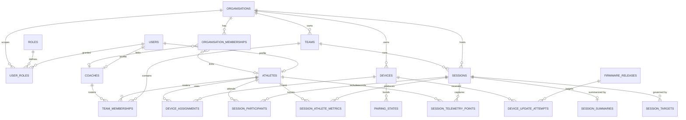

# Database Schema

The SSP-API persists all state in **Supabase PostgreSQL**. The gateway never
uses the anon/scoped client: `lib/supabase.ts` builds a cached
`SupabaseClient<Database>` with the service-role key (`SUPABASE_SERVICE_ROLE_KEY`),
`auth: { persistSession: false, autoRefreshToken: false }`, so it bypasses RLS
entirely and the gateway's role/tenant checks are authoritative. The
`Database` generic comes from `src/lib/database.types.ts`, which is generated
from the live schema and committed (see [Regenerating types](#regenerating-types)
below).

This page documents every public table declared in the generated types,
grouped by domain, followed by the three migrations in
`supabase/migrations/` and the read/write footprint of each route file. Column
types are quoted from the generated TypeScript row types (`string` = `text`/
`uuid`/`timestamptz`, `number` = `integer`/`bigint`/`numeric`/`double`, `Json` =
`jsonb`). The two firmware-OTA tables and the `devices` additions are
cross-checked against the migration SQL, so their Postgres types and CHECK
constraints are stated verbatim there.

::: tip Inference flag
"PK (inferred)" and "FK → `<table>`(id) (inferred)" mean the generated types
do not expose constraints; the designation follows from the column name and
row shape. Only the constraints explicitly written in the three migrations are
stated as fact. Do not treat inferred FKs as guaranteed DB-level foreign keys.
:::

---

## Entity Relationship Overview



---

## 1. Identity & Access

### `users`

Application profile mirror of `auth.users`. Read by `users.ts`, `context.ts`,
and `session-access.ts`.

| Column | Type | Nullable | Notes |
| :--- | :--- | :--- | :--- |
| `id` | `string` | NO | PK (inferred); matches `auth.users.id`. |
| `email` | `string` | NO | |
| `full_name` | `string` | YES | |
| `phone` | `string` | YES | |
| `avatar_url` | `string` | YES | |
| `primary_organisation_id` | `string` | YES | FK → `organisations(id)` (inferred); tenant scope loaded in `context.ts`. |
| `is_active` | `boolean` | YES | |
| `created_at` | `string` | YES | |
| `updated_at` | `string` | YES | |

### `roles`

Canonical role catalog. The five names are hardcoded in
`src/schemas/roles.ts` (`SSP_ROLES`); `auth.ts` filters `user_roles` to these
names via `KNOWN_ROLES`.

| Column | Type | Nullable | Notes |
| :--- | :--- | :--- | :--- |
| `id` | `string` | NO | PK (inferred). |
| `name` | `string` | NO | One of `ssp_super_admin`, `organisation_admin`, `coach`, `sub_coach`, `athlete`. |
| `description` | `string` | YES | |
| `hierarchy_level` | `number` | NO | Lower number = higher privilege (mirrors `ROLE_HIERARCHY`). |

### `user_roles`

Active grants. `auth.ts` joins this to `roles(name)` with
`revoked_at IS NULL` on **every** request; any query failure fails closed to
`[]` (→ 403 on role-gated routes). Roles are never read from the JWT.

| Column | Type | Nullable | Notes |
| :--- | :--- | :--- | :--- |
| `id` | `string` | NO | PK (inferred). |
| `user_id` | `string` | NO | FK → `users(id)` (inferred). |
| `role_id` | `string` | NO | FK → `roles(id)` (inferred). |
| `organisation_id` | `string` | NO | FK → `organisations(id)` (inferred); tenant scope of the grant. |
| `team_id` | `string` | YES | FK → `teams(id)` (inferred). |
| `sport_id` | `string` | YES | FK → `sports(id)` (inferred). |
| `granted_at` | `string` | YES | |
| `granted_by_user_id` | `string` | YES | FK → `users(id)` (inferred). |
| `revoked_at` | `string` | YES | `NULL` = active; `auth.ts` filters `revoked_at IS NULL`. |
| `created_at` | `string` | YES | |
| `updated_at` | `string` | YES | |

### `permissions`

Present in the generated types but **not referenced by any route or lib**.

| Column | Type | Nullable | Notes |
| :--- | :--- | :--- | :--- |
| `id` | `string` | NO | PK (inferred). |
| `role_id` | `string` | NO | FK → `roles(id)` (inferred). |
| `resource` | `string` | NO | |
| `action` | `string` | NO | |
| `organisation_id` | `string` | YES | FK → `organisations(id)` (inferred). |
| `created_at` | `string` | YES | |
| `updated_at` | `string` | YES | |

### `organisations`

Multi-tenant boundary. Listed cross-tenant only by `ssp_super_admin`.

| Column | Type | Nullable | Notes |
| :--- | :--- | :--- | :--- |
| `id` | `string` | NO | PK (inferred). |
| `name` | `string` | NO | |
| `slug` | `string` | YES | |
| `logo_url` | `string` | YES | |
| `timezone` | `string` | YES | |
| `created_at` | `string` | YES | |
| `updated_at` | `string` | YES | |

### `organisation_memberships`

Links users/athletes/coaches to an organisation. Read by `athletes.ts` and
`coaches.ts` listing filters (`left_at IS NULL`).

| Column | Type | Nullable | Notes |
| :--- | :--- | :--- | :--- |
| `id` | `string` | NO | PK (inferred). |
| `organisation_id` | `string` | NO | FK → `organisations(id)` (inferred). |
| `user_id` | `string` | YES | FK → `users(id)` (inferred). |
| `athlete_id` | `string` | YES | FK → `athletes(id)` (inferred). |
| `coach_id` | `string` | YES | FK → `coaches(id)` (inferred). |
| `membership_type` | `string` | NO | |
| `is_admin` | `boolean` | YES | |
| `is_primary` | `boolean` | YES | |
| `invited_by_user_id` | `string` | YES | FK → `users(id)` (inferred). |
| `joined_at` | `string` | YES | |
| `left_at` | `string` | YES | `NULL` = active. |
| `created_at` | `string` | YES | |
| `updated_at` | `string` | YES | |

### `team_memberships`

Active roster. Written by `teams.ts` (`POST /teams/:id/members`) and read by
`athletes.ts`, `context.ts` (`loadTeamIds`), and `analytics.ts`.

| Column | Type | Nullable | Notes |
| :--- | :--- | :--- | :--- |
| `id` | `string` | NO | PK (inferred). |
| `team_id` | `string` | NO | FK → `teams(id)` (inferred). |
| `organisation_id` | `string` | NO | FK → `organisations(id)` (inferred). |
| `athlete_id` | `string` | YES | FK → `athletes(id)` (inferred). |
| `coach_id` | `string` | YES | FK → `coaches(id)` (inferred). |
| `sub_coach_id` | `string` | YES | FK → `coaches(id)` (inferred). |
| `role_in_team` | `string` | YES | |
| `sport_id` | `string` | YES | FK → `sports(id)` (inferred); copied from the team on insert. |
| `assigned_by_user_id` | `string` | YES | FK → `users(id)` (inferred). |
| `joined_at` | `string` | YES | |
| `left_at` | `string` | YES | `NULL` = active; `teams.ts` roster filters `left_at IS NULL`. |
| `created_at` | `string` | YES | |
| `updated_at` | `string` | YES | |

### `teams`

Squad within an organisation. Created by `organisation_admin` /
`ssp_super_admin`.

| Column | Type | Nullable | Notes |
| :--- | :--- | :--- | :--- |
| `id` | `string` | NO | PK (inferred). |
| `organisation_id` | `string` | NO | FK → `organisations(id)` (inferred). |
| `name` | `string` | NO | |
| `sport_id` | `string` | YES | FK → `sports(id)` (inferred). |
| `created_at` | `string` | YES | |
| `updated_at` | `string` | YES | |

---

## 2. Athletes, Coaches & Sports

### `athletes`

| Column | Type | Nullable | Notes |
| :--- | :--- | :--- | :--- |
| `id` | `string` | NO | PK (inferred). |
| `user_id` | `string` | YES | FK → `users(id)` (inferred); self-access check compares `user_id === user.id`. |
| `first_name` | `string` | YES | |
| `last_name` | `string` | YES | |
| `date_of_birth` | `string` | YES | |
| `squad_number` | `number` | YES | |
| `created_at` | `string` | YES | |
| `updated_at` | `string` | YES | |

### `coaches`

| Column | Type | Nullable | Notes |
| :--- | :--- | :--- | :--- |
| `id` | `string` | NO | PK (inferred). |
| `user_id` | `string` | YES | FK → `users(id)` (inferred). |
| `first_name` | `string` | YES | |
| `last_name` | `string` | YES | |
| `email` | `string` | YES | |
| `phone` | `string` | YES | |
| `created_at` | `string` | YES | |
| `updated_at` | `string` | YES | |

### `athlete_sport_memberships`

Read by `athletes.ts` detail (`GET /athletes/:id` selects
`athlete_sport_memberships(*)`).

| Column | Type | Nullable | Notes |
| :--- | :--- | :--- | :--- |
| `id` | `string` | NO | PK (inferred). |
| `athlete_id` | `string` | NO | FK → `athletes(id)` (inferred). |
| `sport_id` | `string` | NO | FK → `sports(id)` (inferred). |
| `organisation_id` | `string` | NO | FK → `organisations(id)` (inferred). |
| `team_id` | `string` | YES | FK → `teams(id)` (inferred). |
| `position_label` | `string` | YES | |
| `is_active` | `boolean` | YES | |
| `joined_at` | `string` | YES | |
| `left_at` | `string` | YES | |
| `created_at` | `string` | YES | |
| `updated_at` | `string` | YES | |

### `coach_sport_assignments`

Present in the generated types but **not referenced by any route or lib**.

| Column | Type | Nullable | Notes |
| :--- | :--- | :--- | :--- |
| `id` | `string` | NO | PK (inferred). |
| `coach_id` | `string` | NO | FK → `coaches(id)` (inferred). |
| `sport_id` | `string` | NO | FK → `sports(id)` (inferred). |
| `organisation_id` | `string` | NO | FK → `organisations(id)` (inferred). |
| `team_id` | `string` | YES | FK → `teams(id)` (inferred). |
| `assignment_type` | `string` | NO | |
| `is_active` | `boolean` | YES | |
| `started_at` | `string` | YES | |
| `ended_at` | `string` | YES | |
| `created_at` | `string` | YES | |
| `updated_at` | `string` | YES | |

### `sports`

Sport catalog. Referenced as a FK target by `teams`, `sessions`,
`athlete_sport_memberships`, `coach_sport_assignments`, `user_roles`,
`team_memberships`, and `benchmarks`; not read directly by any route.

| Column | Type | Nullable | Notes |
| :--- | :--- | :--- | :--- |
| `id` | `string` | NO | PK (inferred). |
| `name` | `string` | NO | |
| `slug` | `string` | NO | |
| `description` | `string` | YES | |
| `created_at` | `string` | YES | |
| `updated_at` | `string` | YES | |

### `session_classifications`

Session type catalog (e.g. training vs. match). Referenced by
`sessions.classification_id`; not read directly by any route.

| Column | Type | Nullable | Notes |
| :--- | :--- | :--- | :--- |
| `id` | `string` | NO | PK (inferred). |
| `name` | `string` | NO | |
| `slug` | `string` | NO | |
| `description` | `string` | YES | |
| `is_match` | `boolean` | YES | |
| `created_at` | `string` | YES | |
| `updated_at` | `string` | YES | |

---

## 3. Devices & Firmware

### `devices`

Wearable tracking units. `hardware_revision` is added by migration 1;
`firmware_version_code` (with CHECK) is added by migration 3.

| Column | Type | Nullable | Notes |
| :--- | :--- | :--- | :--- |
| `id` | `string` | NO | PK (inferred). |
| `organisation_id` | `string` | NO | FK → `organisations(id)` (inferred). |
| `serial_number` | `string` | NO | |
| `hardware_model` | `string` | NO | Firmware-compatibility key. |
| `hardware_revision` | `string` | YES | Added by `firmware_ota_releases.sql` (`text`). |
| `ble_device_name` | `string` | YES | |
| `capability_mask` | `string` | YES | |
| `firmware_version` | `string` | YES | Updated by `POST /devices/:id/firmware-update/status` on `confirmed`. |
| `firmware_version_code` | `number` | YES | `bigint`; migration 3 adds `CHECK (firmware_version_code IS NULL OR firmware_version_code > 0)`. Latest-release selection orders by this desc, not semver. |
| `protocol_version` | `string` | YES | |
| `status` | `string` | YES | |
| `last_battery_pct` | `number` | YES | |
| `last_gnss_state` | `string` | YES | |
| `last_app_state` | `string` | YES | |
| `last_firmware_session_id` | `string` | YES | |
| `last_seen_at` | `string` | YES | |
| `created_at` | `string` | YES | |
| `updated_at` | `string` | YES | |

### `device_assignments`

Lends a device to an athlete. Active row has `unassigned_at IS NULL`;
`DELETE /devices/:id/assign` sets `unassigned_at`.

| Column | Type | Nullable | Notes |
| :--- | :--- | :--- | :--- |
| `id` | `string` | NO | PK (inferred). |
| `device_id` | `string` | NO | FK → `devices(id)` (inferred). |
| `athlete_id` | `string` | NO | FK → `athletes(id)` (inferred). |
| `organisation_id` | `string` | NO | FK → `organisations(id)` (inferred). |
| `assigned_by_user_id` | `string` | YES | FK → `users(id)` (inferred). |
| `assigned_at` | `string` | YES | |
| `unassigned_at` | `string` | YES | `NULL` = currently assigned. |
| `created_at` | `string` | YES | |
| `updated_at` | `string` | YES | |

### `pairing_states`

BLE bonding state. `POST /devices/:id/pair` revokes prior active pairing
(`revoked_at` set where `revoked_at IS NULL`) and inserts a new row with
`bond_status: 'bonded'` and `paired_user_id: user.id`.

| Column | Type | Nullable | Notes |
| :--- | :--- | :--- | :--- |
| `id` | `string` | NO | PK (inferred). |
| `device_id` | `string` | NO | FK → `devices(id)` (inferred). |
| `organisation_id` | `string` | NO | FK → `organisations(id)` (inferred). |
| `paired_user_id` | `string` | YES | FK → `users(id)` (inferred). |
| `app_instance_id` | `string` | YES | |
| `mobile_device_label` | `string` | YES | |
| `bond_status` | `string` | YES | e.g. `bonded`. |
| `encryption_required` | `boolean` | YES | |
| `encryption_confirmed` | `boolean` | YES | |
| `last_seen_at` | `string` | YES | |
| `revoked_at` | `string` | YES | `NULL` = active pairing. |
| `created_at` | `string` | YES | |
| `updated_at` | `string` | YES | |

### `firmware_releases`

Created by migration 1. Both publish paths (`POST /firmware-releases` JWT +
`POST /internal/firmware-releases` secret) call `storeFirmwareRelease`, which
uploads the artifact to the `firmware-releases` Storage bucket and inserts this
row. RLS is enabled (the gateway uses the service-role key, so RLS is moot for
it).

| Column | Type | Nullable | Notes |
| :--- | :--- | :--- | :--- |
| `id` | `uuid` | NO | PK; `DEFAULT gen_random_uuid()`. |
| `target` | `text` | NO | `CHECK (target = 'nrf5340_app')`. |
| `hardware_model` | `text` | NO | |
| `hardware_revision` | `text` | YES | |
| `version` | `text` | NO | Zod-validated semver-ish string; not used for ordering. |
| `version_code` | `bigint` | NO | `CHECK (version_code > 0)`. **This is the version comparator** — `devices.ts` orders `version_code desc`. |
| `protocol_version` | `text` | NO | |
| `storage_bucket` | `text` | NO | `DEFAULT 'firmware-releases'`. |
| `storage_path` | `text` | NO | `UNIQUE`. |
| `file_size` | `bigint` | NO | `CHECK (file_size > 0)`. |
| `sha256` | `text` | NO | `CHECK (sha256 ~ '^[0-9a-f]{64}$')`. |
| `content_type` | `text` | NO | `DEFAULT 'application/octet-stream'`. |
| `mandatory` | `boolean` | NO | `DEFAULT false`. |
| `release_notes` | `text` | YES | |
| `created_by_user_id` | `uuid` | YES | `REFERENCES auth.users(id) ON DELETE SET NULL`. `null` on the `/internal` path. |
| `published_at` | `timestamptz` | NO | `DEFAULT now()`. |
| `created_at` | `timestamptz` | NO | `DEFAULT now()`. |

Constraint: `UNIQUE (target, hardware_model, version)`.
Index: `firmware_releases_compatibility_idx` on
`(target, hardware_model, hardware_revision, protocol_version, version_code desc)`.

### `device_update_attempts`

Created by migration 1. Written by
`POST /devices/:id/firmware-update/status`. Terminal statuses
(`confirmed`, `failed`, `cancelled`) set `completed_at`; `confirmed` also
updates `devices.firmware_version` + `firmware_version_code`.

| Column | Type | Nullable | Notes |
| :--- | :--- | :--- | :--- |
| `id` | `uuid` | NO | PK. |
| `device_id` | `uuid` | NO | `REFERENCES devices(id) ON DELETE CASCADE`. |
| `firmware_release_id` | `uuid` | NO | `REFERENCES firmware_releases(id)`. |
| `requested_by_user_id` | `uuid` | YES | `REFERENCES auth.users(id) ON DELETE SET NULL`. |
| `from_version` | `text` | YES | |
| `status` | `text` | NO | `CHECK (status IN ('downloading','transferring','testing','rebooting','confirmed','failed','cancelled'))`. |
| `progress_pct` | `integer` | YES | `CHECK (progress_pct BETWEEN 0 AND 100)`. |
| `error_code` | `text` | YES | |
| `error_message` | `text` | YES | |
| `started_at` | `timestamptz` | NO | `DEFAULT now()`. |
| `completed_at` | `timestamptz` | YES | Set on terminal status. |
| `created_at` | `timestamptz` | NO | `DEFAULT now()`. |
| `updated_at` | `timestamptz` | NO | `DEFAULT now()`. |

Index: `device_update_attempts_device_idx` on `(device_id, created_at desc)`.

---

## 4. Sessions & Telemetry

### `sessions`

| Column | Type | Nullable | Notes |
| :--- | :--- | :--- | :--- |
| `id` | `string` | NO | PK (inferred). |
| `organisation_id` | `string` | NO | FK → `organisations(id)` (inferred). |
| `team_id` | `string` | YES | FK → `teams(id)` (inferred). |
| `sport_id` | `string` | YES | FK → `sports(id)` (inferred). |
| `classification_id` | `string` | YES | FK → `session_classifications(id)` (inferred). |
| `title` | `string` | NO | |
| `description` | `string` | YES | |
| `status` | `string` | NO | Lifecycle: `ready`, `recording`, `paused`, `ended`, `syncing`, `synced`, `failed`. |
| `sync_status` | `string` | YES | `pending`, `in_progress`, `completed`, `failed`. |
| `planned_start_at` | `string` | YES | |
| `planned_end_at` | `string` | YES | |
| `actual_start_at` | `string` | YES | Set by `POST /sessions/:id/start`. |
| `actual_end_at` | `string` | YES | Set by `POST /sessions/:id/stop`. |
| `scheduled_date` | `string` | YES | |
| `firmware_session_id` | `string` | YES | Device-side session id; set on start. |
| `firmware_sport_code` | `string` | YES | Device-side sport code; set on start. |
| `source_device_id` | `string` | YES | FK → `devices(id)` (inferred). |
| `created_by_user_id` | `string` | YES | FK → `users(id)` (inferred); `DELETE /sessions/:id` allows creator. |
| `data_point_count` | `number` | YES | Set by stop and by the parser. |
| `created_at` | `string` | YES | |
| `updated_at` | `string` | YES | |

### `session_participants`

| Column | Type | Nullable | Notes |
| :--- | :--- | :--- | :--- |
| `id` | `string` | NO | PK (inferred). |
| `session_id` | `string` | NO | FK → `sessions(id)` (inferred). |
| `athlete_id` | `string` | NO | FK → `athletes(id)` (inferred). |
| `organisation_id` | `string` | NO | FK → `organisations(id)` (inferred). |
| `device_id` | `string` | YES | FK → `devices(id)` (inferred). |
| `device_assignment_id` | `string` | YES | FK → `device_assignments(id)` (inferred). |
| `status` | `string` | NO | e.g. `enrolled` (set on insert). |
| `added_by_user_id` | `string` | YES | FK → `users(id)` (inferred). |
| `added_at` | `string` | YES | |
| `created_at` | `string` | YES | |
| `updated_at` | `string` | YES | |

### `session_summaries`

Upserted by the parser (`onConflict: 'session_id'`).

| Column | Type | Nullable | Notes |
| :--- | :--- | :--- | :--- |
| `id` | `string` | NO | PK (inferred). |
| `session_id` | `string` | NO | FK → `sessions(id)` (inferred). |
| `organisation_id` | `string` | NO | FK → `organisations(id)` (inferred). |
| `athlete_count` | `number` | YES | |
| `total_distance_meters` | `number` | YES | Sum across athletes. |
| `total_sprint_count` | `number` | YES | Sum across athletes. |
| `max_speed_mps` | `number` | YES | Max non-null athlete max. |
| `average_intensity` | `number` | YES | Parser writes `null`. |
| `data_quality_status` | `string` | YES | `valid` if all athletes valid, else `partial`. |
| `completed_at` | `string` | YES | |
| `created_at` | `string` | YES | |
| `updated_at` | `string` | YES | |

### `session_athlete_metrics`

Upserted by the parser (`onConflict: 'session_id,athlete_id'`); read by
`metrics.ts` and `analytics.ts`.

| Column | Type | Nullable | Notes |
| :--- | :--- | :--- | :--- |
| `id` | `string` | NO | PK (inferred). |
| `session_id` | `string` | NO | FK → `sessions(id)` (inferred). |
| `athlete_id` | `string` | NO | FK → `athletes(id)` (inferred). |
| `organisation_id` | `string` | NO | FK → `organisations(id)` (inferred). |
| `distance_meters` | `number` | YES | Haversine sum. |
| `duration_seconds` | `number` | YES | |
| `max_speed_mps` | `number` | YES | |
| `sprint_count` | `number` | YES | Transitions into speed ≥ 7 m/s. |
| `impact_count` | `number` | YES | |
| `step_count_delta` | `number` | YES | |
| `acceleration_magnitude_summary` | `number` | YES | Mean accel magnitude. |
| `workload_index` | `number` | YES | |
| `load_balance_score` | `number` | YES | |
| `data_source` | `string` | YES | Parser writes `'mobile_ble'`. |
| `data_quality_status` | `string` | YES | `valid` (≥2 GPS points) or `partial`. |
| `recorded_at` | `string` | YES | |
| `created_at` | `string` | YES | |
| `updated_at` | `string` | YES | |

### `session_targets`

| Column | Type | Nullable | Notes |
| :--- | :--- | :--- | :--- |
| `id` | `string` | NO | PK (inferred). |
| `session_id` | `string` | NO | FK → `sessions(id)` (inferred). |
| `organisation_id` | `string` | NO | FK → `organisations(id)` (inferred). |
| `athlete_id` | `string` | YES | FK → `athletes(id)` (inferred). |
| `target_scope` | `string` | NO | `squad` \| `group` \| `individual`. |
| `target_group_label` | `string` | YES | |
| `target_distance_meters` | `number` | YES | |
| `target_sprint_count` | `number` | YES | |
| `target_max_speed_mps` | `number` | YES | |
| `target_workload_index` | `number` | YES | |
| `target_duration_minutes` | `number` | YES | |
| `session_objective` | `string` | YES | |
| `coach_notes` | `string` | YES | |
| `created_at` | `string` | YES | |
| `updated_at` | `string` | YES | |

### `session_telemetry_points`

Raw per-point rows. Upserted by the parser in 500-row chunks with
`onConflict: 'session_id,athlete_id,point_index'`. Note `id` is a `number`
(not `uuid`) and `location` is a PostGIS geography.

| Column | Type | Nullable | Notes |
| :--- | :--- | :--- | :--- |
| `id` | `number` | NO | PK (inferred); numeric, not uuid. |
| `session_id` | `string` | NO | FK → `sessions(id)` (inferred). |
| `athlete_id` | `string` | NO | FK → `athletes(id)` (inferred). |
| `organisation_id` | `string` | NO | FK → `organisations(id)` (inferred). |
| `point_index` | `number` | NO | Sequential 0..n; part of the upsert conflict key. |
| `timestamp` | `string` | NO | Normalized to ISO. |
| `latitude` | `number` | YES | |
| `longitude` | `number` | YES | |
| `location` | `unknown` | YES | **PostGIS geography**. The parser writes `SRID=4326;POINT(lng lat)` (or `null`); the generated TS type is `unknown` because `supabase gen types` does not reflect PostGIS. Heatmaps are future work. |
| `speed_mps` | `number` | YES | |
| `accel_magnitude` | `number` | YES | |
| `impact_count` | `number` | YES | |
| `step_count_delta` | `number` | YES | |
| `data_quality_status` | `string` | NO | `valid` \| `partial`. |
| `firmware_session_id` | `string` | YES | From envelope or session. |
| `created_at` | `string` | NO | |
| `updated_at` | `string` | NO | |

### `sync_records`

Tracks one Storage upload + parse cycle per session ingest.

| Column | Type | Nullable | Notes |
| :--- | :--- | :--- | :--- |
| `id` | `string` | NO | PK (inferred). |
| `organisation_id` | `string` | NO | FK → `organisations(id)` (inferred). |
| `user_id` | `string` | YES | FK → `users(id)` (inferred). |
| `athlete_id` | `string` | YES | FK → `athletes(id)` (inferred); looked up for athlete callers. |
| `device_id` | `string` | YES | FK → `devices(id)` (inferred); from `session.source_device_id`. |
| `session_id` | `string` | YES | FK → `sessions(id)` (inferred). |
| `entity_id` | `string` | NO | The session id. |
| `entity_type` | `string` | NO | `'session'`. |
| `source_type` | `string` | NO | `'mobile_app'`. |
| `sync_status` | `string` | NO | `pending` → `in_progress` → `completed` \| `failed`. |
| `storage_bucket` | `string` | YES | |
| `storage_path` | `string` | YES | |
| `payload_format` | `string` | YES | `json` \| `ndjson` \| `msgpack`. |
| `compression` | `string` | YES | `none` \| `gzip`. |
| `payload_size_bytes` | `number` | YES | |
| `point_count` | `number` | YES | |
| `attempted_at` | `string` | YES | |
| `completed_at` | `string` | YES | |
| `error_message` | `string` | YES | Truncated to 2000 chars by the parser. |
| `created_at` | `string` | YES | |
| `updated_at` | `string` | YES | |

### `workload_readiness`

Read-only via `GET /athletes/:id/workload`.

| Column | Type | Nullable | Notes |
| :--- | :--- | :--- | :--- |
| `id` | `string` | NO | PK (inferred). |
| `athlete_id` | `string` | NO | FK → `athletes(id)` (inferred). |
| `organisation_id` | `string` | NO | FK → `organisations(id)` (inferred). |
| `recorded_at` | `string` | YES | Query orders `recorded_at asc`. |
| `workload_score` | `number` | YES | |
| `acwr` | `number` | YES | |
| `load_balance_score` | `number` | YES | |
| `energy_score` | `number` | YES | |
| `availability_score` | `number` | YES | |
| `availability_status` | `string` | YES | |
| `created_at` | `string` | YES | |
| `updated_at` | `string` | YES | |

---

## 5. Goals, Benchmarks, Notifications & Audit

### `goals`

| Column | Type | Nullable | Notes |
| :--- | :--- | :--- | :--- |
| `id` | `string` | NO | PK (inferred). |
| `organisation_id` | `string` | NO | FK → `organisations(id)` (inferred). |
| `team_id` | `string` | YES | FK → `teams(id)` (inferred). |
| `athlete_id` | `string` | YES | FK → `athletes(id)` (inferred). |
| `title` | `string` | NO | |
| `description` | `string` | YES | |
| `category` | `string` | YES | |
| `target_value` | `number` | YES | |
| `current_value` | `number` | YES | |
| `unit` | `string` | YES | |
| `deadline` | `string` | YES | |
| `status` | `string` | YES | `On Track` \| `At Risk` \| `Achieved` \| `Behind`. |
| `created_by_user_id` | `string` | YES | FK → `users(id)` (inferred). |
| `created_at` | `string` | YES | |
| `updated_at` | `string` | YES | |

### `benchmarks`

Read-only via `GET /benchmarks`.

| Column | Type | Nullable | Notes |
| :--- | :--- | :--- | :--- |
| `id` | `string` | NO | PK (inferred). |
| `organisation_id` | `string` | NO | FK → `organisations(id)` (inferred). |
| `sport_id` | `string` | NO | FK → `sports(id)` (inferred). |
| `team_id` | `string` | YES | FK → `teams(id)` (inferred). |
| `metric_name` | `string` | NO | |
| `position_label` | `string` | YES | |
| `squad_average` | `number` | YES | |
| `percentile_90` | `number` | YES | |
| `unit` | `string` | YES | |
| `computed_at` | `string` | YES | |
| `created_at` | `string` | YES | |
| `updated_at` | `string` | YES | |

### `notifications`

Recipient-scoped; `notifications.ts` filters `recipient_user_id === user.id`.

| Column | Type | Nullable | Notes |
| :--- | :--- | :--- | :--- |
| `id` | `string` | NO | PK (inferred). |
| `organisation_id` | `string` | NO | FK → `organisations(id)` (inferred). |
| `recipient_user_id` | `string` | NO | FK → `users(id)` (inferred). |
| `notification_type` | `string` | NO | |
| `title` | `string` | NO | |
| `body` | `string` | YES | |
| `related_entity_type` | `string` | YES | |
| `related_entity_id` | `string` | YES | |
| `read_at` | `string` | YES | `NULL` = unread. |
| `created_at` | `string` | YES | Ordered `created_at desc`. |
| `updated_at` | `string` | YES | |

### `audit_logs`

Present in the generated types but **not referenced by any route or lib**.

| Column | Type | Nullable | Notes |
| :--- | :--- | :--- | :--- |
| `id` | `string` | NO | PK (inferred). |
| `organisation_id` | `string` | NO | FK → `organisations(id)` (inferred). |
| `user_id` | `string` | YES | FK → `users(id)` (inferred). |
| `target_user_id` | `string` | YES | FK → `users(id)` (inferred). |
| `table_name` | `string` | NO | |
| `action` | `string` | NO | |
| `action_category` | `string` | YES | |
| `record_id` | `string` | YES | |
| `old_values` | `Json` | YES | |
| `new_values` | `Json` | YES | |
| `created_at` | `string` | YES | |

---

## Migrations

All three live in `supabase/migrations/` and are reproduced verbatim in
intent below. The gateway's service-role client bypasses RLS, but the
migrations still enable it on the new tables.

### 1. `20260723223629_firmware_ota_releases.sql`

- `alter table public.devices add column if not exists hardware_revision text;`
- Creates `public.firmware_releases`:
  - `id uuid primary key default gen_random_uuid()`
  - `target text not null check (target = 'nrf5340_app')`
  - `hardware_model text not null`
  - `hardware_revision text`
  - `version text not null`
  - `version_code bigint not null check (version_code > 0)`
  - `protocol_version text not null`
  - `storage_bucket text not null default 'firmware-releases'`
  - `storage_path text not null unique`
  - `file_size bigint not null check (file_size > 0)`
  - `sha256 text not null check (sha256 ~ '^[0-9a-f]{64}$')`
  - `content_type text not null default 'application/octet-stream'`
  - `mandatory boolean not null default false`
  - `release_notes text`
  - `created_by_user_id uuid references auth.users(id) on delete set null`
  - `published_at timestamptz not null default now()`
  - `created_at timestamptz not null default now()`
  - `unique (target, hardware_model, version)`
- Index `firmware_releases_compatibility_idx` on
  `(target, hardware_model, hardware_revision, protocol_version, version_code desc)`.
- Creates `public.device_update_attempts`:
  - `id uuid primary key`
  - `device_id uuid not null references public.devices(id) on delete cascade`
  - `firmware_release_id uuid not null references public.firmware_releases(id)`
  - `requested_by_user_id uuid references auth.users(id) on delete set null`
  - `from_version text`
  - `status text not null check (status in ('downloading','transferring','testing','rebooting','confirmed','failed','cancelled'))`
  - `progress_pct integer check (progress_pct between 0 and 100)`
  - `error_code text`
  - `error_message text`
  - `started_at timestamptz not null default now()`
  - `completed_at timestamptz`
  - `created_at timestamptz not null default now()`
  - `updated_at timestamptz not null default now()`
- Index `device_update_attempts_device_idx` on `(device_id, created_at desc)`.
- `alter table public.firmware_releases enable row level security;`
- `alter table public.device_update_attempts enable row level security;`
- Inserts the private Storage bucket:
  `insert into storage.buckets (id, name, public) values ('firmware-releases', 'firmware-releases', false) on conflict (id) do update set public = false;`
- Table comments: `firmware_releases` is
  "Published, MCUboot-signed firmware artifacts available to compatible SSP
  devices."; `device_update_attempts` is
  "Mobile-reported OTA transfer and confirmation outcomes."

### 2. `20260723225239_firmware_ota_foreign_key_indexes.sql`

- `device_update_attempts_release_idx` on `public.device_update_attempts (firmware_release_id)`
- `device_update_attempts_requester_idx` on `public.device_update_attempts (requested_by_user_id)`
- `firmware_releases_creator_idx` on `public.firmware_releases (created_by_user_id)`

### 3. `20260723225333_device_firmware_version_code.sql`

```sql
alter table public.devices
  add column if not exists firmware_version_code bigint
  check (firmware_version_code is null or firmware_version_code > 0);
```

---

## Generated-type caveats

- **No Views, Functions, Enums, or CompositeTypes** are declared in
  `src/lib/database.types.ts` (each section is `[_ in never]: never`). All
  "enum-like" columns (`status`, `target_scope`, `sync_status`, `membership_type`,
  etc.) are plain `text` in the DB, not Postgres enums. The enumerated values
  above come from the Zod schemas and parser/code constants, not from DB
  constraints (except the two `CHECK` constraints in migration 1).
- **`session_telemetry_points.location` is `unknown`** in the generated types.
  It is a PostGIS `geography` column; the parser writes
  `SRID=4326;POINT(lng lat)` strings (or `null` when lat/lng are absent).
  PostGIS-backed heatmaps are explicitly future work per the project README.

## Regenerating types

`src/lib/database.types.ts` is generated from the live Supabase schema and
committed. Regenerate it after any migration so response types stay accurate
(from the project README):

```bash
npx supabase gen types typescript --project-id <ref> > src/lib/database.types.ts
# then: npm run typecheck && npm run build && commit dist/
```

This is what gives both client apps typed responses (not just typed
requests): `createClient<Database>(...)` types every query, so `c.json(data)`
carries concrete row types into `AppType` and out via `hono/client`.

---

## Tables read/written by routes

Inferred from the route and lib code (R = read, W = write, D = delete).

| Source file | Tables touched |
| :--- | :--- |
| `routes/users.ts` | `users` (R/W) |
| `routes/organisations.ts` | `organisations` (R) |
| `routes/teams.ts` | `teams` (R/W), `team_memberships` (R/W) |
| `routes/athletes.ts` | `athletes` (R/W), `team_memberships` (R), `organisation_memberships` (R), `athlete_sport_memberships` (R) |
| `routes/coaches.ts` | `coaches` (R/W), `organisation_memberships` (R) |
| `routes/devices.ts` | `devices` (R/W), `device_assignments` (R/W), `pairing_states` (R/W), `firmware_releases` (R), `device_update_attempts` (R/W); Storage `createSignedUrl` |
| `routes/firmware-releases.ts` | `firmware_releases` (W); Storage `upload` |
| `routes/sessions.ts` | `sessions` (R/W/D), `session_participants` (R/W/D), `session_summaries` (R) |
| `routes/metrics.ts` | `session_athlete_metrics` (R), `session_summaries` (R), `session_targets` (R/W) |
| `routes/workload.ts` | `workload_readiness` (R) |
| `routes/goals.ts` | `goals` (R/W), `athletes` (R) |
| `routes/benchmarks.ts` | `benchmarks` (R) |
| `routes/notifications.ts` | `notifications` (R/W) |
| `routes/analytics.ts` | `sessions` (R), `session_athlete_metrics` (R), `athletes` (R), `team_memberships` (R) |
| `routes/ingest.ts` | `sync_records` (R/W), `sessions` (R/W), `athletes` (R); Storage `createSignedUploadUrl` |
| `routes/internal.ts` | `sync_records` (R/W), `sessions` (R/W), `session_participants` (R), `session_telemetry_points` (W, upsert), `session_athlete_metrics` (W, upsert), `session_summaries` (W, upsert), `firmware_releases` (W); Storage `download`/`upload`/`remove` |
| `middleware/auth.ts` | `user_roles` (R) joined to `roles` |
| `lib/context.ts` | `users` (R), `athletes` (R), `coaches` (R), `team_memberships` (R) |
| `lib/session-access.ts` | `sessions` (R), `athletes` (R), `session_participants` (R) |
| `lib/team-access.ts` | `teams` (R) |

Tables present in the generated types but **not referenced by any route or
lib**: `audit_logs`, `coach_sport_assignments`, `permissions`, `session_classifications`,
and `sports`. `roles` is referenced only via the `user_roles` join in `auth.ts`.

---

See [Architecture](../architecture) for how the gateway fits with Supabase Auth
and Storage, [Auth & Security](../auth-and-security) for the JWT/role model, and
[Ingestion Pipeline](./ingestion-pipeline) and [Firmware OTA](./firmware-ota)
for the pipelines that write the telemetry and firmware tables above.