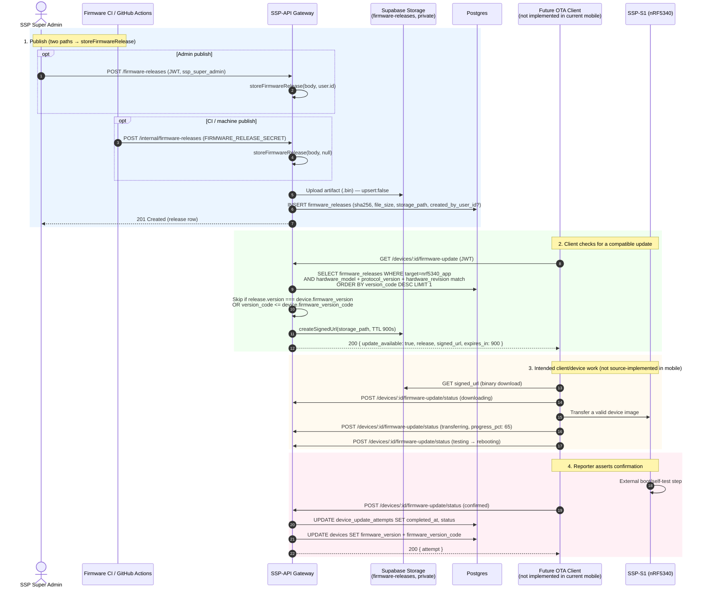

# Firmware OTA Pipeline

The **Phase 3 Firmware OTA API** stores firmware artifacts and metadata, selects a compatible release for `target: nrf5340_app`, mints a short-lived Storage URL, and records caller-reported update status. The current `SSP-Mobile-App` does **not** call these endpoints or implement BLE DFU, so this is a server-side contract rather than a working end-to-end OTA pipeline.

::: danger Artifact and boot trust boundary
The API does not parse the binary, verify an MCUboot signature/container, compare an expected publisher checksum, or attest the image running after reboot. It accepts a non-empty base64 payload that passes the size/schema limits, computes a SHA-256 digest for the stored bytes, and trusts a permitted caller that reports `status: 'confirmed'`. Firmware signing, transfer, reboot, self-test, rollback, and post-reset identity remain external gates.
:::

Two concerns shape this doc: there are **two publish paths** (admin JWT and CI shared-secret) that converge on one storage routine, and "latest release" is decided by the integer `version_code` column, **not** by parsing the semver-looking `version` string. See [Architecture](./architecture) and [Auth & Security](./auth-and-security) for surrounding context; device registration and pairing live in [Devices API](./routes/devices).

---

## OTA Architecture



---

## 1. Publish Firmware Release

A release is published by uploading the supplied binary to Storage and recording its metadata in `firmware_releases`. The caller is responsible for providing the correctly signed, target-compatible artifact; the gateway does not validate the firmware container. Both publish paths delegate to `storeFirmwareRelease` in `src/lib/firmware.ts`; they differ only in authentication and whether `created_by_user_id` is set.

### 1a. Admin Publish (`POST /firmware-releases`)

- **Path:** `/firmware-releases`
- **Method:** `POST`
- **Auth:** JWT
- **Required Roles:** `ssp_super_admin`
- **Tenant Scope:** Cross-tenant (super admin only)
- **Source:** `src/routes/firmware-releases.ts`

Delegates to `storeFirmwareRelease(body, user.id)`; the publishing user's id is recorded as `created_by_user_id`.

### 1b. CI / Machine Publish (`POST /internal/firmware-releases`)

- **Path:** `/internal/firmware-releases`
- **Method:** `POST`
- **Auth:** `FIRMWARE_RELEASE_SECRET` (shared secret), sent via the `x-cron-secret` header **or** `Authorization: Bearer <secret>`
- **Required Roles:** n/a (machine/CI caller, no JWT)
- **Tenant Scope:** Cross-tenant
- **Source:** `src/routes/internal.ts`

The `/internal` router's middleware selects `FIRMWARE_RELEASE_SECRET` when `c.req.path.endsWith('/firmware-releases')` (it selects `CRON_SECRET` otherwise). Delegates to `storeFirmwareRelease(body, null)`, so `created_by_user_id` is recorded as `null`, reflecting an unattended publish. If `FIRMWARE_RELEASE_SECRET` is unset, this route always returns `401`.

### Request Body Schema (`publishFirmwareRelease`)

Validated with `zValidator('json', publishFirmwareRelease)`, the same schema for both paths.

| Field | Type | Required | Constraints |
| :--- | :--- | :--- | :--- |
| `target` | `literal('nrf5340_app')` | yes | The only allowed target. |
| `hardware_model` | `string` | yes | min 1, max 100. |
| `hardware_revision` | `string` | no | min 1, max 100; nullable. |
| `version` | `string` (firmwareVersion) | yes | Regex `/^\d+\.\d+\.\d+(?:[-+][0-9A-Za-z.-]+)?$/`, max 50. **Format only, not used for ordering.** |
| `version_code` | `integer` | yes | Positive. This is the ordering key. |
| `protocol_version` | `string` | yes | min 1, max 50. |
| `mandatory` | `boolean` | no | Default `false`. |
| `release_notes` | `string` | no | max 10,000; nullable. |
| `content_type` | `string` | no | min 1, max 100; default `application/octet-stream`. |
| `artifact_base64` | `string` | yes | min 1, max 3,000,000 chars (base64-encoded binary). |

```json
{
  "target": "nrf5340_app",
  "hardware_model": "SSP-S1-PRO",
  "hardware_revision": "revB",
  "version": "1.4.2",
  "version_code": 1042,
  "protocol_version": "v1",
  "mandatory": false,
  "release_notes": "BLE DFU stability fix for revB units.",
  "content_type": "application/octet-stream",
  "artifact_base64": "<base64-encoded .bin>"
}
```

### Response (`201 Created`)

The created `firmware_releases` row (the `artifact_base64` is stripped before insert).

```json
{
  "id": "a1b2c3d4-1111-4aaa-8bbb-222222222222",
  "target": "nrf5340_app",
  "hardware_model": "SSP-S1-PRO",
  "hardware_revision": "revB",
  "version": "1.4.2",
  "version_code": 1042,
  "protocol_version": "v1",
  "storage_bucket": "firmware-releases",
  "storage_path": "nrf5340_app/SSP-S1-PRO/1.4.2/<uuid>.bin",
  "file_size": 482316,
  "sha256": "9f86d081884c7d659a2feaa0c55ad015a3bf4f1b2b0b822cd15d6c15b0f00a08",
  "content_type": "application/octet-stream",
  "mandatory": false,
  "release_notes": "BLE DFU stability fix for revB units.",
  "created_by_user_id": "8ef0f0e0-47b1-4f67-88eb-116f1997380c",
  "published_at": "2026-08-15T10:00:00.000Z",
  "created_at": "2026-08-15T10:00:00.000Z"
}
```

> On the `/internal/firmware-releases` path, `created_by_user_id` is `null`.

### Errors

| Status | When |
| :--- | :--- |
| 400 | `artifact_base64` is not valid base64 (`'artifact_base64 is not valid base64'`); or decoded artifact is 0 bytes (`'Firmware artifact is empty'`). |
| 401 | Missing/mismatched secret (`/internal` path); missing/invalid JWT (`/firmware-releases` path). |
| 403 | JWT path only: caller is not `ssp_super_admin`. |
| 500 | Storage upload failure; or `firmware_releases` insert failure (rolled back, see below); or unhandled error. |

### `storeFirmwareRelease` flow (`src/lib/firmware.ts`)

Both paths run the same routine, step by step:

1. **Decode artifact.** `decodeBase64(body.artifact_base64)`; on failure return `400 'artifact_base64 is not valid base64'`; if the result is 0 bytes return `400 'Firmware artifact is empty'`.
2. **Resolve bucket.** `bucket = process.env.FIRMWARE_BUCKET ?? 'firmware-releases'` (the `DEFAULT_BUCKET`).
3. **Build storage path.** `path = [target, safePathSegment(hardware_model), version, `${crypto.randomUUID()}.bin`].join('/')`. `safePathSegment` replaces any run of non-`[0-9A-Za-z._-]+` with `-`.
4. **Hash.** `sha256(artifact)` via `crypto.subtle.digest('SHA-256', …)` → 64-char hex.
5. **Upload.** `db().storage.from(bucket).upload(path, artifact, { contentType: body.content_type, upsert: false })`. On error return `500` with the upload error message.
6. **Insert row.** Strip `artifact_base64`, default `hardware_revision`/`release_notes` to `null`, and insert into `firmware_releases` with `storage_bucket`, `storage_path`, `file_size = artifact.byteLength`, `sha256`, and `created_by_user_id` (the caller's id, or `null`). `.select().single()`.
7. **Rollback on insert failure.** If the insert errors, `db().storage.from(bucket).remove([path])` deletes the just-uploaded object and the routine returns `500`.
8. **Success.** Return `{ data, status: 201 }`.

---

## 2. Device Update Check (`GET /devices/:id/firmware-update`)

- **Path:** `/devices/:id/firmware-update`
- **Method:** `GET`
- **Auth:** JWT
- **Required Roles:** none (manual `hasOrgAccess` check against `device.organisation_id`)
- **Tenant Scope:** Org
- **Path Parameters:** `id` (device id)
- **Source:** `src/routes/devices.ts`

An OTA-capable client would call this to discover whether a compatible, newer release exists for the device. The current mobile app has no caller. `FIRMWARE_DOWNLOAD_TTL_SECONDS = 15 * 60` (900 seconds) is a module constant.

### Compatibility resolution

The handler queries `firmware_releases` with:

- `target` = `'nrf5340_app'`
- `hardware_model` = `device.hardware_model`
- `protocol_version` = `device.protocol_version`
- `hardware_revision` = `device.hardware_revision` **when the device has one**; otherwise `.is('hardware_revision', null)` (revision-agnostic releases only)

Ordered by `version_code desc`, `limit(1)`, so the database picks the row with the highest `version_code`. It does **not** parse `version`.

### Skip conditions

The handler short-circuits with `update_available: false` when:

- `device.protocol_version` is null/empty: `{ update_available: false, current_version, reason: 'Device protocol version is unknown' }`.
- No release matched, **or** `release.version === device.firmware_version`, **or** `device.firmware_version_code !== null && release.version_code <= device.firmware_version_code`: `{ update_available: false, current_version }`.

### Response (`200 OK` — update available)

A signed download URL is minted via `db().storage.from(release.storage_bucket).createSignedUrl(release.storage_path, FIRMWARE_DOWNLOAD_TTL_SECONDS)`. `storage_bucket` and `storage_path` are stripped from the `release` object before it is returned.

```json
{
  "update_available": true,
  "current_version": "1.4.0",
  "release": {
    "id": "a1b2c3d4-1111-4aaa-8bbb-222222222222",
    "target": "nrf5340_app",
    "hardware_model": "SSP-S1-PRO",
    "hardware_revision": "revB",
    "version": "1.4.2",
    "version_code": 1042,
    "protocol_version": "v1",
    "file_size": 482316,
    "sha256": "9f86d081884c7d659a2feaa0c55ad015a3bf4f1b2b0b822cd15d6c15b0f00a08",
    "content_type": "application/octet-stream",
    "mandatory": false,
    "release_notes": "BLE DFU stability fix for revB units.",
    "published_at": "2026-08-15T10:00:00.000Z"
  },
  "signed_url": "https://<supabase-ref>.supabase.co/storage/v1/object/sign/firmware-releases/nrf5340_app/SSP-S1-PRO/1.4.2/<uuid>.bin?token=...",
  "expires_in": 900
}
```

### Response (`200 OK` — no update)

```json
{
  "update_available": false,
  "current_version": "1.4.2"
}
```

With a reason when the device has no known protocol version:

```json
{
  "update_available": false,
  "current_version": "1.4.2",
  "reason": "Device protocol version is unknown"
}
```

### Errors

| Status | When |
| :--- | :--- |
| 403 | Caller fails `hasOrgAccess` against the device's `organisation_id`. |
| 404 | Device not found. |
| 500 | `firmware_releases` query error; or signed-URL minting fails (`'Unable to create firmware download URL'`). |

> **`version_code` is the comparator, not semver.** "Latest release" is the row with the highest `version_code` (a DB integer), selected by `order('version_code', { ascending: false }).limit(1)`. `lib/firmware.ts` only validates the `version` string's *format* (the Zod regex) and handles storage; it performs **no** version comparison. The device-side skip guards compare `version_code` (integer) against `device.firmware_version_code`, and `release.version` against `device.firmware_version` only as an exact-string equality tiebreaker. Any claim that the API parses semver `1.4.2` to determine ordering is wrong.

---

## 3. Report Update Status (`POST /devices/:id/firmware-update/status`)

- **Path:** `/devices/:id/firmware-update/status`
- **Method:** `POST`
- **Auth:** JWT
- **Required Roles:** none (manual `hasOrgAccess` check)
- **Tenant Scope:** Org
- **Path Parameters:** `id` (device id)
- **Source:** `src/routes/devices.ts`

An OTA-capable client reports progress and the final outcome. Each report is tied to an `attempt_id` (a client-generated UUID); the first report inserts a `device_update_attempts` row and subsequent reports update it. The current mobile app does not make these reports.

### Request Body Schema (`reportFirmwareUpdate`)

Validated with `zValidator('json', reportFirmwareUpdate)`.

| Field | Type | Required | Constraints |
| :--- | :--- | :--- | :--- |
| `attempt_id` | `uuid` | yes | Client-generated; identifies the update attempt. |
| `firmware_release_id` | `uuid` | yes | The release being applied. |
| `status` | `enum` | yes | `downloading` \| `transferring` \| `testing` \| `rebooting` \| `confirmed` \| `failed` \| `cancelled` |
| `progress_pct` | `integer` | no | 0–100; nullable. |
| `error_code` | `string` | no | max 100; nullable. |
| `error_message` | `string` | no | max 2000; nullable. |

```json
{
  "attempt_id": "b3c4d5e6-2222-4bbb-9ccc-333333333333",
  "firmware_release_id": "a1b2c3d4-1111-4aaa-8bbb-222222222222",
  "status": "transferring",
  "progress_pct": 65
}
```

### Handler logic

1. Loads the device (404 if missing) and checks `hasOrgAccess` (403 if denied).
2. Loads the release by `firmware_release_id` (404 `'Firmware release not found'` if missing).
3. **Compatibility check.** The release is compatible only if `target === 'nrf5340_app'` **and** `hardware_model`, `hardware_revision`, and `protocol_version` all match the device. Otherwise `409 'Firmware release is not compatible with device'`.
4. **Attempt ownership.** If `attempt_id` already exists in `device_update_attempts` but belongs to a different `device_id`, or to a different user and the caller is not `ssp_super_admin`, returns `403 'Firmware update attempt belongs to another user or device'`.
5. **Write.** If the attempt exists, update it; otherwise insert a new row with `requested_by_user_id = user.id` and `from_version = device.firmware_version`. The existing-attempt lookup does not select/compare `firmware_release_id`, so a later body can reference a different compatible release. Terminal statuses set `completed_at`; `confirmed` forces `progress_pct = 100`.
6. **On `confirmed`.** Updates `devices.firmware_version` and `devices.firmware_version_code` to the release's `version` and `version_code` respectively.
7. Returns `{ attempt: <device_update_attempts row> }`.

### Response (`200 OK`)

```json
{
  "attempt": {
    "id": "b3c4d5e6-2222-4bbb-9ccc-333333333333",
    "device_id": "3fa85f64-5717-4562-b3fc-2c963f66afa6",
    "firmware_release_id": "a1b2c3d4-1111-4aaa-8bbb-222222222222",
    "requested_by_user_id": "8ef0f0e0-47b1-4f67-88eb-116f1997380c",
    "from_version": "1.4.0",
    "status": "confirmed",
    "progress_pct": 100,
    "error_code": null,
    "error_message": null,
    "started_at": "2026-08-15T10:05:00.000Z",
    "completed_at": "2026-08-15T10:09:30.000Z",
    "created_at": "2026-08-15T10:05:00.000Z",
    "updated_at": "2026-08-15T10:09:30.000Z"
  }
}
```

### Errors

| Status | When |
| :--- | :--- |
| 403 | Org access denied; or `attempt_id` belongs to another user/device (and caller is not `ssp_super_admin`). |
| 404 | Device not found; or release not found. |
| 409 | Release target/hardware_model/hardware_revision/protocol_version does not match the device. |
| 500 | Insert/update failure on `device_update_attempts`; or `devices` update failure on `confirmed`. |

---

## 4. OTA Status State Machine

The schema accepts the following reporter-supplied statuses. The first four are non-terminal; the last three are terminal. They describe intended client/device semantics, but the API does not verify that the corresponding physical action occurred.

The handler does not enforce this as an ordered state machine. Any status can be submitted first; a terminal attempt can later return to a non-terminal status, which clears `completed_at`. Attempt and device-version updates are not transactional, so a confirmed attempt can remain stored if the subsequent device update fails.

| Status | Terminal? | Description |
| :--- | :---: | :--- |
| `downloading` | no | Reporter says it is fetching the binary from Storage. |
| `transferring` | no | Intended to represent device transfer; typically includes `progress_pct` (0–100). |
| `testing` | no | Intended to represent a transferred image under test. |
| `rebooting` | no | Intended to represent a device reboot. |
| `confirmed` | yes | Reporter asserts success. Triggers `devices.firmware_version` + `firmware_version_code` update; `progress_pct` forced to 100. |
| `failed` | yes | Reporter asserts failure; optional `error_code` and `error_message`. |
| `cancelled` | yes | User or system cancelled before completion. |

---

## 5. Database Schema

Created by migration `supabase/migrations/20260723223629_firmware_ota_releases.sql`. Row-level security is **enabled** on both tables; the gateway uses the Supabase service-role key (which bypasses RLS), so all access is enforced in the API, not in Postgres. See [Database Schema](./database-schema) for the wider schema.

### `firmware_releases`

| Column | Type | Notes |
| :--- | :--- | :--- |
| `id` | `uuid` PK | `gen_random_uuid()`. |
| `target` | `text` | `not null`, `check (target = 'nrf5340_app')`. |
| `hardware_model` | `text` | `not null`. |
| `hardware_revision` | `text` | Nullable. |
| `version` | `text` | `not null`. Format-validated in Zod only. |
| `version_code` | `bigint` | `not null`, `check (> 0)`. **Ordering key.** |
| `protocol_version` | `text` | `not null`. |
| `storage_bucket` | `text` | `not null`, default `'firmware-releases'`. |
| `storage_path` | `text` | `not null`, `unique`. |
| `file_size` | `bigint` | `not null`, `check (> 0)`. |
| `sha256` | `text` | `not null`, `check (~ '^[0-9a-f]{64}$')`. |
| `content_type` | `text` | `not null`, default `'application/octet-stream'`. |
| `mandatory` | `boolean` | `not null`, default `false`. |
| `release_notes` | `text` | Nullable. |
| `created_by_user_id` | `uuid` | References `auth.users(id) on delete set null`. `null` for CI publishes. |
| `published_at` | `timestamptz` | `not null`, default `now()`. |
| `created_at` | `timestamptz` | `not null`, default `now()`. |

Constraints: `unique (target, hardware_model, version)`. RLS enabled.

### `device_update_attempts`

| Column | Type | Notes |
| :--- | :--- | :--- |
| `id` | `uuid` PK | Client-supplied `attempt_id`. |
| `device_id` | `uuid` | `not null`, references `devices(id) on delete cascade`. |
| `firmware_release_id` | `uuid` | `not null`, references `firmware_releases(id)`. |
| `requested_by_user_id` | `uuid` | References `auth.users(id) on delete set null`. |
| `from_version` | `text` | The device's `firmware_version` at attempt start. |
| `status` | `text` | `not null`, `check (in (downloading, transferring, testing, rebooting, confirmed, failed, cancelled))`. |
| `progress_pct` | `integer` | `check (0–100)`. |
| `error_code` | `text` | Nullable. |
| `error_message` | `text` | Nullable. |
| `started_at` | `timestamptz` | `not null`, default `now()`. |
| `completed_at` | `timestamptz` | Set on terminal statuses. |
| `created_at` | `timestamptz` | `not null`, default `now()`. |
| `updated_at` | `timestamptz` | `not null`, default `now()`. |

RLS enabled.

### Indexes, bucket, and follow-ups

The same migration creates:

- **`firmware_releases_compatibility_idx`** on `(target, hardware_model, hardware_revision, protocol_version, version_code desc)`, the index that serves the update-check query.
- **`device_update_attempts_device_idx`** on `(device_id, created_at desc)`.
- The **private Storage bucket** `firmware-releases` via `insert into storage.buckets (id, name, public) values ('firmware-releases', 'firmware-releases', false) on conflict (id) do update set public = false` (idempotent, forces the bucket private even if it already exists).
- `alter table public.devices add column if not exists hardware_revision text`.

Follow-up migrations add: `device_update_attempts_release_idx` (`firmware_release_id`), `device_update_attempts_requester_idx` (`requested_by_user_id`), `firmware_releases_creator_idx` (`created_by_user_id`), and `devices.firmware_version_code bigint` (`check (null or > 0)`).

---

## Environment

| Variable | Purpose | Default |
| :--- | :--- | :--- |
| `FIRMWARE_BUCKET` | Private Storage bucket for firmware artifacts. | `'firmware-releases'` |
| `FIRMWARE_RELEASE_SECRET` | Shared secret for `POST /internal/firmware-releases` (sent via `x-cron-secret` or `Authorization: Bearer`). | none (route 401s if unset) |
