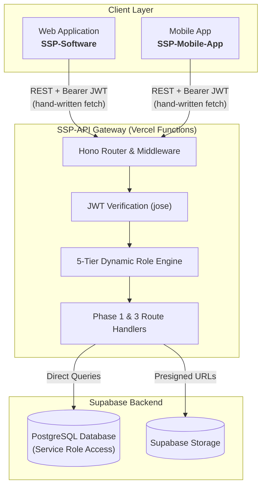

# Backend Overview (SSP-API)

The **SSP-API** is the central **[Hono](https://hono.dev)** gateway configured for **Vercel Functions**. The current web and mobile apps send their application-data requests to this gateway with hand-written `fetch` clients; both authenticate directly with Supabase Auth, and the web app also owns several onboarding/access-request server actions. Neither client currently imports the API's published `AppType` contract or calls PostgREST directly.

The role engine enforces the cascade `ssp_super_admin > organisation_admin > coach > sub_coach > athlete`. Roles are loaded from the `user_roles` table on every request (joined to `roles(name)` with `revoked_at IS NULL`), not from JWT `app_metadata.roles`, so grants take effect immediately without token re-issuance. `isAthlete` does **not** cascade. Requiring `athlete` admits only literal athletes, which is why several routes list both `athlete` and `coach`.

::: info Verification baseline: 2026-08-15
These pages were checked against `SSP-API` branch `codex/phase3-api-integration` at commit `01c5a15888d12a6a991e18d082f182ecab3a4b34`, including its pre-existing dirty OTA, telemetry, migration, generated-type, test, and API-documentation changes. `npm test` passes 53/53 tests, production and test TypeScript checks pass, coverage thresholds pass, and a clean temporary `tsup` build succeeds. This audit did not connect to the live Supabase project, apply or inspect live migrations/RLS/Storage, run `vercel dev`, deploy Vercel, invoke the scheduled cron, publish from firmware CI, or exercise a client against a deployed API.
:::

| Repository gate | Result |
| :--- | :--- |
| `npm test` | **Pass:** 5/5 files, 53/53 mocked/unit HTTP tests. |
| `npm run typecheck` | **Pass:** production and `tsconfig.test.json`. |
| `npm run test:coverage` | **Pass:** 78.87% statements, 57.14% branches, 85.02% functions, 86.66% lines. |
| Temporary `tsup` build | **Pass:** ESM and declaration bundles generated outside the repository. |
| `npm ls --depth=0` | **Not clean:** 48 top-level entries reported extraneous in the current `node_modules`. |
| `npm audit --omit=dev` | **Open:** one moderate Hono advisory group for installed `hono@4.12.31`; no automatic fix was applied. |
| Live database/deployment/client/device | **Not run.** |

---

## Phase 1 Deliverables Summary

In **Phase 1**, the gateway implements core identity, multi-tenancy, roster management, hardware device registration, session tracking, and read-side analytics:

| Category | Documentation Guide | Key Endpoints | Status |
| :--- | :--- | :--- | :---: |
| **System Architecture** | [Architecture Guide](./architecture) | Gateway topology, edge routing, Vercel setup | ✅ Implemented |
| **Auth & Security** | [Auth & Security](./auth-and-security) | Cryptographic JWT verification, 5-tier role cascade | ✅ Implemented |
| **Database Model** | [Database Schema](./database-schema) | PostgreSQL entities, foreign keys, constraints | ✅ Implemented |
| **Master API Directory** | [API Reference](./api-reference) | Master route catalog & status codes | ✅ Implemented |
| **Users & Identity** | [Users Route](./routes/users) | `GET /me`, `PATCH /me` | ✅ Implemented |
| **Organisations** | [Organisations Route](./routes/organisations) | `GET /organisations`, `GET /organisations/:id` | ✅ Implemented |
| **Teams & Rosters** | [Teams Route](./routes/teams) | `GET /teams`, `GET /teams/:id/roster`, `POST /teams` | ✅ Implemented |
| **Athletes** | [Athletes Route](./routes/athletes) | `GET /athletes`, `GET /athletes/:id`, `POST /athletes` | ✅ Implemented |
| **Coaches** | [Coaches Route](./routes/coaches) | `GET /coaches`, `POST /coaches` | ✅ Implemented |
| **Hardware Devices** | [Devices Route](./routes/devices) | `GET /devices`, `POST /devices`, `POST /devices/:id/pair`, `POST /devices/:id/assign` | ✅ Implemented |
| **Sessions & Tracking**| [Sessions Route](./routes/sessions) | `GET /sessions`, `POST /sessions/:id/start\|pause\|stop` | ✅ Implemented |
| **Metrics & Targets** | [Metrics Route](./routes/metrics) | `GET /sessions/:id/metrics`, `GET /sessions/:id/summary`, `GET/POST /sessions/:id/targets` | ✅ Implemented |
| **Workload & ACWR** | [Workload Route](./routes/workload) | `GET /athletes/:id/workload` | ✅ Implemented |
| **Goals & Benchmarks**| [Goals](./routes/goals) & [Benchmarks](./routes/benchmarks) | `GET /goals`, `POST /goals`, `GET /benchmarks` | ✅ Implemented |
| **Notifications** | [Notifications Route](./routes/notifications) | `GET /notifications`, `PATCH /notifications/:id/read` | ✅ Implemented |
| **Analytics** | [Analytics Route](./routes/analytics) | `GET /teams/:id/analytics`, `GET /athletes/:id/analytics` | ✅ Implemented |

---

## Phase 3 Deliverables Summary

In **Phase 3** (telemetry and OTA), the gateway adds signed telemetry upload, a retry-safe same-payload parser, and server-side firmware release/update contracts. Phase 2 was deferred per the project plan; no Phase 2 surface exists.

| Category | Documentation Guide | Key Endpoints | Status |
| :--- | :--- | :--- | :---: |
| **Firmware OTA API** | [Firmware OTA](./firmware-ota) | `GET /devices/:id/firmware-update`, `POST /devices/:id/firmware-update/status`, `POST /firmware-releases`, `POST /internal/firmware-releases` | ✅ Source implemented; client transport open |
| **Telemetry Ingest** | [Ingestion Pipeline](./ingestion-pipeline) | `POST /sessions/:id/ingest-url`, `POST /sessions/:id/complete`, `GET /sessions/:id/sync`, `GET /sessions/:id/telemetry` | ✅ Implemented |
| **Telemetry Parser** | [Ingestion Pipeline](./ingestion-pipeline) | `POST /internal/parse/:sessionId`, `GET /internal/parse/pending` | ✅ Source implemented; concurrent claim race documented |
| **Public Health** | [API Reference](./api-reference) | `GET /health` (public, no auth) | ✅ Implemented |

Firmware release "latest" selection is driven by `version_code desc` (a DB integer), not semver parsing. The parser upserts telemetry points, per-athlete metrics, and session summaries with explicit conflict keys, so reprocessing the same payload overwrites those rows; its queue claim is not atomic and concurrent workers can race. `POST /sessions/:id/complete` short-circuits an already-completed sync. The `/internal/*` routes authenticate via `CRON_SECRET` / `FIRMWARE_RELEASE_SECRET` (shared secret in `x-cron-secret` or `Authorization: Bearer`), not JWT.

---

## Phase status

- **Phase 1 (Core):** implemented: identity, organisations, teams, athletes, coaches, devices, sessions, metrics, workload, goals, benchmarks, notifications, analytics.
- **Phase 3 (Telemetry & OTA):** server source implemented: signed telemetry upload (`/sessions/:id/ingest-url|complete|sync|telemetry`), internal parsing (`/internal/parse/*`), and OTA metadata/status routes (`/devices/:id/firmware-update`, `/firmware-releases`, `/internal/firmware-releases`). The current mobile app has no Devices-API OTA client or BLE DFU transport.
- **Future work:** PostGIS heatmaps, Supabase Realtime wiring, and `pg_cron` aggregations (not yet implemented).

---

## Technical Specifications

- **Runtime:** Hono application with a recognized Vercel entry at `src/app.ts`; live deployment was not verified in this audit.
- **Language / Type System:** TypeScript 5 with strict mode.
- **Validation Engine:** Zod with `@hono/zod-validator` for many bodies; other bodies/queries use manual parsing. `GET /sessions` uses throwing `.parse`, while telemetry query validation uses `safeParse`.
- **Database Engine:** Supabase PostgreSQL accessed by this gateway with a service-role key, so gateway queries bypass RLS and depend on handler authorization.
- **Auth:** Supabase-issued JWTs verified locally with **`jose`** (HS256 via `SUPABASE_JWT_SECRET`, or ES256/RS256 via JWKS). Roles are DB-loaded per request, fail-closed to `[]` on DB error.
- **Client Protocol:** The API publishes `AppType` for optional `hono/client` use, but both current clients use local types and hand-written `fetch` wrappers.
- **Data Separation:** Most handlers apply organisation, team, session, or self scoping in the gateway. Confirmed source-level gaps are listed in [Auth & Security](./auth-and-security#known-source-level-authorization-gaps).
