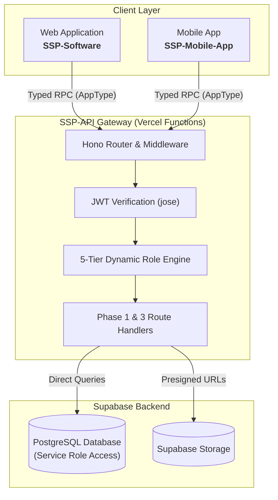

# Backend Overview (SSP-API)

The **SSP-API** is the central, self-hosted **[Hono](https://hono.dev)** gateway deployed on **Vercel Functions** that serves as the single API surface for the entire SSP Sports Tracker ecosystem. All interactions from the **Web Frontend** (`SSP-Software`) and **Mobile App** (`SSP-Mobile-App`) flow exclusively through this gateway; clients never touch PostgREST or tables directly.

The role engine enforces the cascade `ssp_super_admin > organisation_admin > coach > sub_coach > athlete`. Roles are loaded from the `user_roles` table on every request (joined to `roles(name)` with `revoked_at IS NULL`), not from JWT `app_metadata.roles`, so grants take effect immediately without token re-issuance. Note `isAthlete` does **not** cascade — requiring `athlete` admits only literal athletes, which is why several routes list both `athlete` and `coach` explicitly.

---

## Phase 1 Deliverables Summary

In **Phase 1**, the gateway implements core identity, multi-tenancy, roster management, hardware device registration, session tracking, and read-side analytics:

| Category | Documentation Guide | Key Endpoints | Status |
| :--- | :--- | :--- | :---: |
| **System Architecture** | [Architecture Guide](./architecture) | Gateway topology, edge routing, Vercel setup | ✅ Implemented |
| **Auth & Security** | [Auth & Security](./auth-and-security) | Cryptographic JWT verification, 5-tier role cascade | ✅ Implemented |
| **Database Model** | [Database Schema](./database-schema) | PostgreSQL entities, foreign keys, constraints | ✅ Implemented |
| **Master API Directory** | [API Reference](./api-reference) | Master route catalog & status codes | ✅ Implemented |
| **Users & Identity** | [Users Route](./routes/users) | `GET /me`, `PATCH /me` | ✅ Implemented |
| **Organisations** | [Organisations Route](./routes/organisations) | `GET /organisations`, `GET /organisations/:id` | ✅ Implemented |
| **Teams & Rosters** | [Teams Route](./routes/teams) | `GET /teams`, `GET /teams/:id/roster`, `POST /teams` | ✅ Implemented |
| **Athletes** | [Athletes Route](./routes/athletes) | `GET /athletes`, `GET /athletes/:id`, `POST /athletes` | ✅ Implemented |
| **Coaches** | [Coaches Route](./routes/coaches) | `GET /coaches`, `POST /coaches` | ✅ Implemented |
| **Hardware Devices** | [Devices Route](./routes/devices) | `GET /devices`, `POST /devices`, `POST /devices/:id/pair`, `POST /devices/:id/assign` | ✅ Implemented |
| **Sessions & Tracking**| [Sessions Route](./routes/sessions) | `GET /sessions`, `POST /sessions/:id/start\|pause\|stop` | ✅ Implemented |
| **Metrics & Targets** | [Metrics Route](./routes/metrics) | `GET /sessions/:id/metrics`, `GET /sessions/:id/summary`, `GET/POST /sessions/:id/targets` | ✅ Implemented |
| **Workload & ACWR** | [Workload Route](./routes/workload) | `GET /athletes/:id/workload` | ✅ Implemented |
| **Goals & Benchmarks**| [Goals](./routes/goals) & [Benchmarks](./routes/benchmarks) | `GET /goals`, `POST /goals`, `GET /benchmarks` | ✅ Implemented |
| **Notifications** | [Notifications Route](./routes/notifications) | `GET /notifications`, `PATCH /notifications/:id/read` | ✅ Implemented |
| **Analytics** | [Analytics Route](./routes/analytics) | `GET /teams/:id/analytics`, `GET /athletes/:id/analytics` | ✅ Implemented |

---

## Phase 3 Deliverables Summary

In **Phase 3** (telemetry and OTA), the gateway adds signed telemetry upload, an idempotent server-side parser, and firmware update delivery. Phase 2 was deferred per the project plan; no Phase 2 surface exists.

| Category | Documentation Guide | Key Endpoints | Status |
| :--- | :--- | :--- | :---: |
| **Firmware OTA** | [Firmware OTA](./firmware-ota) | `GET /devices/:id/firmware-update`, `POST /devices/:id/firmware-update/status`, `POST /firmware-releases`, `POST /internal/firmware-releases` | ✅ Implemented |
| **Telemetry Ingest** | [Ingestion Pipeline](./ingestion-pipeline) | `POST /sessions/:id/ingest-url`, `POST /sessions/:id/complete`, `GET /sessions/:id/sync`, `GET /sessions/:id/telemetry` | ✅ Implemented |
| **Idempotent Parser** | [Ingestion Pipeline](./ingestion-pipeline) | `POST /internal/parse/:sessionId`, `GET /internal/parse/pending` | ✅ Implemented |
| **Public Health** | [API Reference](./api-reference) | `GET /health` (public, no auth) | ✅ Implemented |

Firmware release "latest" selection is driven by `version_code desc` (a DB integer), not semver parsing. The parser upserts telemetry points, per-athlete metrics, and session summaries with explicit conflict keys, so re-runs are safe; `POST /sessions/:id/complete` short-circuits an already-completed sync. The `/internal/*` routes authenticate via `CRON_SECRET` / `FIRMWARE_RELEASE_SECRET` (shared secret in `x-cron-secret` or `Authorization: Bearer`), not JWT. See [Auth & Security](./auth-and-security) for the two auth modes.

---

## Phase status

- **Phase 1 (Core):** implemented — identity, organisations, teams, athletes, coaches, devices, sessions, metrics, workload, goals, benchmarks, notifications, analytics.
- **Phase 3 (Telemetry & OTA):** implemented — signed telemetry upload (`/sessions/:id/ingest-url|complete|sync|telemetry`), the idempotent internal parser (`/internal/parse/*`), and firmware OTA (`/devices/:id/firmware-update`, `/firmware-releases`, `/internal/firmware-releases`).
- **Future work:** PostGIS heatmaps, Supabase Realtime wiring, and `pg_cron` aggregations (not yet implemented).

---

## Technical Specifications

- **Runtime:** Edge-compatible Vercel Functions with Hono's zero-configuration adapter.
- **Language / Type System:** TypeScript 5 with strict mode.
- **Validation Engine:** Zod with `@hono/zod-validator` (request bodies only; query strings are parsed manually via `c.req.query()` + `safeParse`).
- **Database Engine:** Supabase PostgreSQL accessed with the service-role key — the gateway is the sole DB client, bypassing RLS as the authoritative authz layer.
- **Auth:** Supabase-issued JWTs verified locally with **`jose`** (HS256 via `SUPABASE_JWT_SECRET`, or ES256/RS256 via JWKS). Roles are DB-loaded per request, fail-closed to `[]` on DB error.
- **Client Protocol:** Typed RPC via `hono/client` importing the published `AppType` contract.
- **Data Separation:** Multi-tenant isolation is enforced in the gateway through organisation and team scoping (role + membership checks), not relied upon via RLS alone.