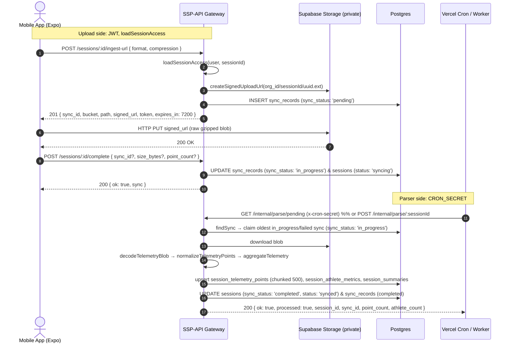
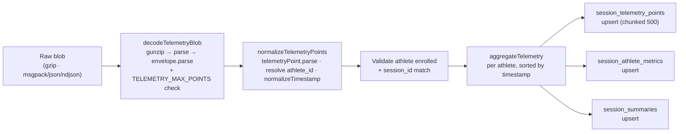

# Telemetry Ingestion Pipeline

The Phase 3 telemetry pipeline moves a configured maximum of GPS and IMU
samples per upload (100,000 by default) off the mobile app, through Supabase Storage, and into
Postgres without streaming raw points through a stateless Vercel Function. The
gateway (`src/routes/ingest.ts`) only mints a presigned upload URL and records a
pending `sync_records` row; the mobile app PUTs the blob straight to Storage; a
second, secret-gated worker (`src/routes/internal.ts` + `src/lib/telemetry.ts`)
downloads, decodes, normalizes, aggregates, and upserts the derived rows.

Two auth modes are in play: the **upload side** is JWT-authenticated and gated by
`loadSessionAccess`; the **parser side** (`/internal/*`) is shared-secret
authenticated via `CRON_SECRET` (no JWT). See
[Auth & Security](../auth-and-security) for both modes.

---

## Pipeline at a glance



---

## Storage layout

| Aspect | Value |
| :--- | :--- |
| Bucket | `process.env.TELEMETRY_BUCKET ?? 'session-telemetry'` |
| Object path | `${session.organisation_id}/${sessionId}/${uuid}.${ext}` |
| Extension | `msgpack` / `json` / `ndjson`, with `.gz` appended when `compression === 'gzip'` |
| Visibility | Private bucket; clients upload via a presigned URL, the gateway downloads with the service-role key |

---

## Upload side (JWT, `loadSessionAccess`)

All four routes are root-mounted from `src/routes/ingest.ts`, so their real paths
begin with `/sessions/:id/...`. Each handler calls `loadSessionAccess(user,
sessionId)` first and returns the access result's `error`/`status` (403 / 404)
on failure. No `requireRoles` gate; access is granted by session membership.

### 1. Mint presigned upload URL (`POST /sessions/:id/ingest-url`)

- **Path**: `POST /sessions/:id/ingest-url` (param `id`)
- **Auth**: JWT, then `loadSessionAccess`
- **Required roles**: none (manual `loadSessionAccess`, any session member)
- **Tenant scope**: Session (org/team derived from the session)
- **Request body**: `createIngestUpload`, parsed via `safeParse` (body allowed
  to be empty `{}`). `format` defaults to `'json'`; `compression` defaults to
  `'gzip'`.
- **Behavior**: builds the storage object path, calls
  `db().storage.from(bucket).createSignedUploadUrl(path)`, and inserts a
  `sync_records` row with `source_type: 'mobile_app'`, `entity_type: 'session'`,
  `entity_id: sessionId`, `sync_status: 'pending'`, plus `storage_bucket`,
  `storage_path`, `payload_format`, `compression`, `organisation_id`,
  `user_id`, `device_id` (from `session.source_device_id`), and `session_id`.
  If the caller holds the `athlete` role, it looks up `athletes.id` by
  `user_id` and stores it as `athlete_id`.
- **Response (`201 Created`)**
  ```json
  {
    "sync_id": "9df0f0e0-47b1-4f67-88eb-116f1997380d",
    "bucket": "session-telemetry",
    "path": "0a1b2c3d-...-.../8ef0f0e0-47b1-4f67-88eb-116f1997380c/a1b2c3d4-....json.gz",
    "signed_url": "https://<ref>.supabase.co/storage/v1/object/upload/sign/session-telemetry/...?token=...",
    "token": "<storage-token>",
    "expires_in": 7200,
    "format": "json",
    "compression": "gzip"
  }
  ```
- **Errors**: 400 `{ error: 'Invalid body', issues: [{path, message}] }`;
  403 / 404 from `loadSessionAccess`; 500 on Storage or insert error.

`SIGNED_UPLOAD_TTL_SECONDS = 2 * 60 * 60` (7200s).

---

### 2. Acknowledge upload completion (`POST /sessions/:id/complete`)

- **Path**: `POST /sessions/:id/complete` (param `id`)
- **Auth**: JWT, then `loadSessionAccess`
- **Required roles**: none (manual `loadSessionAccess`)
- **Request body**: `completeIngest` via `safeParse` (empty `{}` ok):
  `sync_id?` (uuid), `size_bytes?` (int ≥ 0), `point_count?` (int ≥ 0).
- **Behavior**: finds the sync record by `sync_id` if provided, otherwise the
  latest `sync_status = 'pending'` row for the session. 404
  `'Pending sync record not found'` if none. 409 `'Sync record has no Storage
  object'` if the row lacks `storage_bucket` or `storage_path`. If
  `sync_status === 'completed'` already → idempotent `{ ok: true, sync }`
  (no further writes). Otherwise updates `sync_records` to
  `sync_status: 'in_progress'`, `attempted_at: now`, clears `completed_at` and
  `error_message`, and stores `payload_size_bytes` / `point_count` when
  provided; updates `sessions` to `sync_status: 'in_progress'`,
  `status: 'syncing'`, and `data_point_count` (from `point_count` if given,
  else `null`).
- **Response (`200 OK`)**
  ```json
  {
    "ok": true,
    "sync": {
      "id": "9df0f0e0-47b1-4f67-88eb-116f1997380d",
      "session_id": "8ef0f0e0-47b1-4f67-88eb-116f1997380c",
      "sync_status": "in_progress",
      "attempted_at": "2026-08-15T14:02:00.000Z",
      "completed_at": null,
      "error_message": null,
      "payload_size_bytes": 145820,
      "point_count": 5200
    }
  }
  ```
- **Errors**: 400 invalid body; 403 / 404 (access / not found); 409 missing
  Storage object; 500 on DB error.

---

### 3. List sync records (`GET /sessions/:id/sync`)

- **Path**: `GET /sessions/:id/sync` (param `id`)
- **Auth**: JWT, then `loadSessionAccess`
- **Required roles**: none (manual `loadSessionAccess`)
- **Behavior**: lists `sync_records` for the session, ordered
  `created_at desc`, selecting `id, session_id, sync_status, attempted_at,
  completed_at, error_message, payload_size_bytes, point_count, payload_format,
  compression, created_at, updated_at`.
- **Response (`200 OK`)**
  ```json
  {
    "session_id": "8ef0f0e0-47b1-4f67-88eb-116f1997380c",
    "sync_status": "in_progress",
    "records": [
      { "id": "...", "sync_status": "in_progress", "point_count": 5200 }
    ]
  }
  ```
  `sync_status` falls back to `'pending'` when there are no records.
- **Errors**: 403 / 404 / 500.

---

### 4. Read session telemetry (`GET /sessions/:id/telemetry`)

- **Path**: `GET /sessions/:id/telemetry` (param `id`)
- **Auth**: JWT, then `loadSessionAccess`
- **Required roles**: none (manual `loadSessionAccess`)
- **Query parameters**: parsed via `telemetryListQuery.safeParse`:
  `athlete_id?` (uuid), `after_index` (coerced int ≥ -1, default `-1`),
  `limit` (coerced int 1–5000, default `1000`).
- **Behavior**: queries `session_telemetry_points`
  `gte('point_index', after_index + 1)`, `order('point_index', { ascending:
  true })`, `.limit(limit)`, optional `eq('athlete_id', …)`. Selects
  `athlete_id, point_index, timestamp, latitude, longitude, speed_mps,
  accel_magnitude, impact_count, step_count_delta, data_quality_status`.
- **Response (`200 OK`)**
  ```json
  {
    "session_id": "8ef0f0e0-47b1-4f67-88eb-116f1997380c",
    "points": [
      {
        "athlete_id": "11111111-2222-3333-4444-555555555555",
        "point_index": 0,
        "timestamp": "2026-08-15T14:00:00.000Z",
        "latitude": -29.8587,
        "longitude": 31.0218,
        "speed_mps": 4.2,
        "accel_magnitude": 1.15,
        "impact_count": 0,
        "step_count_delta": 2,
        "data_quality_status": "valid"
      }
    ],
    "next_after_index": 0,
    "has_more": false
  }
  ```
  `next_after_index` is the last point's `point_index` or `null`;
  `has_more = points.length === limit`.
- **Errors**: 400 `{ error: 'Invalid query', issues }`; 403 / 404 / 500.

---

## Parser side (`/internal/*`, `CRON_SECRET`)

`src/routes/internal.ts` is **not** JWT-protected. Its middleware picks the
secret per request: `FIRMWARE_RELEASE_SECRET` when the path ends with
`/firmware-releases`, otherwise `CRON_SECRET`. A request is authorized if the
chosen secret is set **and** either `x-cron-secret === secret` or
`Authorization: Bearer <secret>`; otherwise `401 { error: 'Unauthorized' }`.
If the secret env var is unset, the route always 401s.

| Method | Full path | Auth | Behavior |
| :--- | :--- | :--- | :--- |
| `POST` | `/internal/parse/:sessionId` | `CRON_SECRET` | Manual / id-specific parse. Calls `processTelemetry(sessionId)`. |
| `GET` | `/internal/parse/pending` | `CRON_SECRET` | Vercel Cron entry. Calls `processTelemetry('pending')`, which claims the **single oldest** `in_progress` / `failed` sync across **all** sessions (no `session_id` filter). |

Both handlers return the `processTelemetry` result body verbatim:

- Nothing to do: `200 { ok: true, processed: false, message: 'No in-progress telemetry sync found' }`.
- Success: `200 { ok: true, processed: true, session_id, sync_id, point_count, athlete_count }`.
- Failure: `500 { error: <message> }`.

> **Note (cross-session claim).** `/internal/parse/pending` does not filter by
> session. Concurrent cron runs could race on the same sync record; the only
> guard against double-processing is the `sync_status` claim update (step 4
> below). There is no row lock.

---

## `processTelemetry`: the 20-step flow

`processTelemetry(sessionIdParam)` is the shared worker. When `sessionIdParam
=== 'pending'`, `findSync` omits the `eq('session_id', …)` filter so it claims
the oldest eligible sync across all sessions; otherwise it scopes to that
session. Steps, mapped from `src/lib/telemetry.ts` + `src/routes/internal.ts`:

1. **`findSync(sessionIdParam)`**: `sync_records.select('*')`
   `.in('sync_status', ['in_progress', 'failed'])`
   `.order('attempted_at', { ascending: true })`; if `sessionIdParam !==
   'pending'`, also `.eq('session_id', sessionIdParam)`; `.limit(1).maybeSingle()`.
2. If no sync or no `session_id` → return `200 { ok: true, processed: false,
   message: 'No in-progress telemetry sync found' }`.
3. Capture `syncId = sync.id`, `actualSessionId = sync.session_id`. If
   `!sync.storage_path` → throw `'Sync record has no Storage path'`.
4. **Claim**: `update sync_records set sync_status: 'in_progress',
   attempted_at: now, error_message: null where id = sync.id`.
5. Load `sessions` (`id, organisation_id, firmware_session_id`); throw
   `'Session not found'` if missing.
6. Load `session_participants.athlete_id` for the session; build a unique
   `athleteIds` set; throw `'Session has no athlete participants'` if empty.
7. `bucket = sync.storage_bucket ?? process.env.TELEMETRY_BUCKET ??
   'session-telemetry'`; `db().storage.from(bucket).download(sync.storage_path)`;
   throw if the blob is missing.
8. `format = telemetryFormat.parse(sync.payload_format ?? 'json')`;
   `compression = telemetryCompression.parse(sync.compression ?? 'gzip')`;
   `envelope = await decodeTelemetryBlob(blob, format, compression)`.
9. If `envelope.session_id && envelope.session_id !== actualSessionId` →
   throw `'Telemetry session_id does not match the sync session'`.
10. `points = normalizeTelemetryPoints(envelope, athleteIds.length === 1 ?
    athleteIds[0] : null)`.
11. Validate every point's `athleteId` is in the participant set; throw
    `'Athlete <id> is not enrolled in the session'` otherwise.
12. Compute per-athlete `dataQualityStatus` via `aggregateTelemetry(points)`.
13. Build `telemetryRows` (one per point) with `session_id, athlete_id,
    organisation_id, firmware_session_id` (from `envelope.firmware_session_id
    ?? session.firmware_session_id`), `point_index` (sequential `0..n`),
    `timestamp, latitude, longitude, location`
    (`SRID=4326;POINT(lng lat)` when both coords present, else `null`),
    `speed_mps, accel_magnitude, impact_count, step_count_delta,
    data_quality_status, updated_at`.
14. **Upsert `session_telemetry_points`** in `chunk(rows, 500)` batches with
    `onConflict: 'session_id,athlete_id,point_index'`.
15. `metrics = aggregateTelemetry(points)`; build `metricRows`
    (`data_source: 'mobile_ble'`, `recorded_at`, etc.); upsert into
    `session_athlete_metrics` with `onConflict: 'session_id,athlete_id'`.
16. Upsert `session_summaries` with `onConflict: 'session_id'`. Totals:
    `total_distance_meters` (sum), `athlete_count`, `average_intensity: null`,
    `max_speed_mps` (max non-null), `total_sprint_count` (sum), `completed_at`,
    `data_quality_status` (`'valid'` if every athlete is valid else
    `'partial'`), `updated_at`.
17. Update `sessions` → `sync_status: 'completed'`, `status: 'synced'`,
    `data_point_count: points.length`.
18. Update `sync_records` → `sync_status: 'completed'`, `completed_at`,
    `error_message: null`, `point_count: points.length`.
19. Return `200 { ok: true, processed: true, session_id, sync_id, point_count,
    athlete_count }`.
20. **On any thrown error**: `updateFailure(actualSessionId, syncId, error)`
    sets `sessions.sync_status = 'failed'` and (if `syncId`) `sync_records` →
    `sync_status: 'failed'`, `error_message` (truncated to 2000 chars);
    returns `500 { error: <message> }`.

### Retry and concurrency behavior

- The explicit `onConflict` keys on all three upserts make reprocessing the same
  payload retry-safe; a retry overwrites the same rows rather than duplicating
  them.
- The step-4 `sync_status` update is not an atomic compare-and-set or lock.
  Concurrent cron/manual workers can select and process the same eligible sync.
- `processTelemetry` only ever picks `in_progress` / `failed` syncs. A sync
  already `'completed'` is **not** re-claimed by the worker; the only
  short-circuit for completed syncs is in `POST /sessions/:id/complete`
  (step 2 above), which returns `{ ok: true, sync }` without further writes.

---

## Decode, normalize, aggregate (`src/lib/telemetry.ts`)



### `decodeTelemetryBlob(blob, format, compression)`

1. `bytes = await blob.arrayBuffer()`.
2. If `compression === 'gzip'`, `bytes = await gunzip(bytes)` (via
   `DecompressionStream('gzip')`; throws if unavailable).
3. If `format === 'msgpack'`, `raw = decode(bytes)` (`@msgpack/msgpack`).
   Else `text = new TextDecoder().decode(bytes)`; `raw = format === 'ndjson' ?
   parseNdjson(text) : JSON.parse(text)`.
4. `parsed = telemetryEnvelope.parse(raw)`.
5. **Point limit (decode-time only).** `maxPoints = Number.isSafeInteger(Number(process.env.TELEMETRY_MAX_POINTS)) && > 0
   ? env : 100_000` (`DEFAULT_MAX_POINTS`). If `parsed.points.length > maxPoints`
   → throw `'Telemetry blob exceeds the <maxPoints> point limit'`.
6. Returns the parsed envelope.

`parseNdjson(text)` splits lines, JSON.parses each; if there is exactly one
value that is an object with a `points` array, it returns that object; else it
wraps the values as `{ version: 1, points: values }`.

> **The point limit is enforced only at decode time**, not when the upload URL
> is minted. An oversized blob is accepted by Storage and fails only when the
> parser runs.

### `normalizeTimestamp(value)`

- ISO string → `new Date(value).toISOString()`.
- Number `< 10_000_000_000` → treated as seconds (×1000); otherwise milliseconds.

### `normalizeTelemetryPoints(envelope, fallbackAthleteId)`

Maps each point through `telemetryPoint.parse`. `athleteId = point.athlete_id ??
envelope.athlete_id ?? fallbackAthleteId`; throws if none resolves (`'Telemetry
point <i> has no athlete_id'`). Timestamp from `point.timestamp ?? point.ts!`
(normalized). Coords become `latitude`/`longitude` (nullable).

### `aggregateTelemetry(points)`

Groups by athlete; per athlete sorts by timestamp; then for each:

- **Distance**: Haversine (earth radius `6_371_000` m) summed between
  consecutive points; `0` when either coord is null. Rounded.
- **Sprint count**: transitions **into** `speed_mps >= SPRINT_THRESHOLD_MPS`
  (`7` m/s); increments once per rising edge.
- **Max speed**: highest non-null `speed_mps`, or `null`.
- **Accel mean**: mean of non-null `accel_magnitude`, rounded to 3 decimals;
  `null` if none.
- **Impact count**: sum of `impact_count` (nulls as 0).
- **Step count delta**: sum of `step_count_delta` (nulls as 0).
- **Duration**: `(last - first) / 1000` seconds, floored at 0, rounded.
- **`data_quality_status`**: `'valid'` when the athlete has ≥ 2 GPS points
  (both `latitude` and `longitude` non-null), else `'partial'`. There is no
  `'degraded'` tier.
- `recordedAt`: the last point's timestamp.

---

## Schemas (`src/schemas/ingest.ts`)

| Schema | Shape |
| :--- | :--- |
| `telemetryFormat` | `z.enum(['json', 'ndjson', 'msgpack'])` |
| `telemetryCompression` | `z.enum(['none', 'gzip'])` |
| `createIngestUpload` | `format: telemetryFormat.default('json')`, `compression: telemetryCompression.default('gzip')` |
| `completeIngest` | `sync_id?: uuid`, `size_bytes?: int ≥ 0`, `point_count?: int ≥ 0` |
| `telemetryListQuery` | `athlete_id?: uuid`, `after_index: coerce int ≥ -1 default -1`, `limit: coerce int 1–5000 default 1000` |
| `telemetryPoint` | `athlete_id?: uuid`, `timestamp? \| ts?` (one required), `lat? / lng?` (both-or-neither, XOR forbidden), `speed_mps? ≥ 0`, `accel_magnitude? ≥ 0`, `impact_count? int ≥ 0`, `step_count_delta? int ≥ 0` |
| `telemetryEnvelope` | `version: z.literal(1).default(1)`, `session_id?: uuid`, `athlete_id?: uuid`, `firmware_session_id?: string max 100`, `points: array(telemetryPoint).min(1)` |

`timestamp` (internal) is `z.union([z.string().datetime(),
z.number().finite().nonnegative()])`. Bodies are validated with `safeParse`
(not `zValidator`), so invalid bodies return `400 { error: 'Invalid body',
issues: [{path, message}] }`; the telemetry list query returns `400 { error:
'Invalid query', issues }`.

---

## Example envelope

```json
{
  "version": 1,
  "session_id": "8ef0f0e0-47b1-4f67-88eb-116f1997380c",
  "athlete_id": "11111111-2222-3333-4444-555555555555",
  "firmware_session_id": "nrf-session-00042",
  "points": [
    {
      "timestamp": "2026-08-15T14:00:00.000Z",
      "lat": -29.8587,
      "lng": 31.0218,
      "speed_mps": 4.2,
      "accel_magnitude": 1.15,
      "impact_count": 0,
      "step_count_delta": 2
    },
    {
      "ts": 1755266400200,
      "lat": -29.8588,
      "lng": 31.0219,
      "speed_mps": 6.8,
      "accel_magnitude": 2.4,
      "impact_count": 1,
      "step_count_delta": 3
    }
  ]
}
```

`timestamp` may be an ISO string or epoch (seconds if `< 10_000_000_000`, else
milliseconds). `lat` and `lng` must always be supplied together.

---

## Environment

| Var | Used in | Purpose | Default |
| :--- | :--- | :--- | :--- |
| `TELEMETRY_BUCKET` | `routes/ingest.ts`, `routes/internal.ts` | Private Storage bucket for raw session telemetry. | `'session-telemetry'` |
| `TELEMETRY_MAX_POINTS` | `lib/telemetry.ts` | Max points accepted in one decoded envelope; **enforced at decode time only**. Applied only when `Number.isSafeInteger(value) && value > 0`. | `100_000` |
| `CRON_SECRET` | `routes/internal.ts` | Shared secret for `/internal/parse/:sessionId` and `/internal/parse/pending`, via `x-cron-secret` header or `Authorization: Bearer <secret>`. | none (routes always 401 if unset) |

See [Architecture](../architecture) for the full env var reference and
[Database Schema](../database-schema) for the `sync_records`,
`session_telemetry_points`, `session_athlete_metrics`, and `session_summaries`
tables.
