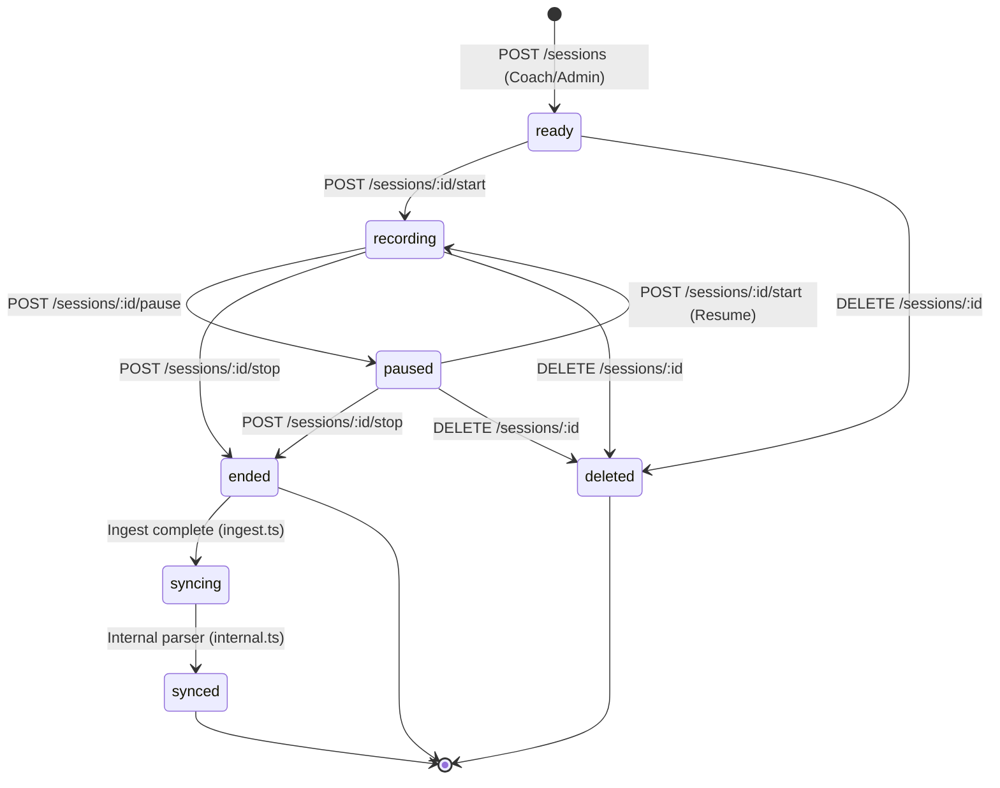

# Sessions API (Phase 1)

The Sessions API manages training sessions and competitive matches, tracking the complete session lifecycle from initial scheduling through live recording, participant enrollment, and session finalization. All routes are JWT-authenticated and mounted at `/sessions` (source: `src/routes/sessions.ts`). Access to an individual session is gated by `loadSessionAccess` (source: `src/lib/session-access.ts`), which admits super admins, the session creator, org admins of the session's organisation, coaches/sub-coaches of the session's team, and enrolled athletes.

Per-session metrics, summaries, and targets live under `/sessions/:id/metrics`, `/sessions/:id/summary`, and `/sessions/:id/targets` but are owned by `metrics.ts` — see [Metrics & Targets](./metrics). Telemetry upload, sync, and point retrieval live under `/sessions/:id/ingest-url|complete|sync|telemetry` and are owned by `ingest.ts` — see [Ingestion Pipeline](../ingestion-pipeline). Those sub-paths are not documented here.

---

## Session Lifecycle State Machine

The router writes a small set of `status` values directly. `syncing` and `synced` are set by the ingestion pipeline (`ingest.ts` / `internal.ts`), not by the routes below.



---

## 1. List Sessions (`GET /sessions`)

Lists sessions visible to the caller. Visibility is enforced in-memory after the query by `filterVisibleSessions`.

- **Path:** `/sessions`
- **Method:** `GET`
- **Auth:** JWT
- **Required Roles:** none — manual visibility filter
- **Tenant Scope:** Team / User (super admin sees all; org admin sees org matches; others see sessions on their teams or that they created)
- **Query Parameters** (parsed manually via `sessionListQuery` on `c.req.query`):
  - `team_id` (`uuid`, optional): Filters `eq('team_id', …)`.
  - `status` (`string`, optional): Filters `eq('status', …)` (e.g. `ready`, `recording`, `paused`, `ended`, `syncing`, `synced`).
  - `limit` (`integer`, optional, default: `25`, coerced, `1`–`100`): Page size.
  - `offset` (`integer`, optional, default: `0`, coerced, min `0`): Page offset.

The DB query selects `*`, applies optional `team_id`/`status` filters, orders `created_at desc`, and ranges `offset` to `offset + limit - 1`. `filterVisibleSessions` then drops rows the caller cannot see: super admins keep all; org admins keep rows where `organisation_id === ctx.primaryOrganisationId`; everyone else keeps rows whose `team_id` is in their loaded `teamIds`, or where `created_by_user_id === user.id` when `team_id` is null.

### Response (`200 OK`)

```json
{
  "sessions": [
    {
      "id": "8ef0f0e0-47b1-4f67-88eb-116f1997380c",
      "organisation_id": "1a2b3c4d-5e6f-7890-1234-567890abcdef",
      "team_id": "22222222-3333-4444-5555-666666666666",
      "title": "Tactical Scrimmage & Speed Drills",
      "sport_id": "9df0f0e0-47b1-4f67-88eb-116f1997380d",
      "classification_id": "aef0f0e0-47b1-4f67-88eb-116f1997380e",
      "status": "recording",
      "sync_status": "pending",
      "planned_start_at": "2026-08-15T14:00:00.000Z",
      "planned_end_at": null,
      "actual_start_at": "2026-08-15T14:05:12.000Z",
      "actual_end_at": null,
      "data_point_count": 0,
      "firmware_session_id": "SSP-FW-20260815-01",
      "firmware_sport_code": "RUGBY_UNION",
      "source_device_id": null,
      "description": "Pitch conditioning block focusing on repeat sprints.",
      "scheduled_date": "2026-08-15",
      "created_by_user_id": "55555555-6666-7777-8888-999999999999",
      "created_at": "2026-08-15T13:00:00.000Z",
      "updated_at": "2026-08-15T14:05:12.000Z"
    }
  ]
}
```

---

## 2. Get Session Details (`GET /sessions/:id`)

Fetches a single session row with its participants and summaries nested.

- **Path:** `/sessions/:id`
- **Method:** `GET`
- **Auth:** JWT
- **Required Roles:** none — access via `loadSessionAccess`
- **Tenant Scope:** Team / Org / Self (per `loadSessionAccess`)
- **Path Parameters:**
  - `id` (`uuid`): Session ID.

`loadSessionAccess` loads the session's `id, organisation_id, team_id, created_by_user_id, source_device_id, firmware_session_id` and returns `403`/`404` before the handler queries. The handler then selects `*, session_participants(*), session_summaries(*)` by `id`; a missing row returns `404`.

### Response (`200 OK`)

```json
{
  "id": "8ef0f0e0-47b1-4f67-88eb-116f1997380c",
  "organisation_id": "1a2b3c4d-5e6f-7890-1234-567890abcdef",
  "team_id": "22222222-3333-4444-5555-666666666666",
  "title": "Tactical Scrimmage & Speed Drills",
  "sport_id": "9df0f0e0-47b1-4f67-88eb-116f1997380d",
  "classification_id": "aef0f0e0-47b1-4f67-88eb-116f1997380e",
  "status": "recording",
  "sync_status": "pending",
  "planned_start_at": "2026-08-15T14:00:00.000Z",
  "planned_end_at": null,
  "actual_start_at": "2026-08-15T14:05:12.000Z",
  "actual_end_at": null,
  "data_point_count": 0,
  "firmware_session_id": "SSP-FW-20260815-01",
  "firmware_sport_code": "RUGBY_UNION",
  "source_device_id": null,
  "description": "Pitch conditioning block focusing on repeat sprints.",
  "scheduled_date": "2026-08-15",
  "created_by_user_id": "55555555-6666-7777-8888-999999999999",
  "created_at": "2026-08-15T13:00:00.000Z",
  "updated_at": "2026-08-15T14:05:12.000Z",
  "session_participants": [
    {
      "id": "99999999-0000-1111-2222-333333333333",
      "session_id": "8ef0f0e0-47b1-4f67-88eb-116f1997380c",
      "athlete_id": "44444444-5555-6666-7777-888888888888",
      "device_assignment_id": "5fa85f64-5717-4562-b3fc-2c963f66afa8",
      "device_id": null,
      "organisation_id": "1a2b3c4d-5e6f-7890-1234-567890abcdef",
      "added_by_user_id": "55555555-6666-7777-8888-999999999999",
      "added_at": "2026-08-15T13:05:00.000Z",
      "status": "enrolled",
      "created_at": "2026-08-15T13:05:00.000Z",
      "updated_at": "2026-08-15T13:05:00.000Z"
    }
  ],
  "session_summaries": [
    {
      "id": "aaaaaaaa-bbbb-cccc-dddd-eeeeeeeeeeee",
      "session_id": "8ef0f0e0-47b1-4f67-88eb-116f1997380c",
      "organisation_id": "1a2b3c4d-5e6f-7890-1234-567890abcdef",
      "athlete_count": 1,
      "total_distance_meters": 7420.5,
      "total_sprint_count": 14,
      "max_speed_mps": 8.92,
      "average_intensity": null,
      "data_quality_status": "valid",
      "completed_at": "2026-08-15T15:30:00.000Z",
      "created_at": "2026-08-15T15:31:00.000Z",
      "updated_at": "2026-08-15T15:31:00.000Z"
    }
  ]
}
```

### Errors

| Status | Body | Cause |
| :---: | :--- | :--- |
| `403` | `{ "error": "Forbidden" }` | `loadSessionAccess` denied the caller. |
| `404` | `{ "error": "Session not found" }` | `loadSessionAccess` found no session row. |

---

## 3. Create Session (`POST /sessions`)

Schedules a new training session. The session is created with `status: 'ready'` and `sync_status: 'pending'`.

- **Path:** `/sessions`
- **Method:** `POST`
- **Auth:** JWT
- **Required Roles:** `coach`, `organisation_admin`, `ssp_super_admin` (via `requireRoles`; `coach` admits org admins and super admins via cascade)
- **Tenant Scope:** Team (caller must have access to `body.team_id`)

The handler loads `ctx` via `loadCallerContext`, validates team access with `canAccessTeam(user, body.team_id)` (delegates to `hasTeamResourceAccess`), and requires `ctx.primaryOrganisationId` (else `400 'User has no primary organisation'`). The insert adds `created_by_user_id: user.id`, `organisation_id: ctx.primaryOrganisationId`, `status: 'ready'`, `sync_status: 'pending'`, and the body fields.

### Request Body Schema (`createSession`)

```json
{
  "title": "High-Intensity Interval Training",
  "team_id": "22222222-3333-4444-5555-666666666666",
  "sport_id": "9df0f0e0-47b1-4f67-88eb-116f1997380d",
  "classification_id": "aef0f0e0-47b1-4f67-88eb-116f1997380e",
  "planned_start_at": "2026-08-16T08:00:00.000Z",
  "source_device_id": "6b7c8d9e-0f1a-2b3c-4d5e-6f7081920304",
  "description": "Pitch conditioning block focusing on repeat sprints.",
  "scheduled_date": "2026-08-16"
}
```

| Field | Type | Required | Constraints |
| :--- | :--- | :---: | :--- |
| `title` | string | yes | min `3`, max `200` |
| `team_id` | uuid | yes | caller must pass `canAccessTeam` |
| `sport_id` | uuid | yes | — |
| `classification_id` | uuid | yes | — |
| `planned_start_at` | ISO 8601 datetime | yes | `z.string().datetime()` |
| `source_device_id` | uuid | no | — |
| `description` | string | no | max `2000` |
| `scheduled_date` | ISO date | no | `z.string().date()` |

### Response (`201 Created`)

The created `sessions` row (full `select('*')`).

### Errors

| Status | Body | Cause |
| :---: | :--- | :--- |
| `400` | `{ "error": "User has no primary organisation" }` | Caller has no `primary_organisation_id` in `users`. |
| `400` | structured zValidator body | Body failed `createSession` validation. |
| `403` | `{ "error": "Forbidden" }` | `requireRoles` denied, or `canAccessTeam` failed. |
| `500` | `{ "error": "<message>" }` | Supabase insert error. |

---

## 4. Update Session (`PATCH /sessions/:id`)

Updates editable fields of a scheduled session. Does not change `status` or `sync_status`.

- **Path:** `/sessions/:id`
- **Method:** `PATCH`
- **Auth:** JWT
- **Required Roles:** `coach`, `organisation_admin`, `ssp_super_admin` (via `requireRoles`)
- **Tenant Scope:** per `loadSessionAccess`
- **Path Parameters:**
  - `id` (`uuid`): Session ID.

### Request Body Schema (`updateSession`)

All fields optional.

```json
{
  "title": "Tactical Scrimmage & Speed Drills (Revised)",
  "description": "Adjusted focus to repeat sprint sets.",
  "planned_start_at": "2026-08-16T09:00:00.000Z",
  "planned_end_at": "2026-08-16T10:30:00.000Z"
}
```

| Field | Type | Required | Constraints |
| :--- | :--- | :---: | :--- |
| `title` | string | no | min `3`, max `200` |
| `description` | string | no | max `2000` |
| `planned_start_at` | ISO 8601 datetime | no | `z.string().datetime()` |
| `planned_end_at` | ISO 8601 datetime | no | `z.string().datetime()` |

### Response (`200 OK`)

The updated `sessions` row.

### Errors

| Status | Body | Cause |
| :---: | :--- | :--- |
| `403` | `{ "error": "Forbidden" }` | `requireRoles` denied, or `loadSessionAccess` denied. |
| `404` | `{ "error": "Session not found" }` | `loadSessionAccess` found no session row. |
| `500` | `{ "error": "<message>" }` | Supabase update error. |

---

## 5. Start Session Recording (`POST /sessions/:id/start`)

Transitions a session to `recording`, stamps `actual_start_at` with the current time, and links the firmware session. Resuming a `paused` session re-enters `recording` via the same route.

- **Path:** `/sessions/:id/start`
- **Method:** `POST`
- **Auth:** JWT
- **Required Roles:** `coach`, `athlete`, `organisation_admin`, `ssp_super_admin` (via `requireRoles`; `athlete` is listed explicitly because `isAthlete` does not cascade — a coach is not admitted as an athlete)
- **Tenant Scope:** per `loadSessionAccess`
- **Path Parameters:**
  - `id` (`uuid`): Session ID.

### Request Body Schema (`startSession`)

```json
{
  "firmware_session_id": "SSP-FW-20260816-01",
  "firmware_sport_code": "RUGBY_UNION"
}
```

| Field | Type | Required | Constraints |
| :--- | :--- | :---: | :--- |
| `firmware_session_id` | string | yes | min `1`, max `100` |
| `firmware_sport_code` | string | no | min `1`, max `20` |

### Response (`200 OK`)

The updated `sessions` row with `status: 'recording'`, `actual_start_at: <now>`, `firmware_session_id`, and `firmware_sport_code` set.

### Errors

| Status | Body | Cause |
| :---: | :--- | :--- |
| `403` | `{ "error": "Forbidden" }` | `requireRoles` denied, or `loadSessionAccess` denied. |
| `404` | `{ "error": "Session not found" }` | `loadSessionAccess` found no session row. |
| `500` | `{ "error": "<message>" }` | Supabase update error. |

---

## 6. Pause Session (`POST /sessions/:id/pause`)

Temporarily pauses active recording. Sets `status: 'paused'`; no other fields change.

- **Path:** `/sessions/:id/pause`
- **Method:** `POST`
- **Auth:** JWT
- **Required Roles:** `coach`, `athlete`, `organisation_admin`, `ssp_super_admin` (via `requireRoles`)
- **Tenant Scope:** per `loadSessionAccess`
- **Path Parameters:**
  - `id` (`uuid`): Session ID.

No request body is read or validated.

### Response (`200 OK`)

The updated `sessions` row with `status: 'paused'`.

### Errors

| Status | Body | Cause |
| :---: | :--- | :--- |
| `403` | `{ "error": "Forbidden" }` | `requireRoles` denied, or `loadSessionAccess` denied. |
| `404` | `{ "error": "Session not found" }` | `loadSessionAccess` found no session row. |
| `500` | `{ "error": "<message>" }` | Supabase update error. |

---

## 7. Stop Session (`POST /sessions/:id/stop`)

Concludes the session, setting `status: 'ended'`, `actual_end_at`, and `data_point_count`.

- **Path:** `/sessions/:id/stop`
- **Method:** `POST`
- **Auth:** JWT
- **Required Roles:** `coach`, `athlete`, `organisation_admin`, `ssp_super_admin` (via `requireRoles`)
- **Tenant Scope:** per `loadSessionAccess`
- **Path Parameters:**
  - `id` (`uuid`): Session ID.

### Request Body Schema (`stopSession`)

```json
{
  "actual_end_at": "2026-08-16T09:45:00.000Z",
  "data_point_count": 8450
}
```

| Field | Type | Required | Constraints |
| :--- | :--- | :---: | :--- |
| `actual_end_at` | ISO 8601 datetime | yes | `z.string().datetime()` |
| `data_point_count` | integer | no | min `0`; written as `null` when omitted |

### Response (`200 OK`)

The updated `sessions` row with `status: 'ended'`, `actual_end_at`, and `data_point_count` set.

### Errors

| Status | Body | Cause |
| :---: | :--- | :--- |
| `403` | `{ "error": "Forbidden" }` | `requireRoles` denied, or `loadSessionAccess` denied. |
| `404` | `{ "error": "Session not found" }` | `loadSessionAccess` found no session row. |
| `500` | `{ "error": "<message>" }` | Supabase update error. |

---

## 8. Enroll Athlete (`POST /sessions/:id/participants`)

Adds an athlete as a session participant with `status: 'enrolled'`. `organisation_id` is taken from `access.session.organisation_id` and `added_by_user_id` from the caller.

- **Path:** `/sessions/:id/participants`
- **Method:** `POST`
- **Auth:** JWT
- **Required Roles:** `coach`, `organisation_admin`, `ssp_super_admin` (via `requireRoles`)
- **Tenant Scope:** per `loadSessionAccess`
- **Path Parameters:**
  - `id` (`uuid`): Session ID.

### Request Body Schema (`addParticipant`)

```json
{
  "athlete_id": "44444444-5555-6666-7777-888888888888",
  "device_assignment_id": "5fa85f64-5717-4562-b3fc-2c963f66afa8"
}
```

| Field | Type | Required | Constraints |
| :--- | :--- | :---: | :--- |
| `athlete_id` | uuid | yes | — |
| `device_assignment_id` | uuid | no | — |

### Response (`201 Created`)

The created `session_participants` row (full `select('*')`), including `session_id`, `athlete_id`, `device_assignment_id`, `organisation_id`, `added_by_user_id`, `status: 'enrolled'`.

### Errors

| Status | Body | Cause |
| :---: | :--- | :--- |
| `403` | `{ "error": "Forbidden" }` | `requireRoles` denied, or `loadSessionAccess` denied. |
| `404` | `{ "error": "Session not found" }` | `loadSessionAccess` found no session row. |
| `500` | `{ "error": "<message>" }` | Supabase insert error. |

---

## 9. Remove Athlete (`DELETE /sessions/:id/participants/:athleteId`)

Deletes the matching `session_participants` row for the session and athlete.

- **Path:** `/sessions/:id/participants/:athleteId`
- **Method:** `DELETE`
- **Auth:** JWT
- **Required Roles:** `coach`, `organisation_admin`, `ssp_super_admin` (via `requireRoles`)
- **Tenant Scope:** per `loadSessionAccess`
- **Path Parameters:**
  - `id` (`uuid`): Session ID.
  - `athleteId` (`uuid`): Athlete ID to remove.

No request body.

### Response (`200 OK`)

```json
{ "ok": true }
```

### Errors

| Status | Body | Cause |
| :---: | :--- | :--- |
| `403` | `{ "error": "Forbidden" }` | `requireRoles` denied, or `loadSessionAccess` denied. |
| `404` | `{ "error": "Session not found" }` | `loadSessionAccess` found no session row. |
| `500` | `{ "error": "<message>" }` | Supabase delete error. |

---

## 10. Delete Session (`DELETE /sessions/:id`)

Permanently deletes a session. No `requireRoles` gate — access is manual: the caller must be an `organisation_admin` or `ssp_super_admin`, or the session creator (`created_by_user_id === user.id`).

- **Path:** `/sessions/:id`
- **Method:** `DELETE`
- **Auth:** JWT
- **Required Roles:** none — manual admin or creator check
- **Tenant Scope:** Org / Self
- **Path Parameters:**
  - `id` (`uuid`): Session ID.

The handler selects `created_by_user_id, team_id` for the session. If no row, `404`. If the caller is neither admin (`organisation_admin` or `ssp_super_admin`) nor the creator (`created_by_user_id === user.id`), `403`. Otherwise it deletes the session row.

### Response (`200 OK`)

```json
{ "ok": true }
```

### Errors

| Status | Body | Cause |
| :---: | :--- | :--- |
| `403` | `{ "error": "Forbidden" }` | Caller is not an org/super admin and did not create the session. |
| `404` | `{ "error": "Not found" }` | No session row matched `id`. |
| `500` | `{ "error": "<message>" }` | Supabase delete error. |