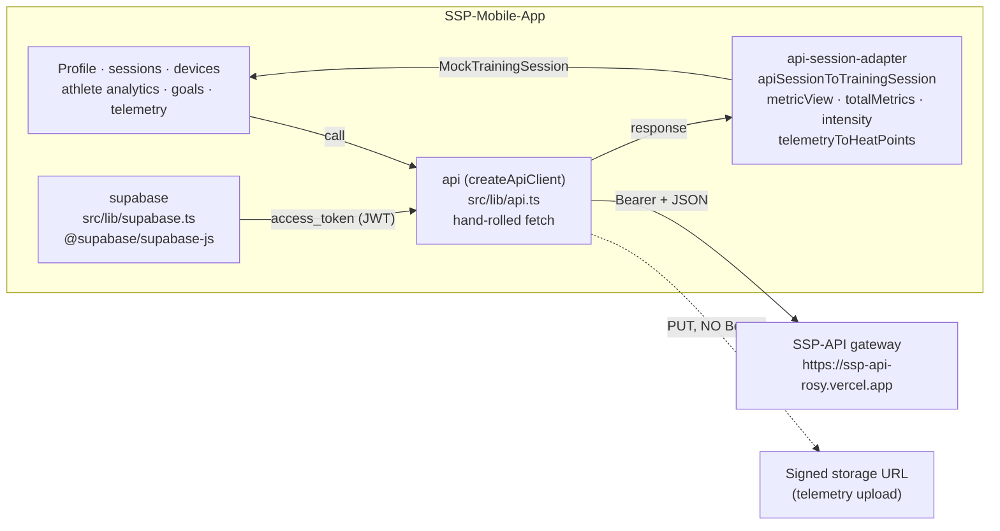

# API Client & Data Layer

::: warning Plainly stated
The SSP Mobile App talks to [SSP-API](../backend/index) through a **hand-rolled `fetch` client** in [`src/lib/api.ts`](https://github.com/IzandlaSystem/SSP-Mobile-App/blob/main/src/lib/api.ts): `createApiClient({ baseUrl, getAccessToken, fetchImpl })`. It is **NOT** Hono `hc()`, **NOT** `hono/client`, and there is **NO `AppType` contract import**. The backend *publishes* an `AppType` contract (see [Backend Client Contract](../backend/client-contract)); the mobile app does **not currently consume it**. The only `createClient` in this repo is `@supabase/supabase-js`'s auth client in `src/lib/supabase.ts`. The mobile app calls the same gateway paths as the typed web client through its own fetch wrapper.
:::

This page covers the client factory, the `request<T>` engine, the `ApiError` class, the exported singleton, the 35 authenticated gateway methods, `uploadToSignedUrl` (the one no-bearer call), response adapters, Supabase auth setup, and the hooks that carry real data into the UI.



---

## 1. The client: `src/lib/api.ts`

### `createApiClient({ baseUrl, getAccessToken, fetchImpl })`

The factory builds a client object whose every method funnels through one internal `request<T>` helper. It takes three options:

| Option | Type | Purpose |
| :--- | :--- | :--- |
| `baseUrl` | `string` | Gateway root. Trailing slashes are stripped (`root = baseUrl.replace(/\/+$/, "")`). |
| `getAccessToken` | `() => Promise<string \| null>` | Token provider. The exported `api` singleton wires this to `supabase.auth.getSession()`. |
| `fetchImpl` | `Fetch` (optional, default `fetch`) | Injectable for tests. `api.test.ts` passes a `vi.fn()` to assert URLs/headers without hitting the network. |

### `request<T>(path, init)`

Every gateway method goes through `request`. Its contract:

1. `const token = await getAccessToken()`: if there is no token, it throws `ApiError("You must sign in first.", 401)` **locally**, before any network call. `api.test.ts` asserts `fetchImpl` is never invoked in this case.
2. Sets headers: `Authorization: Bearer <token>`, `Accept: application/json`, and `Content-Type: application/json` only when a `body` is present and the caller hasn't already set one.
3. Calls `fetchImpl(${root}${path}, { ...init, headers })`.
4. Reads `content-type`; parses JSON only when the response is `application/json`, otherwise `payload` is `undefined`.
5. On `!response.ok`, throws `ApiError(errorPayload?.error ?? "API request failed (status)", status, errorPayload)`.
6. On success, returns `payload as T`.

### `ApiError`

```ts
export class ApiError extends Error {
  constructor(message: string, readonly status: number, readonly payload?: ApiErrorPayload);
  // name = "ApiError"
}
```

`ApiErrorPayload` is `{ error?: string; issues?: unknown }`, the gateway's error envelope. `api.test.ts` verifies a 403 `{ error: "Forbidden" }` surfaces as `error.message === "Forbidden"` and `error.status === 403`.

### The `api` singleton and defaults

```ts
const apiUrl = process.env.EXPO_PUBLIC_API_URL ?? "https://ssp-api-rosy.vercel.app";

export const api = createApiClient({
  baseUrl: apiUrl,
  getAccessToken: async () => {
    const { data, error } = await supabase.auth.getSession();
    if (error) throw error;
    return data.session?.access_token ?? null;
  },
});
```

- **Default `baseUrl`:** `https://ssp-api-rosy.vercel.app`, overridable at build time via `EXPO_PUBLIC_API_URL` (see [Configuration](./configuration)). All `EXPO_PUBLIC_*` vars are inlined at build time.
- **`getAccessToken`:** pulls the Supabase Auth JWT (`session.access_token`) from the persisted Supabase session. The gateway verifies this JWT server-side (see [Backend Auth & Security](../backend/auth-and-security)).
- **`ApiClient`** is exported as `ReturnType<typeof createApiClient>` for typing the client in tests or providers.

### `uploadToSignedUrl`: the no-bearer PUT

The one method that does **not** go through `request<T>`:

```ts
uploadToSignedUrl: async (signedUrl: string, body: BodyInit, contentType = "application/json") => {
  const response = await fetchImpl(signedUrl, {
    method: "PUT",
    headers: { "Content-Type": contentType },
    body,
  });
  if (!response.ok) throw new ApiError(`Telemetry upload failed (${response.status})`, response.status);
}
```

It PUTs the telemetry payload straight to a pre-signed storage URL returned by `createIngestUrl`. **No `Authorization` header is added** because the signed URL carries its own `token` query parameter granting short-lived write access. `api.test.ts` asserts `headers.get("Authorization")` is `null` for this call. This is the upload step in the [Ingestion Pipeline](../backend/ingestion-pipeline); see [Tracker & Sync](./tracker-and-sync) for how `sync.ts` chains `createIngestUrl → uploadToSignedUrl → completeIngest`.

---

## 2. Response types

All types live in `src/lib/api.ts`. They mirror the gateway's row shapes but are **re-declared locally** (not imported from the backend contract), a consequence of not consuming `AppType`.

| Type | Shape | Notes |
| :--- | :--- | :--- |
| `ApiRole` | `"athlete" \| "coach" \| "sub_coach" \| "organisation_admin" \| "ssp_super_admin"` | Matches the backend role union. The app's UI role is `coach` or `player`; `session.ts` maps `athlete → player` (see [Auth & Onboarding](./auth-and-onboarding)). |
| `ApiMe` | `{ id, email, phone, full_name, avatar_url, primary_organisation_id, is_active, roles: ApiRole[] }` | Profile identity. Surfaced by `useApiMe`. |
| `ApiSession` | Session row with `status: "ready" \| "recording" \| "paused" \| "ended" \| string`, `firmware_session_id`, `firmware_sport_code`, `data_point_count`, optional `session_participants[]`, `session_summaries[]` | The `firmware_session_id` is what `startSession` sends to the tracker and what `sync.ts` uploads against. |
| `ApiSessionParticipant` | `{ athlete_id, status, device_assignment_id? }` | Nested on `ApiSession`. |
| `ApiSessionMetric` | Per-athlete metrics: `distance_meters`, `duration_seconds`, `max_speed_mps`, `sprint_count`, `workload_index`, `step_count_delta`, `impact_count`, `acceleration_magnitude_summary`, `load_balance_score`, `data_quality_status`, `recorded_at` | Converted by `api-session-adapter` to UI `SessionMetrics`. |
| `ApiSessionSummary` | Aggregate row: `total_distance_meters`, `max_speed_mps`, `total_sprint_count`, `athlete_count`, `average_intensity`, `completed_at`, quality/timestamps | This table has no `duration_seconds`; duration is per-athlete metric data. |
| `ApiTelemetryPoint` | `{ point_index, athlete_id, timestamp, latitude, longitude, speed_mps, accel_magnitude, step_count_delta }` | Paged by `getTelemetry`; location and sensor fields may be `null`. |
| `ApiSyncRecord` | `{ id, session_id, sync_status, error_message, payload_size_bytes, point_count, payload_format: "json"|"ndjson"|"msgpack", compression: "none"|"gzip", created_at, updated_at }` | |
| `ApiDevice` | Registered tracker identity, display/BLE name, hardware model, status, firmware, last battery/seen time, assignments and pairing states | Combined with local BLE bindings by `DeviceProvider`. |
| `ApiAthlete` / `ApiGoal` | Athlete roster/identity and the caller-visible goal rows | Feed device assignment, player analytics and Home goals. |
| `ApiDeviceClaim` | `{ device, pairing, assignment, reused }` | Result of app-scoped `POST /devices/claim`. |
| `ApiErrorPayload` | `{ error?: string; issues?: unknown }` | The gateway error envelope, attached to `ApiError.payload`. |

---

## 3. Gateway methods (endpoint table)

::: warning Source is ahead of the endpoint-map test
`createApiClient` currently exposes **35 authenticated gateway methods** plus `uploadToSignedUrl`. The test named `"maps every mobile API function..."` covers 32 of those gateway methods; it does not yet include `getMyAthlete`, `getAthleteAnalytics`, or `listGoals`. The table below follows `api.ts`, not the stale test name.
:::

| # | Method | Path | HTTP | Backend route doc |
| :---: | :--- | :--- | :--- | :--- |
| 1 | `getMe()` | `/me` | GET | [Users](../backend/routes/users) |
| 2 | `updateMe(body)` | `/me` | PATCH | [Users](../backend/routes/users) |
| 3 | `listSessions(params?)` | `/sessions` | GET | [Sessions](../backend/routes/sessions) |
| 4 | `createSession(body)` | `/sessions` | POST | [Sessions](../backend/routes/sessions) |
| 5 | `getSession(id)` | `/sessions/{id}` | GET | [Sessions](../backend/routes/sessions) |
| 6 | `updateSession(id, body)` | `/sessions/{id}` | PATCH | [Sessions](../backend/routes/sessions) |
| 7 | `deleteSession(id)` | `/sessions/{id}` | DELETE | [Sessions](../backend/routes/sessions) |
| 8 | `startSession(id, body)` | `/sessions/{id}/start` | POST | [Sessions](../backend/routes/sessions) |
| 9 | `pauseSession(id)` | `/sessions/{id}/pause` | POST | [Sessions](../backend/routes/sessions) |
| 10 | `stopSession(id, body)` | `/sessions/{id}/stop` | POST | [Sessions](../backend/routes/sessions) |
| 11 | `addParticipant(id, body)` | `/sessions/{id}/participants` | POST | [Sessions](../backend/routes/sessions) |
| 12 | `removeParticipant(id, athleteId)` | `/sessions/{id}/participants/{athleteId}` | DELETE | [Sessions](../backend/routes/sessions) |
| 13 | `getMetrics(id)` | `/sessions/{id}/metrics` | GET | [Metrics](../backend/routes/metrics) |
| 14 | `getAthleteMetrics(id, athleteId)` | `/sessions/{id}/metrics/{athleteId}` | GET | [Metrics](../backend/routes/metrics) |
| 15 | `getSummary(id)` | `/sessions/{id}/summary` | GET | [Sessions](../backend/routes/sessions) |
| 16 | `getTargets(id)` | `/sessions/{id}/targets` | GET | [Goals](../backend/routes/goals) |
| 17 | `createTarget(id, body)` | `/sessions/{id}/targets` | POST | [Goals](../backend/routes/goals) |
| 18 | `updateTarget(id, targetId, body)` | `/sessions/{id}/targets/{targetId}` | PATCH | [Goals](../backend/routes/goals) |
| 19 | `createIngestUrl(id, body?)` | `/sessions/{id}/ingest-url` | POST | [Ingestion Pipeline](../backend/ingestion-pipeline) |
| 20 | `completeIngest(id, body)` | `/sessions/{id}/complete` | POST | [Ingestion Pipeline](../backend/ingestion-pipeline) |
| 21 | `getSyncRecords(id)` | `/sessions/{id}/sync` | GET | [Ingestion Pipeline](../backend/ingestion-pipeline) |
| 22 | `getTelemetry(id, params?)` | `/sessions/{id}/telemetry` | GET | [Ingestion Pipeline](../backend/ingestion-pipeline) |
| 23 | `listDevices()` | `/devices` | GET | [Devices](../backend/routes/devices) |
| 24 | `listMyDevices()` | `/devices/mine` | GET | [Devices](../backend/routes/devices) |
| 25 | `getDevice(id)` | `/devices/{id}` | GET | [Devices](../backend/routes/devices) |
| 26 | `claimDevice(body)` | `/devices/claim` | POST | [Devices](../backend/routes/devices) |
| 27 | `renameDevice(id, displayName)` | `/devices/{id}/name` | PATCH | [Devices](../backend/routes/devices) |
| 28 | `listAthletes()` | `/athletes` | GET | [Athletes](../backend/routes/athletes) |
| 29 | `getMyAthlete()` | `/athletes/me` | GET | [Athletes](../backend/routes/athletes) |
| 30 | `getAthleteAnalytics(id, params?)` | `/athletes/{id}/analytics` | GET | [Analytics](../backend/routes/analytics) |
| 31 | `listGoals()` | `/goals` | GET | [Goals](../backend/routes/goals) |
| 32 | `pairDevice(id, body)` | `/devices/{id}/pair` | POST | [Devices](../backend/routes/devices) |
| 33 | `unpairDevice(id)` | `/devices/{id}/unpair` | POST | [Devices](../backend/routes/devices) |
| 34 | `assignDevice(id, athleteId)` | `/devices/{id}/assign` | POST | [Devices](../backend/routes/devices) |
| 35 | `unassignDevice(id)` | `/devices/{id}/assign` | DELETE | [Devices](../backend/routes/devices) |

::: details The signed-URL PUT (not a gateway endpoint)
| Method | Path | HTTP | Bearer? |
| :--- | :--- | :--- | :--- |
| `uploadToSignedUrl(signedUrl, body, contentType?)` | a pre-signed storage URL returned by `createIngestUrl` | PUT | **None** (the URL's own `token` query param authorizes the write). |
This is a client method but not a gateway route, so it is not counted in the 35 authenticated methods above. `sync.ts` uses it to push `toTelemetryEnvelope` output to object storage, then calls `completeIngest` to close the sync record. See [Tracker & Sync](./tracker-and-sync).
:::

### Query-string helpers

`listSessions`, `getTelemetry`, and `getAthleteAnalytics` build query strings via an internal `queryString()` helper that only appends keys whose value is not `undefined`:

- `listSessions({ teamId?, status?, limit?, offset? })` → `?team_id=…&status=…&limit=…&offset=…`
- `getTelemetry(id, { athleteId?, afterIndex?, limit? })` → `?athlete_id=…&after_index=…&limit=…`
- `getAthleteAnalytics(id, { from?, to? })` → `?from=…&to=…`

`api.test.ts` asserts `listSessions({ teamId: "team-1", limit: 10, offset: 20 })` produces exactly `https://api.example.test/sessions?team_id=team-1&limit=10&offset=20`.

---

## 4. Session adapter: `src/lib/api-session-adapter.ts`

The gateway returns raw `ApiSession` / `ApiSessionMetric[]` / `ApiTelemetryPoint[]`. The dashboard UI renders `MockTrainingSession` (the shared session shape from `src/components/dashboard/session-history.ts`). The adapter bridges the two.

::: warning Naming
`MockTrainingSession` is the UI type, not a fake. It is the single session shape the dashboard components consume; only its name still carries "Mock" for historical reasons. Real API data flows through `apiSessionToTrainingSession` into this type.
:::

| Function | Input | Output | Conversion |
| :--- | :--- | :--- | :--- |
| `apiSessionToTrainingSession(session, metrics=[], telemetry=[], athleteId?)` | API row + metrics + telemetry + optional athlete focus | `MockTrainingSession` | Picks `actual_start_at ?? planned_start_at ?? created_at` for `startsAt`; resolves `duration_seconds` from the matching athlete's metric (or first metric, or 3600s fallback, floored at 60s); builds `teamMetrics` via `totalMetrics`, `playerMetrics` via `metricView`, `gpsPoints` via `telemetryToHeatPoints`, `intensity` from the athlete-or-team load. |
| `metricView(metric?)` | one `ApiSessionMetric` | `SessionMetrics` | `distance_meters / 1000 → distanceKm`; `max_speed_mps * 3.6 → maxSpeedKmh`; `averageSpeedKmh = distanceKm / durationHours` (guarding zero duration); `workload_index → trainingLoadAu`; `sprint_count → sprints`; `impact_count → accelerations`. Returns `EMPTY_METRICS` when given no metric. |
| `totalMetrics(metrics[])` | many metrics | one `SessionMetrics` | Sums `distanceKm`/`sprints`/`accelerations`, means `averageSpeedKmh`, max of `maxSpeedKmh`, **rounds** the mean of `trainingLoadAu`. |
| `intensity(metrics)` | `SessionMetrics` | `"Max" \| "High" \| "Moderate" \| "Low"` | `trainingLoadAu >= 85 → "Max"`; `>= 65 → "High"`; `>= 35 → "Moderate"`; else `"Low"`. |
| `telemetryToHeatPoints(telemetry)` | `ApiTelemetryPoint[]` | `GpsHeatPoint[]` | Drops points with null lat/lng; normalizes longitude to `x ∈ [0,1]` and latitude to `y ∈ [0,1]` (inverted, so north is up); `intensity = speed_mps / maxSpeed`. Returns `[]` when no located points. |

The adapter is the only place raw API shapes are translated for the UI. It does **not** fabricate data; empty metrics/telemetry yield `EMPTY_METRICS` and `[]` respectively.

---

## 5. Supabase client: `src/lib/supabase.ts`

The Supabase client provides **auth only** on the mobile side. All data reads/writes go through the gateway `api`, not PostgREST.

```ts
import "react-native-url-polyfill/auto";
import AsyncStorage from "@react-native-async-storage/async-storage";
import { createClient } from "@supabase/supabase-js";
import { AppState, Platform } from "react-native";
```

| Concern | Setting | Source |
| :--- | :--- | :--- |
| URL | `process.env.EXPO_PUBLIC_SUPABASE_URL` | required, throws if missing |
| Anon/publishable key | `process.env.EXPO_PUBLIC_SUPABASE_PUBLISHABLE_KEY \|\| process.env.EXPO_PUBLIC_SUPABASE_ANON_KEY` | fallback to the legacy `ANON_KEY` name; throws if both absent |
| `auth.storage` | `Platform.OS === "web" ? undefined : AsyncStorage` | AsyncStorage on native; on web the SDK uses its browser storage default (normally local storage when available) |
| `autoRefreshToken` | `true` | |
| `persistSession` | `true` | session persisted to `storage` |
| `detectSessionInUrl` | `false` | a mobile app, not a browser redirect flow |
| AppState refresh | on native, `AppState.addEventListener("change", …)` calls `startAutoRefresh()` when `"active"` and `stopAutoRefresh()` otherwise | keeps the JWT fresh when the app returns to foreground |

The thrown error is `"Missing EXPO_PUBLIC_SUPABASE_URL or EXPO_PUBLIC_SUPABASE_PUBLISHABLE_KEY / EXPO_PUBLIC_SUPABASE_ANON_KEY"`. The app will not boot without these (see [Configuration](./configuration)). The `api.getAccessToken` token provider reads the access token this client persists.

### Session role helper: `src/lib/session.ts`

`Role` is `"coach" | "player"` (the UI role, distinct from `ApiRole`). `getUserRole()` resolves it in priority order:

1. `supabase.auth.getUser()` → `user.user_metadata.role`: `"coach"` → coach, `"athlete"` or `"player"` → player.
2. AsyncStorage key `"user-role"` (set by `setUserRole`).
3. Default `"coach"`.

`shouldRememberSession()` reads `"remember-session"` and returns `true` unless the stored value is exactly `"false"`. `setRememberSession(b)` writes `String(b)`. `clearUserRole()` removes the key. These power the entry gate and the RememberMe switch on the auth screen (see [Auth & Onboarding](./auth-and-onboarding)).

---

## 6. Hooks

The UI has focused hooks for profile, sessions, athlete analytics, goals, and paginated telemetry. `useRoleGuard` reads local/Supabase role state rather than gateway data. See [Dashboard & Analytics](./dashboard-and-analytics) for the exact screen-by-screen real-vs-mock boundary.

| Hook | Gateway calls | Consumer |
| :--- | :--- | :--- |
| `useApiMe` | `getMe` | Home/Profile identity |
| `useApiSessions` / `useApiSession` | sessions, metrics, telemetry | Analytics history and API session detail |
| `useAthleteAnalytics` | `getMyAthlete`, `getAthleteAnalytics` | Player charts and weekly performance |
| `useMyGoals` | `listGoals` | Player Home goal progress |
| `useSessionTelemetry` / `useTelemetryZoom` | paginated `getTelemetry` | Player Analytics drill-down |

### `useApiMe()`: `src/hooks/use-api-me.ts`

```ts
export function useApiMe(): { data: ApiMe | null; error: string | null }
```

Calls `api.getMe()` once on mount, sets `data` on success or `error` (the `Error`/`ApiError` message, else `"Unable to load profile."`) on failure. Uses an `active` flag so a fast unmount doesn't setState after teardown. Used by the coach/player profile screens and the home identity cards.

### `useApiSessions()` / `useApiSession(sessionId, athleteId?)`: `src/hooks/use-api-sessions.ts`

**`useApiSessions()`** returns `{ data: MockTrainingSession[]; loading: boolean; error: string | null }`:

1. `supabase.auth.getSession()`: if there is no session, returns `{ data: [], loading: false, error: null }` immediately (no API call).
2. `api.listSessions({ limit: 100 })`.
3. Maps each `ApiSession` through `apiSessionToTrainingSession(session)` (no per-athlete focus; `metrics` and `telemetry` default to `[]`).
4. Sets the array, or an error message on failure.

Used by `SessionHistorySection` on both coach and player analytics screens. This is the **real** session history list, not a `MOCK_*` array.

**`useApiSession(sessionId, athleteId?)`** returns `{ data: MockTrainingSession | null; loading: boolean; error: string | null }`:

1. `Promise.all([api.getSession(id), api.getMetrics(id).catch(() => ({ metrics: [] })), api.getTelemetry(id, { athleteId, limit: 5000 }).catch(() => ({ points: [], next_after_index: -1, has_more: false }))])`.
2. The `getMetrics` and `getTelemetry` calls **fail open**: a missing-metrics/telemetry response degrades to empty arrays rather than failing the whole detail.
3. `apiSessionToTrainingSession(session, metrics, telemetry, athleteId)` assembles the `MockTrainingSession`.
4. Error message fallbacks: `"Unable to load this session."`.

Used by `SessionDetailScreen` (the bounded Previous/Next detail view). The 5000-point telemetry cap feeds the heatmap; `telemetryToHeatPoints` normalizes it.

### `useRoleGuard(allowedRole)`: `src/hooks/useRoleGuard.ts`

```ts
export function useRoleGuard(allowedRole: Role): void
```

On mount, resolves `getUserRole()`; if the actual role differs from `allowedRole`, `router.replace`s to that role's tab (coach → `/(coach)/(tabs)/home`, player → `/(player)/(tabs)/dashboard`). This is the guard mounted in each role group's `_layout.tsx` (see [Architecture](./architecture)). An `active` flag prevents a replace after unmount.

`useRoleGuard` is UI routing only. Because `getUserRole` may fall back to `user_metadata` or AsyncStorage, it must not be treated as authorization; the gateway remains responsible for enforcing verified roles.

---

## 7. Tests

### `src/lib/api.test.ts` (vitest)

| Test | Asserts |
| :--- | :--- |
| `"adds the Supabase bearer token and serializes list filters"` | `Authorization: Bearer <jwt>` is set; `listSessions({ teamId, limit, offset })` produces the exact query string `?team_id=team-1&limit=10&offset=20`. |
| `"fails locally when no authenticated session is available"` | `getAccessToken` returning `null` rejects with `{ name: "ApiError", status: 401 }` **and** `fetchImpl` is never called. |
| `"surfaces the API error envelope and status"` | A 403 `{ error: "Forbidden" }` response throws an `ApiError` with `message === "Forbidden"` and `status === 403`. |
| `"uploads telemetry directly without leaking the API bearer token"` | `uploadToSignedUrl` sends `Content-Type: application/json`, `method: PUT`, and **no** `Authorization` header. |
| `"maps every mobile API function to its gateway method and path"` | 32 gateway methods are invoked and their URL/verb asserted. Despite its name, the array currently omits the three newer athlete/goals methods; this is a coverage gap. `uploadToSignedUrl` has its own no-bearer test. |
| `"sends the app-scoped claim without an organisation or hardware serial"` | `claimDevice` sends the app instance, BLE id/name and display name without client-supplied organisation or serial identity. |

### `src/lib/api-session-adapter.test.ts` (vitest)

Unit conversions (`m → km`, `mps → kmh × 3.6`), `intensity` boundaries (e.g. `trainingLoadAu` 70 → `"High"`), and `telemetryToHeatPoints` normalization (lat/lng to `[0,1]` x/y, speed-scaled intensity).

::: tip Where the test runner details live
Both files are `.test.ts` and run under `vitest`. See [Testing](./testing) for the dual-runner setup (`vitest run` + `node --test` for `.test.mjs` source-contract tests).
:::

---

## Known contract-maintenance gaps

- Mobile response types are locally re-declared instead of inferred from SSP-API's exported `AppType`, so backend/mobile drift is possible.
- The endpoint-map test has not caught up with the three athlete/goals methods noted above.
- `createTarget` is the actual method name for `POST /sessions/{id}/targets`; older notes called it `setTargets`.

---

## 8. Related

- [Backend Client Contract](../backend/client-contract): the `AppType` / `hc<AppType>()` typed RPC the **web** app uses. The mobile app calls the same paths via its own fetch client; it does not import `AppType`.
- [Backend API Reference](../backend/api-reference): per-resource endpoint details for the gateway the mobile `api` calls.
- [Backend Auth & Security](../backend/auth-and-security): how the gateway verifies the Supabase JWT the mobile `getAccessToken` returns.
- [Backend Ingestion Pipeline](../backend/ingestion-pipeline): `createIngestUrl → uploadToSignedUrl → completeIngest`, the sync flow `src/features/tracker/sync.ts` drives.
- [Tracker & Sync](./tracker-and-sync): the live tracking + firmware-session upload path that consumes `startSession`/`stopSession`/`createIngestUrl`/`completeIngest`.
- [Auth & Onboarding](./auth-and-onboarding): the sign-in flow that establishes the Supabase session `getAccessToken` reads from.
- [Dashboard & Analytics](./dashboard-and-analytics): which screens consume `useApiMe` / `useApiSessions` / `useApiSession` (and which use empty `MOCK_*`).
- [Configuration](./configuration): `EXPO_PUBLIC_API_URL`, `EXPO_PUBLIC_SUPABASE_URL`, and `EXPO_PUBLIC_SUPABASE_PUBLISHABLE_KEY`.
