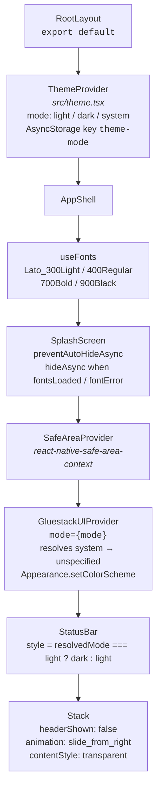
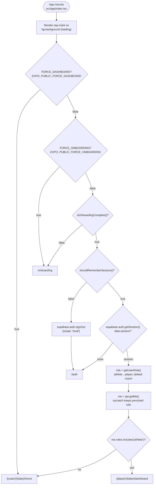
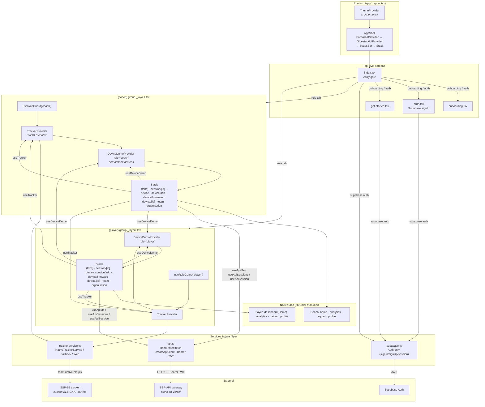

# Mobile App Architecture & Navigation

The **SSP-Mobile-App** is an Expo (React Native) companion app for SSP-S1 trackers, serving coaches and athletes with equal priority. Its navigation layer is built on **Expo Router** with file-based routing and `experiments.typedRoutes` enabled, split into two role-scoped route groups, `(coach)` and `(player)`, each gated by a role guard and each presenting its own native tab bar. This page documents the shell, the route tree, the entry-gate decision flow, and the navigation conventions the app enforces. Screen *content* (what each dashboard, device, or tracker screen renders) lives in the sibling docs cross-linked at the bottom.

## App Shell & Provider Hierarchy

Source: `src/app/_layout.tsx`, `src/theme.tsx`, `components/ui/gluestack-ui-provider/index.tsx`.

The root export is `RootLayout`, which wraps the entire app in `ThemeProvider` and then renders `AppShell`. `AppShell` is responsible for font loading, splash control, and assembling the native provider stack.



### Font loading and splash control

`AppShell` loads the four Lato faces via `useFonts({ Lato_300Light, Lato_400Regular, Lato_700Bold, Lato_900Black })` from `@expo-google-fonts/lato`. `SplashScreen.preventAutoHideAsync()` is called at module load so the native splash stays visible while fonts load (no text flash). Once `fontsLoaded || fontError` is true, a `useEffect` calls `SplashScreen.hideAsync()`. Until then the component returns `null`. The Lato family is the only type family; Figtree is forbidden (see [Design System](./design-system)).

### Resolved color mode and status bar

`useTheme().mode` is `light | dark | system`. The resolved scheme is `mode === "system" ? (systemScheme ?? "light") : mode`, where `systemScheme` comes from React Native's `useColorScheme()`. The status bar style is `resolvedMode === "light" ? "dark" : "light"`. `GluestackUIProvider` receives the raw `mode` and is responsible for resolving `system` to `"unspecified"` and calling `Appearance.setColorScheme(resolvedMode)` so native system-theme overrides clear correctly.

### Root Stack

The root `Stack` is configured with <code v-pre>screenOptions=&#123;&#123; headerShown: false, contentStyle: &#123; backgroundColor: "transparent" &#125;, animation: "slide_from_right" &#125;&#125;</code>. It declares four top-level screens, in order:

| # | Screen name | File |
| :-: | :--- | :--- |
| 1 | `index` | `src/app/index.tsx` (entry gate) |
| 2 | `onboarding` | `src/app/onboarding.tsx` |
| 3 | `get-started` | `src/app/get-started.tsx` |
| 4 | `auth` | `src/app/auth.tsx` |

Everything below these (the role groups and their tab screens) mounts inside the `(coach)` and `(player)` groups, not at the root.

## Expo Router & typedRoutes

Source: `app.json`, `tsconfig.json`, route files under `src/app/`.

Routing is **file-based** under `src/app/`. Expo Router maps the directory tree to routes: `index.tsx` is the route leaf, `_layout.tsx` is the layout for a directory, and parentheses denote **route groups** that group files without contributing a segment to the URL (e.g. `src/app/(coach)/device/add.tsx` is the route `/(coach)/device/add`, and `(coach)` is a grouping-only segment).

`app.json` sets `experiments.typedRoutes: true`, so `router.push` / `router.replace` accept typed `Href` values. Where a path is built from a dynamic segment the app casts through `as Href` (for example `src/app/(coach)/device.tsx` uses `router.push("/(coach)/device/add" as Href)`). `tsconfig.json` extends `expo/tsconfig/base` with `strict: true` and the path alias `@/* -> [./src/*, ./*]`.

Each role group layout exports `unstable_settings = { initialRouteName: "(tabs)" }` so deep links and initial mounts land on the tab group rather than a push screen.

## Route Tree

The full route tree, with file paths relative to the mobile repo root. Group `_layout.tsx` files apply the role guard and wrap their screens in `TrackerProvider` + `DeviceDemoProvider`; the `(tabs)/_layout.tsx` files declare the native tab bar.

### Top-level routes

| Route | File | Purpose |
| :--- | :--- | :--- |
| `/` | `src/app/index.tsx` | Entry gate (see [Entry gate flow](#entry-gate-flow)) |
| `/onboarding` | `src/app/onboarding.tsx` | 3-page onboarding carousel |
| `/get-started` | `src/app/get-started.tsx` | Multi-step registration wizard |
| `/auth` | `src/app/auth.tsx` | Supabase sign-in |

### Coach group `(coach)`

Layout: `src/app/(coach)/_layout.tsx`. `useRoleGuard("coach")`, `unstable_settings.initialRouteName: "(tabs)"`, wraps in `TrackerProvider` > `DeviceDemoProvider role="coach"` > `Stack` (`headerShown: false`).

| Route | File | Screen component |
| :--- | :--- | :--- |
| `/(coach)/(tabs)` | `src/app/(coach)/(tabs)/_layout.tsx` | NativeTabs (home/analytics/squad/profile) |
| `/(coach)/(tabs)/home` | `src/app/(coach)/(tabs)/home.tsx` | `CoachHomeScreen` |
| `/(coach)/(tabs)/analytics` | `src/app/(coach)/(tabs)/analytics.tsx` | Coach analytics |
| `/(coach)/(tabs)/squad` | `src/app/(coach)/(tabs)/squad.tsx` | Squad list |
| `/(coach)/(tabs)/profile` | `src/app/(coach)/(tabs)/profile.tsx` | Coach profile |
| `/(coach)/session/[id]` | `src/app/(coach)/session/[id].tsx` | `SessionDetailScreen role="coach"` |
| `/(coach)/device` | `src/app/(coach)/device.tsx` | `DeviceHubScreen role="coach"` |
| `/(coach)/device/add` | `src/app/(coach)/device/add.tsx` | `AddDeviceScreen role="coach"` |
| `/(coach)/device/firmware` | `src/app/(coach)/device/firmware.tsx` | `FirmwareTrackerScreen` |
| `/(coach)/device/[id]` | `src/app/(coach)/device/[id].tsx` | `DeviceDetailsScreen role="coach"` |
| `/(coach)/team` | `src/app/(coach)/team.tsx` | Read-only team details |
| `/(coach)/organisation` | `src/app/(coach)/organisation.tsx` | Read-only org details |

### Player group `(player)`

Layout: `src/app/(player)/_layout.tsx`. `useRoleGuard("player")`, `unstable_settings.initialRouteName: "(tabs)"`, wraps in `TrackerProvider` > `DeviceDemoProvider role="player"` > `Stack` (`headerShown: false`). The player tab group uses `dashboard` as the route name (with the label "Home") rather than `home`.

| Route | File | Screen component |
| :--- | :--- | :--- |
| `/(player)/(tabs)` | `src/app/(player)/(tabs)/_layout.tsx` | NativeTabs (dashboard/analytics/trainer/profile) |
| `/(player)/(tabs)/dashboard` | `src/app/(player)/(tabs)/dashboard.tsx` | `PlayerDashboardScreen` |
| `/(player)/(tabs)/analytics` | `src/app/(player)/(tabs)/analytics.tsx` | Player analytics |
| `/(player)/(tabs)/trainer` | `src/app/(player)/(tabs)/trainer.tsx` | Trainer / today's session |
| `/(player)/(tabs)/profile` | `src/app/(player)/(tabs)/profile.tsx` | Player profile |
| `/(player)/session/[id]` | `src/app/(player)/session/[id].tsx` | `SessionDetailScreen role="player"` |
| `/(player)/device` | `src/app/(player)/device.tsx` | `DeviceHubScreen role="player"` |
| `/(player)/device/add` | `src/app/(player)/device/add.tsx` | `AddDeviceScreen role="player"` |
| `/(player)/device/firmware` | `src/app/(player)/device/firmware.tsx` | `FirmwareTrackerScreen` |
| `/(player)/device/[id]` | `src/app/(player)/device/[id].tsx` | `DeviceDetailsScreen role="player"` |
| `/(player)/team` | `src/app/(player)/team.tsx` | Read-only team details |
| `/(player)/organisation` | `src/app/(player)/organisation.tsx` | Read-only org details |

## Entry Gate Flow

Source: `src/app/index.tsx`. Verified by `src/app/index-source.test.mjs`.

`src/app/index.tsx` is the first screen mounted. It renders only the SSP mark on a neutral background while it decides where to route, so the entry surface is "identity only, never a dashboard or auth state that may be replaced a moment later." The decision flow, in order:

1. **`FORCE_DASHBOARD` override**: `process.env.EXPO_PUBLIC_FORCE_DASHBOARD === "true"` → `router.replace("/(coach)/(tabs)/home")` and return. (This var is referenced in `index.tsx` but is **not** listed in `.env.example`; it is a dev-only convenience.)
2. **`FORCE_ONBOARDING` override**: `process.env.EXPO_PUBLIC_FORCE_ONBOARDING === "true"` → `router.replace("/onboarding")` and return.
3. **Onboarding completion**: `isOnboardingComplete()` (AsyncStorage key `"onboarding-complete"`). If incomplete → `router.replace("/onboarding")`.
4. **Remember-session flag**: `shouldRememberSession()` (AsyncStorage key `"remember-session"`, treated as `true` unless the stored value is exactly `"false"`). If the user did not choose to stay signed in → `supabase.auth.signOut({ scope: "local" })` then `router.replace("/auth")`.
5. **Supabase session**: `supabase.auth.getSession()`. If no session → `router.replace("/auth")`.
6. **Role resolution**: start with `getUserRole()` (supabase `user_metadata.role` with `athlete` mapped to `player`, then AsyncStorage `"user-role"`, default `"coach"`). Call `api.getMe()`; if `me.roles.includes("athlete")` set role to `"player"`, otherwise `"coach"`. If `api.getMe()` throws (e.g. API temporarily unreachable) the persisted role is kept.
7. **Role tab**: `router.replace(role === "player" ? "/(player)/(tabs)/dashboard" : "/(coach)/(tabs)/home")`.



`api.getMe()` is a hand-rolled `fetch` against the SSP-API gateway, not a Hono `hc()` client or an `AppType` contract import. See [API Client](./api-client) and the [Backend Client Contract](../backend/client-contract).

## Role Guards

Source: `src/hooks/useRoleGuard.ts`, `src/lib/session.ts`.

Each role group layout calls `useRoleGuard(allowedRole)` before rendering any screen. The hook reads the persisted role with `getUserRole()` and, if `actualRole !== allowedRole`, replaces the current route with the matching role's tab:

| allowedRole | Mismatch redirect |
| :--- | :--- |
| `"coach"` | `/(coach)/(tabs)/home` |
| `"player"` | `/(player)/(tabs)/dashboard` |

The hook uses an `active` flag cleaned up in the effect's return, so a rapid unmount does not fire a stale `router.replace`. The guard runs inside the group `_layout.tsx`, so it executes before any of the group's screens mount. The role model (`Role` = `"coach" | "player"`) is the app's UI role, distinct from the backend `ApiRole` enum (`athlete`/`coach`/`sub_coach`/`organisation_admin`/`ssp_super_admin`). `getUserRole` maps the backend `athlete` value to the UI `player`; the default is `coach`. See [Auth & Onboarding](./auth-and-onboarding).

This guard is an information-architecture convenience, **not an authorization boundary**. Its fallback can read user-editable Supabase `user_metadata` or local AsyncStorage. The SSP-API must continue to authorize every request from its verified JWT and database-backed roles; changing a local role can only affect which mobile screens are attempted.

## Native Tabs per Role

Source: `src/app/(coach)/(tabs)/_layout.tsx`, `src/app/(player)/(tabs)/_layout.tsx`.

Both tab bars use `NativeTabs` from `expo-router/unstable-native-tabs` with identical chrome: `tintColor="#003399"` (brand primary blue), `labelVisibilityMode="labeled"`, and `disableTransparentOnScrollEdge`. Each trigger declares an SF Symbol (iOS) and a Material icon (Android) plus a label. The tab trigger `name` must match a sibling route file under `(tabs)/`.

### Coach tabs

| # | `name` | Label | SF Symbol (default / selected) | Material icon |
| :-: | :--- | :--- | :--- | :--- |
| 1 | `home` | Home | `house` / `house.fill` | `home` |
| 2 | `analytics` | Analytics | `chart.bar` / `chart.bar.fill` | `analytics` |
| 3 | `squad` | Squad | `person.3` / `person.3.fill` | `groups` |
| 4 | `profile` | Profile | `person.crop.circle` / `person.crop.circle.fill` | `account_circle` |

### Player tabs

| # | `name` | Label | SF Symbol (default / selected) | Material icon |
| :-: | :--- | :--- | :--- | :--- |
| 1 | `dashboard` | Home | `house` / `house.fill` | `home` |
| 2 | `analytics` | Analytics | `chart.bar` / `chart.bar.fill` | `analytics` |
| 3 | `trainer` | Trainer | `dumbbell` / `dumbbell.fill` | `fitness_center` |
| 4 | `profile` | Profile | `person.crop.circle` / `person.crop.circle.fill` | `account_circle` |

The player's first tab is the route `dashboard` (file `src/app/(player)/(tabs)/dashboard.tsx`) but is labeled "Home" in the UI. The coach's first tab is the route `home` (file `src/app/(coach)/(tabs)/home.tsx`). Both point at brand blue `#003399`.

## Navigation Conventions

The app uses three distinct navigation patterns, chosen per screen so that back-stack and state stay truthful.

### `router.dismissTo` for device add and device detail

`AddDeviceScreen` (both roles) finishes with `router.dismissTo` back to the device hub, passing the newly added device id so the hub can highlight it:

```ts
// src/app/(coach)/device/add.tsx
onCancel={() => router.dismissTo("/(coach)/device")}
onComplete={(deviceId) =>
  router.dismissTo({
    pathname: "/(coach)/device",
    params: { addedDeviceId: deviceId },
  } as Href)
}
```

`DeviceDetailsScreen` uses a `useCallback`-stable `goToHub = () => router.dismissTo("/(coach)/device")` for both `onBack` and `onMissingDevice`, so the hub is revealed (not pushed) when the user leaves a detail or when the device id is missing.

### `router.replace` (not `router.back`) for session detail

`SessionDetailScreen` (both roles) uses `router.replace` for back and for adjacent-session navigation:

```ts
// src/app/(coach)/session/[id].tsx
onBack={() => router.replace("/(coach)/(tabs)/analytics")}
onNavigate={(nextId) =>
  router.replace({ pathname: "/(coach)/session/[id]", params: { id: nextId } })
}
```

This is **enforced** by `src/components/dashboard/session-history-source.test.mjs`: both `src/app/(coach)/session/[id].tsx` and `src/app/(player)/session/[id].tsx` must match `/router\.replace/` and must **not** match `/router\.back/`. Replacing (rather than popping) keeps the analytics tab as the stable origin and avoids a growing back-stack of session ids. Previous/Next are bounded inside `SessionDetailScreen` (`isDisabled={!previousId}` / `isDisabled={!nextId}`), so the user cannot navigate past the first or last session.

### Where `router.back` is used

`router.back()` does appear in `onBack` handlers for push screens that have a genuine parent in the stack. Examples include `team.tsx` and `organisation.tsx` (a bare `router.back()`) and `device/firmware.tsx` and `device.tsx`'s hub header (both guarded with `router.canGoBack() ? router.back() : router.replace(...)` so a deep-link entry still has somewhere to go). The test-enforced ban is scoped to session detail only, where a pop would break the stable-origin invariant; `device/[id].tsx` avoids `router.back` by convention (it uses `router.dismissTo` to reveal the hub) but is not covered by the test.

## Provider / Component Dependency Diagram

The diagram below shows how the providers, screens, and services compose at runtime. The root `ThemeProvider` wraps `AppShell`; each role group adds `TrackerProvider` (real BLE, `src/features/tracker/`) and `DeviceDemoProvider` (demo/mock device feature, `src/features/devices/`) around its `Stack`. Screens consume those contexts plus the data hooks (`useApiMe`, `useApiSessions`, `useApiSession`) and the hand-rolled `api.ts` fetch client. Supabase is used directly for auth only; all data reads/writes go through the SSP-API gateway.



## Cross-References

- [Mobile App Overview](./): product summary, stack table, current state (mocked vs real).
- [API Client](./api-client): the hand-rolled `fetch` client, types, and 28-method endpoint table.
- [Auth & Onboarding](./auth-and-onboarding): Supabase sign-in, the onboarding carousel, and the get-started wizard.
- [Devices](./devices): the demo/mock device feature (`DeviceDemoProvider`, `DeviceHubScreen`, `AddDeviceScreen`).
- [Tracker & Sync](./tracker-and-sync): real BLE tracking via `TrackerProvider` and `NativeTrackerService`.
- [Dashboard & Analytics](./dashboard-and-analytics): what each coach/player tab screen renders.
- [Design System](./design-system): brand colors, Lato typography, SEMANTIC_COLORS, 48dp touch targets.
- [Backend Architecture](../backend/architecture): the SSP-API gateway this app calls.
- [Backend Client Contract](../backend/client-contract): the `AppType` the backend publishes (the mobile app does **not** consume it; it hand-rolls fetch against the same paths).
- [Backend Auth & Security](../backend/auth-and-security): the JWT the mobile Supabase token becomes at the gateway.
