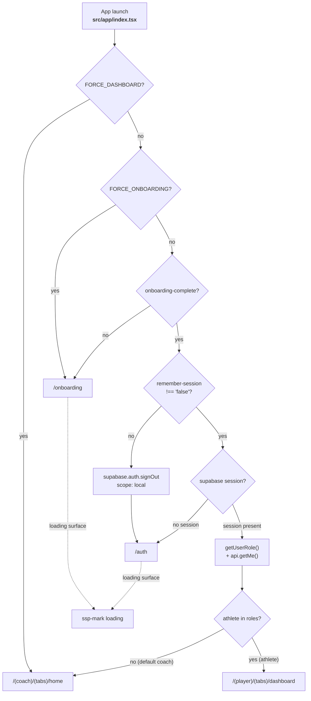
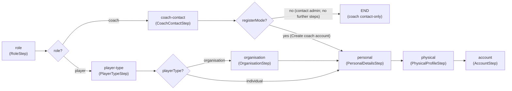

# Auth, Onboarding & Get-Started

The SSP Mobile App authenticates directly against **Supabase Auth** and uses the
resulting JWT as the bearer token for every backend API call. The backend
gateway verifies that JWT and loads live roles from the database on each request.
See [Backend Auth & Security](../backend/auth-and-security) for the
verification flow, role cascade, and tenant isolation the mobile token unlocks.

This page covers four client-side concerns, all in `src/app/` and `src/lib/`:

1. **Sign-in** (`src/app/auth.tsx`): `supabase.auth.signInWithPassword`.
2. **Launch gate** (`src/app/index.tsx` + `src/lib/session.ts`): onboarding,
   remember-session, Supabase session, and role resolution.
3. **First-run flows** (`src/app/onboarding.tsx`, `src/app/get-started.tsx`):
   the 3-page carousel and the multi-step registration wizard.
4. **Logout** (`src/lib/logout.ts` + `src/components/dashboard/LogoutSettingsRow.tsx`):
   `Promise.allSettled` cleanup with navigation last.



> The gate renders only the `ssp-mark` and an `SSP, loading` accessibility label
> while it decides, never a dashboard or auth state that may be replaced a
> moment later. Source: `src/app/index.tsx`.

---

## Sign-in

Source: `src/app/auth.tsx`.

### `signInWithPassword` flow

The screen calls `supabase.auth.signInWithPassword({ email, password })`. On
success it resolves the user's role from the backend and routes into the
role-specific tab root:

```ts
const { error } = await supabase.auth.signInWithPassword({
  email: email.trim(),
  password,
});
if (error) throw error;
const me = await api.getMe().catch(() => ({ roles: [] }));
const role = me.roles.includes("athlete") ? "player" : "coach";
await setOnboardingComplete();
await setRememberSession(rememberMe);
await setUserRole(role);
router.replace(
  role === "player" ? "/(player)/(tabs)/dashboard" : "/(coach)/(tabs)/home",
);
```

Key behaviors:

| Concern | Implementation |
| :--- | :--- |
| Concurrent-submit guard | `submittingRef = useRef(false)`; `signIn` returns immediately if `submittingRef.current` is already true. |
| Role resolution | `api.getMe()` returns `ApiMe` with a `roles: ApiRole[]` array. `roles.includes("athlete")` → `player`; everything else → `coach`. A `getMe` failure collapses to `{ roles: [] }`, which defaults to `coach`. |
| Onboarding flag | `setOnboardingComplete()` is set on every successful sign-in so a returning user never re-sees the carousel. |
| Remember-me | `setRememberSession(rememberMe)` persists the switch state before routing. |
| Role persistence | `setUserRole(role)` writes `"coach"` or `"player"` to AsyncStorage for the next launch. |
| Error display | `errorMessage` renders in a `Box` with `accessibilityRole="alert"` and `bg-destructive/10`. |
| Failure recovery | On any caught error (including `ApiError`), the screen calls `supabase.auth.signOut({ scope: "local" })` to avoid a half-signed-in state. |
| Brand mark | Uses `assets/brand/ssp-mark.png` (no `ShieldCheck` hero). |

### Form controls

| Control | Detail |
| :--- | :--- |
| Email / Password inputs | `min-h-12 bg-card`, with `Mail` / `Lock` leading icons. `KeyboardAvoidingView` shifts on iOS. |
| Show password | `InputSlot` with `accessibilityRole="button"` and label `"Show password"` / `"Hide password"`, `min-h-12 min-w-12`. |
| Remember me | A bare `<Switch accessibilityLabel="Remember me" className="min-h-12 min-w-12">` (no wrapping `Pressable`). Defaults to `true`. |
| Sign in button | <code v-pre>accessibilityState=&#123;&#123; disabled: submitting, busy: submitting &#125;&#125;</code>; label flips to `"Signing in…"`. |
| Get started link | `router.replace("/get-started")` (link button, `text-primary`). |
| Back button | `goBack()` calls `router.back()` if `canGoBack()`, else `router.replace("/onboarding")` so the carousel's Get-started / Log in screen stays reachable. |

---

## Launch session gate

Source: `src/app/index.tsx`, `src/lib/session.ts`, `src/lib/onboarding.ts`.

### Dev overrides

Two build-time env flags short-circuit the gate for development. Both are read
as `process.env.EXPO_PUBLIC_*` (build-time):

| Flag | Effect |
| :--- | :--- |
| `EXPO_PUBLIC_FORCE_DASHBOARD` | `router.replace("/(coach)/(tabs)/home")` immediately. |
| `EXPO_PUBLIC_FORCE_ONBOARDING` | `router.replace("/onboarding")` immediately. |

> `EXPO_PUBLIC_FORCE_DASHBOARD` is referenced in `src/app/index.tsx` but is
> **not** listed in `.env.example`. `EXPO_PUBLIC_FORCE_ONBOARDING` is
> documented in `.env.example` (default `false`).

### Gate sequence

When no override is set, `useEffect` runs this chain (each step can redirect
and end the gate):

1. **Onboarding complete?** `isOnboardingComplete()` reads AsyncStorage
   `"onboarding-complete"`. If not `"true"` → `/onboarding`.
2. **Remember session?** `shouldRememberSession()` returns
   `AsyncStorage.getItem("remember-session") !== "false"` (so an absent key
   defaults to `true`). If `false`, the gate calls
   `supabase.auth.signOut({ scope: "local" })` and routes to `/auth`.
3. **Supabase session?** `supabase.auth.getSession()`: if no session, `/auth`.
4. **Role resolution.** `let role = await getUserRole()` (persisted fallback),
   then `api.getMe()` wrapped in `try/catch`. If the API responds,
   `me.roles.includes("athlete") ? "player" : "coach"` overrides the persisted
   role. If the API is unreachable, the persisted role is kept.
5. **Route.** `player` → `/(player)/(tabs)/dashboard`; otherwise
   `/(coach)/(tabs)/home`.

### `src/lib/session.ts`: role mapping

The app's UI knows exactly two roles, `Role = "coach" | "player"`. The backend
`ApiRole` set is `athlete | coach | sub_coach | organisation_admin |
ssp_super_admin`. `getUserRole` bridges them with a two-tier lookup:

```ts
export async function getUserRole(): Promise<Role> {
  // 1. Supabase user_metadata.role (set by the get-started wizard)
  //    "coach" -> coach, "athlete" or "player" -> player
  // 2. AsyncStorage "user-role" ("coach" | "player")
  // 3. default: "coach"
}
```

| Source | Key | Mapping | Default |
| :--- | :--- | :--- | :--- |
| Supabase `user.user_metadata.role` | `role` | `coach`→coach; `athlete`/`player`→player | None |
| AsyncStorage | `"user-role"` | literal `coach` / `player` | None |
| Fallback | None | None | `coach` |

The runtime path in `auth.tsx` / `index.tsx` is **API-authoritative**
(`api.getMe().roles`), and `getUserRole` is the persisted fallback used only
when the API is unreachable. The `athlete → player` mapping is the only
downcast; every non-athlete (coach, sub_coach, organisation_admin,
ssp_super_admin) resolves to the coach information architecture.

::: warning UI routing is not authorization
`user_metadata` and AsyncStorage are client-controlled and are used here only to choose the mobile information architecture. They must never authorize API data or actions. The SSP-API independently verifies the bearer JWT and loads database-backed roles for every protected request.
:::

### `src/lib/session.ts`: helpers

| Helper | Behavior |
| :--- | :--- |
| `getUserRole()` | Two-tier lookup above; never throws (catches fall through to default). |
| `setUserRole(role)` | `AsyncStorage.setItem("user-role", role)`. Non-fatal. |
| `shouldRememberSession()` | `getItem("remember-session") !== "false"`; absent key → `true`. |
| `setRememberSession(remember)` | `setItem("remember-session", String(remember))`. |
| `clearUserRole()` | `AsyncStorage.removeItem("user-role")`. |

### `src/lib/onboarding.ts`

| Helper | Key | Behavior |
| :--- | :--- |
| `isOnboardingComplete()` | `"onboarding-complete"` | `=== "true"`; errors → `false`. |
| `setOnboardingComplete()` | `"onboarding-complete"` | `setItem("true")`; non-fatal. |
| `clearOnboardingComplete()` | `"onboarding-complete"` | `removeItem`. |

---

## Onboarding carousel

Source: `src/app/onboarding.tsx`, `src/components/onboarding/OnboardingPage.tsx`,
`src/components/onboarding/ProgressDots.tsx`.

A 3-page horizontal `ScrollView` (`pagingEnabled`) introduces the product. Each
page is an `OnboardingPage` with a `bg-primary` hero card, an icon, a title, and a
subtitle.

| # | Icon | Title | Subtitle |
| :---: | :--- | :--- | :--- |
| 1 | `Bluetooth` | Know your device is ready | Connect your SSP-S1 tracker and see the device state before activity begins. |
| 2 | `Activity` | Capture performance in the field | Follow live movement and location data while your SSP device records the session. |
| 3 | `Cpu` | Keep every tracker field-ready | Review diagnostics and firmware status in the same app as performance sessions. |

Behaviors:

- **Haptics.** `expo-haptics` `impactAsync(ImpactFeedbackStyle.Light)` fires on
  page navigation, Get started, and Log in.
- **Reduce motion.** `AccessibilityInfo.isReduceMotionEnabled()` is read once
  and subscribed via `reduceMotionChanged`. When enabled, `scrollTo` is
  non-animated and `OnboardingPage` renders statically (`scale: 1, opacity: 1`).
- **Skip.** On any non-last page, a `Skip` button jumps to the last page.
- **Get started.** On the last page the primary button reads `Get started` and
  calls `setOnboardingComplete()` then `router.push("/get-started")`.
- **Log in.** An outline button on the last page calls `setOnboardingComplete()`
  then `router.push("/auth")`.
- **Dev bypass.** A `__DEV__`-only `Skip to main app` link calls
  `setOnboardingComplete()` then `router.replace("/(coach)/(tabs)/home")`. This
  is dev-only and absent from production builds.

`ProgressDots` renders one `Pressable` per page (`min-h-12 min-w-12`,
`accessibilityRole="button"`, <code v-pre>accessibilityState=&#123;&#123; selected: isActive &#125;&#125;</code>).
The active dot is `h-2 w-8 rounded-full bg-primary`; inactive dots are
`h-2 w-2 rounded-full bg-border`.

---

## Get-started wizard

Source: `src/app/get-started.tsx`, `src/components/get-started/*Step.tsx`,
`src/components/get-started/motion.tsx`.

A multi-step registration wizard collects role, context, personal details,
physical profile, and account credentials, then calls `supabase.auth.signUp`.

### Step order

Steps are built dynamically by `getSteps(data, coachRegisterMode)`:



| Step | Component | Trigger / gate |
| :--- | :--- | :--- |
| `role` | `RoleStep.tsx` | Always first. `MotionCard`s for Player / Coach. |
| `coach-contact` | `CoachContactStep.tsx` | Coach only. "Create coach account" sets `coachRegisterMode=true` and continues to `personal`; contact-admin path ends the wizard. |
| `player-type` | `PlayerTypeStep.tsx` | Player only. Individual vs Through an organisation. |
| `organisation` | `OrganisationStep.tsx` | Player + `playerType === "organisation"`. Closed orgs (`openJoin: false`) show an invite-required Modal. |
| `personal` | `PersonalDetailsStep.tsx` | Name, surname, date of birth, location. |
| `physical` | `PhysicalProfileStep.tsx` | Height (cm), weight (kg), sports (multi-select, at least one required). |
| `account` | `AccountStep.tsx` | Username, email, password (min 8 chars), "Show password" toggle. |

### `supabase.signUp` and `user_metadata`

`AccountStep` submits to `handleAccountSubmit`, which calls
`supabase.auth.signUp` with the wizard's collected data as `user_metadata`:

```ts
const { error: signUpError } = await supabase.auth.signUp({
  email: account.email.trim(),
  password: account.password,
  options: {
    data: {
      full_name: fullName,
      role: role === "player" ? "athlete" : "coach",   // athlete for players
      player_type: data.playerType ?? "individual",
      organisation_id: data.organisation?.id,
      location: data.personal.location,
      height_cm: data.physical.heightCm,
      weight_kg: data.physical.weightKg,
      sports: data.physical.sports,
    },
  },
});
```

The role written to `user_metadata.role` is downcast: a player is stored as
`"athlete"` (the backend `ApiRole`), which `getUserRole` later maps back to
`"player"` for the UI.

::: danger Email-confirmation gap
The code destructures only `error` from `signUp`; it does not inspect the returned session. With Supabase Confirm Email enabled, sign-up can succeed while returning no session. The wizard still marks onboarding complete, attempts `api.updateMe` (which then fails locally without a bearer token), and routes into a role group. This flow is only complete when sign-up returns an authenticated session, or after the app adds an explicit "check your email" branch and confirmation/deep-link handling. This source audit did not inspect the live project's Confirm Email setting.
:::

### Already-registered fallback

If `signUp` returns an error whose message contains `"already registered"` or
`"already exists"` (case-insensitive), the wizard falls back to
`supabase.auth.signInWithPassword` with the same credentials. If the sign-in
also fails, it throws a user-facing message instructing the user to check their
password or log in from the main screen.

That fallback is configuration-dependent: Supabase may return an obfuscated success response for an existing confirmed user when email confirmation is enabled, so the message-based branch is not a reliable account-existence check in every project configuration.

### Non-blocking `api.updateMe`

After a successful sign-up (or fallback sign-in), the wizard calls
`api.updateMe({ full_name: fullName })` inside a `try/catch`:

```ts
try {
  await api.updateMe({ full_name: fullName });
} catch {
  // Non-blocking
}
```

A backend `updateMe` failure does **not** block onboarding completion or
routing. `setOnboardingComplete()` and `setUserRole(role)` are called before
the `updateMe` call; `router.replace` into the role tab (`coach` →
`/(coach)/(tabs)/home`, `player` → `/(player)/(tabs)/dashboard`) runs after it.
See [API Client](./api-client) for the `updateMe` → `PATCH /me` endpoint.

### Hardcoded reference data

The wizard ships two hardcoded arrays (not API-fed):

| Constant | Count | Values |
| :--- | :---: | :--- |
| `ORGANISATIONS` | 4 | Izandla Academy (club, open), Western Province RFC (team, invite-only), Maties Cricket Club (club, open), Springbok Sevens (team, invite-only) |
| `SPORTS` | 10 | Rugby, Cricket, Football, Netball, Hockey, Tennis, Athletics, Swimming, Cycling, Golf |

`OrganisationStep` renders these in a `Select`; closed orgs (`openJoin: false`)
are labelled `(invite only)` and surface an invite-required Modal on continue.

### Motion

`src/components/get-started/motion.tsx` provides the `ReduceMotionProvider`,
`FadeIn`, `MotionCard`, and `ProgressBar` primitives:

| Primitive | Reduce-motion behavior | Default behavior |
| :--- | :--- | :--- |
| `FadeIn` | Renders children un-animated. | `opacity 0→1, y 12→0`, tween `duration: 0.2` + `delay`. |
| `MotionCard` | Plain `Pressable` (`min-h-12`). | Staggered entrance + tween scale-down on press (`scale: 0.97`). |
| `ProgressBar` | `transition: { duration: 0 }`. | tween `duration: 0.2`. |
| `ReduceMotionProvider` | Context flag from `AccessibilityInfo.isReduceMotionEnabled()`. | None |

The screen's `AnimatePresence` + `Motion.View` step transition uses
`reduceMotion ? { duration: 0, type: "tween" } : { duration: 0.22, type: "tween" }`
(no spring).

---

## Logout

Source: `src/lib/logout.ts`, `src/components/dashboard/LogoutSettingsRow.tsx`.

### `logoutLocalSession(deps)`: failure-tolerant, navigate last

```ts
export async function logoutLocalSession(deps: LogoutDependencies) {
  await Promise.allSettled([
    deps.signOut(),
    deps.clearDeviceSession(),
    deps.clearUserRole(),
    deps.clearOnboardingComplete(),
  ]);
  deps.navigateToAuth();
}
```

`Promise.allSettled` runs all four cleanup steps to completion regardless of
rejections. A throwing `signOut` does not skip disconnecting the tracker and
clearing this phone's device bindings or the persisted role. **Navigation is last**, so the user never
sees the auth screen before local state is torn down. This ordering is enforced
by `src/lib/logout.test.mjs` (navigate LAST, even if `signOut` throws).

### `LogoutSettingsRow`

The row is reused on both coach and player profile screens. It renders a
`SettingsRow` (label `"Sign out"`, `tone="destructive"`) that opens an
`AlertDialog`:

| Element | Value |
| :--- | :--- |
| Dialog title | `Sign out of SSP?` |
| Dialog body | `Your local session and device state will be cleared.` |
| Cancel button | `variant="outline"`, disabled while `loggingOut`. |
| Confirm button | `variant="destructive"`, label flips to `"Signing out…"`. |
| `signOut` | `() => supabase.auth.signOut({ scope: "local" })` |
| `clearDeviceSession` | `useDevices().clearDeviceSession`: disconnects the active tracker, clears the auto-connect target, removes this phone's BLE bindings for the signed-in user, and clears the provider's local inventory state. It does not delete backend device records. |
| `clearUserRole` / `clearOnboardingComplete` | from `src/lib/session.ts` / `src/lib/onboarding.ts`. |
| `navigateToAuth` | `() => router.replace("/auth")` |

A `locked` `useRef` guards against a double-trigger of the confirm button.

---

## Backend handoff

The mobile app's only authentication concern is obtaining a Supabase JWT and
attaching it as `Authorization: Bearer <token>` on every API call (see
[API Client](./api-client) for the hand-rolled `fetch` client that does this).
Everything beyond that (JWT verification with `jose`, live database role
lookup, the five-role cascade, multi-tenant org/team boundaries, and the
shared-secret internal routes) lives in the backend gateway:

- [Backend Auth & Security](../backend/auth-and-security): JWT verification,
  `loadRoles`, `requireRoles`, cascade semantics, `hasOrgAccess` /
  `hasTeamAccess`, and the two auth modes.
- [Backend Client Contract](../backend/client-contract): the typed `AppType`
  contract the backend publishes. The mobile app does **not** consume
  `hono/client` / `AppType`; it hand-rolls `fetch` against the same paths.
- [API Reference](../backend/api-reference): the route contract `api.ts`
  maps onto, including `GET /me` (role resolution) and `PATCH /me`
  (non-blocking profile update).
