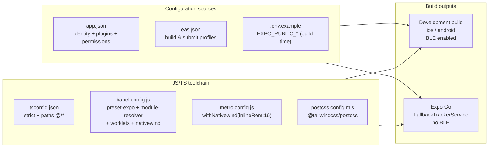

# Mobile App Configuration & Build

The **SSP-Mobile-App** is an [Expo SDK 56](https://docs.expo.dev/versions/v56/) / React Native 0.85.3 project. Its build configuration is split across four layers: Expo app metadata (`app.json`), EAS build/submit profiles (`eas.json`), build-time environment variables (`.env.example`), and the JS/TS toolchain (`tsconfig.json`, `babel.config.js`, `metro.config.js`, `postcss.config.mjs`). This page documents each one against the actual working tree. It does **not** cover `.env.local`; that file is local-only and out of scope.

For the broader stack and how configuration feeds the running app, see [Architecture](./architecture); for the design tokens (colors, fonts, radii) that this toolchain compiles, see [Design System](./design-system).



---

## `app.json`: Expo app metadata

Source: `app.json`.

### Identity

| Field | Value |
| :--- | :--- |
| `name` | `SSP Mobile App` |
| `slug` | `ssp-mobile-app` |
| `scheme` | `sspmobileapp` (deep-link scheme) |
| `version` | `1.0.0` |
| `orientation` | `portrait` |
| `userInterfaceStyle` | `automatic` (light/dark follows system) |
| `owner` | `izandlasystems-dev` (EAS account owner) |
| `extra.eas.projectId` | `1c082f1a-d05c-41ee-a642-73ddd4562f97` |

`experiments.typedRoutes: true` enables [expo-router's typed routes](https://docs.expo.dev/router/advanced/typed-routes/), so `router.push("/session/[id]")` is compile-time checked against the actual file tree under `src/app/`. See [Architecture](./architecture) for the route tree.

### Icon & adaptive icon

The app icon and the Android adaptive-icon foreground are both `./assets/brand/ssp-mark.png`, the same brand mark pinned by `src/components/dashboard/brand-contract.test.mjs` (sha256 `285d48c68c00ec1060f4cc0c0cd0c4694bada2522766c0ccb9c4eec9995bd3f5`). The Android adaptive icon background is `#000000`. The mark must be used with preserved proportions: no stretch, rotate, recolor, crop, or effects. See [Design System](./design-system).

### Plugins and native permissions

| Plugin | Config | Permission strings declared |
| :--- | :--- | :--- |
| `expo-router` | (none) | (none) |
| `react-native-ble-plx` | `{ isBackgroundEnabled: false, modes: ["central"], bluetoothAlwaysPermission: "Allow SSP Mobile App to connect to your SSP tracker." }` | iOS Bluetooth usage description |
| `expo-location` | `{ locationWhenInUsePermission: "Allow SSP Mobile App to use your location to help the tracker acquire GPS faster." }` | iOS location usage description |
| `@maplibre/maplibre-react-native` | (none) | Native map support used by recorded-session detail |
| `./plugins/with-async-storage-size` | local config plugin | Raises the Android AsyncStorage database limit for cached session payloads/indexes |

`expo-location` is used by `TrackerProvider.assistGps` to acquire the phone's current position and send it to the SSP-S1 as a reference-location A-GPS fix. See [Tracker & Sync](./tracker-and-sync).

### Android permissions

Android declares **11 permission entries**: six Bluetooth/location permissions as short aliases, plus five of them repeated in the fully-qualified `android.permission.*` form:

| Permission | Short form | `android.permission.*` form |
| :--- | :---: | :---: |
| Bluetooth (legacy) | `BLUETOOTH` | `android.permission.BLUETOOTH` |
| Bluetooth admin (legacy) | `BLUETOOTH_ADMIN` | `android.permission.BLUETOOTH_ADMIN` |
| Bluetooth Connect (API 31+) | `BLUETOOTH_CONNECT` | `android.permission.BLUETOOTH_CONNECT` |
| Bluetooth Scan (API 31+) | `BLUETOOTH_SCAN` | *(not declared in qualified form)* |
| Fine location | `ACCESS_FINE_LOCATION` | `android.permission.ACCESS_FINE_LOCATION` |
| Coarse location | `ACCESS_COARSE_LOCATION` | `android.permission.ACCESS_COARSE_LOCATION` |

`BLUETOOTH_SCAN` is declared **only** in its short form; the `android.permission.BLUETOOTH_SCAN` qualified form is absent from the array. The duplicated forms cover both the legacy `BLUETOOTH_*` short names and the qualified names some Android toolchains require. The iOS `bundleIdentifier` is `com.izandla.sspmobileapp`; the Android `package` is `com.izandla.sspmobileapp` with `versionCode: 1`.

---

## `eas.json`: Build & submit profiles

Source: `eas.json`.

The CLI is pinned to `>= 14.0.0` and reads app versions from the remote EAS project (`appVersionSource: "remote"`).

| Profile | `developmentClient` | `distribution` | Android `buildType` | `autoIncrement` | Use |
| :--- | :---: | :--- | :--- | :--- | :--- |
| `development` | `true` | `internal` | (default) | None | Internal development-client profile for `eas build --profile development`; BLE-capable after install |
| `preview` | None | `internal` | `apk` | None | Shareable APK for QA |
| `production` | None | (default) | `app-bundle` | `true` | Production profile; Android outputs an AAB, and auto-increment is profile-wide |

The `submit.production` block targets the Android `internal` track, so production Android builds submit to Google Play's internal testing lane by default. iOS submission is not configured in `eas.json`. `package.json` does not currently list `expo-dev-client`, so the EAS `developmentClient: true` profile has not been validated as a launcher-enabled development client by this source audit; local `expo run:*` commands still produce native development builds.

```bash
# Build a dev client (required for BLE: see below)
eas build --profile development --platform ios
eas build --profile development --platform android

# Build a preview APK
eas build --profile preview --platform android

# Build + submit production Android
eas build --profile production --platform android --auto-submit
```

---

## Environment variables

Source: `.env.example` as the committed template, plus the static `process.env.EXPO_PUBLIC_*` references in source. Local `.env*` values are intentionally not reproduced here.

| Variable | `.env.example` default | Used by | Notes |
| :--- | :--- | :--- | :--- |
| `EXPO_PUBLIC_SUPABASE_URL` | `https://your-project.supabase.co` | `src/lib/supabase.ts` | Supabase project URL. `supabase.ts` throws if missing. |
| `EXPO_PUBLIC_SUPABASE_PUBLISHABLE_KEY` | `sb_publishable_your_key` | `src/lib/supabase.ts` | Supabase publishable (anon) key. Falls back to `EXPO_PUBLIC_SUPABASE_ANON_KEY` if unset. |
| `EXPO_PUBLIC_API_URL` | `https://ssp-api-rosy.vercel.app` | `src/lib/api.ts` | Backend gateway base URL; also hard-coded as the in-code default. See [API Client](./api-client). |
| `EXPO_PUBLIC_FORCE_ONBOARDING` | `false` | `src/app/index.tsx` | Dev-only: the code requires the exact string `"true"` to force the onboarding carousel. Leave unset/false in production. |

### Important: all `EXPO_PUBLIC_*` values are public and inlined into the JS bundle

Expo CLI statically replaces these references while bundling JavaScript. In local development, edit the env value and perform a full reload of the development build; a native rebuild is only required when native code/config changes. Production binaries or immutable updates must be rebuilt/re-exported to embed changed values. `EXPO_PUBLIC_*` values are visible in the compiled app, so they must never contain secrets. `.env.example` is a committed template, not a runtime file and not proof of the values used by a deployed build.

Local `.env.local` is gitignored and is not automatically a production EAS environment. Before a preview or production build, verify that the selected EAS environment contains `EXPO_PUBLIC_SUPABASE_URL`, a publishable/anon key, and the intended API URL. Missing Supabase public values cause `src/lib/supabase.ts` to throw during app startup. Never place a Supabase secret or `service_role` key in an `EXPO_PUBLIC_*` variable.

### `EXPO_PUBLIC_FORCE_DASHBOARD`: referenced in code, not in `.env.example`

`src/app/index.tsx` reads `process.env.EXPO_PUBLIC_FORCE_DASHBOARD` to short-circuit the entry gate straight to `/(coach)/(tabs)/home` (used for fast dashboard iteration during development). **This variable is NOT listed in `.env.example`.** Developers who need it must add it to their local `.env.local` manually; it is a dev convenience and should never be set in a shipping build. The entry gate is documented in [Auth & Onboarding](./auth-and-onboarding).

---

## npm configuration & the `lightningcss` pin

Source: `.npmrc`, `package.json`.

`.npmrc` contains a single line:

```ini
legacy-peer-deps=true
```

This tells npm to use legacy peer-dependency resolution for this repository. The file does not record why it was introduced; do not remove it without verifying a clean install and the mobile checks.

`package.json` pins `lightningcss` to `1.30.1` in **both** `overrides` and `resolutions`:

```json
"overrides":  { "lightningcss": "1.30.1" },
"resolutions": { "lightningcss": "1.30.1" }
```

Both fields pin the dependency under npm (`overrides`) and tooling that honors Yarn-style `resolutions`. The configuration does not document the original failure that required the pin, so avoid inventing one; verify a clean install and NativeWind compilation before changing it.

---

## `tsconfig.json`: TypeScript config

Source: `tsconfig.json`.

| Concern | Setting |
| :--- | :--- |
| Base | `extends: "expo/tsconfig.base"` |
| Strictness | `strict: true` |
| Path alias | `@/*` → `["./src/*", "./*"]` |
| Include | `src/**/*`, `.expo/types/**/*.ts`, `expo-env.d.ts`, `nativewind-env.d.ts` |
| Exclude | `node_modules`, `components/ui/**/USAGE_EXAMPLE.tsx` |

The `@/*` alias maps to **both** `./src/*` and the repo root, so `@/lib/api` resolves to `src/lib/api.ts` and `@/components/ui/...` resolves to the gluestack-ui generated components at the repo root (not `src/components/ui`). This matches the module-resolver alias in `babel.config.js` (below). The generated-component usage examples under `components/ui/**/USAGE_EXAMPLE.tsx` are excluded from typecheck so the barrel-of-truth for gluestack-ui stays the real `index.tsx` files.

Typecheck with `npx tsc --noEmit` (see commands table).

---

## JS/TS toolchain

The app uses the NativeWind v5 / Tailwind v4 pipeline on top of Expo SDK 56. Three files wire it together.

### `babel.config.js`

Source: `babel.config.js`.

| Piece | What it does |
| :--- | :--- |
| `babel-preset-expo` | Base Expo preset (React Native + JSX transform). |
| `module-resolver` plugin | Alias `@/` → `./` so Babel-resolved imports match the TS `@/*` alias. The alias root is `./`, so `@/lib/api` and `@/components/ui/...` both resolve relative to the repo root. |
| `react-native-worklets/plugin` | Registers the worklets transform for Reanimated/worklets on native. |
| `nativewind/babel` override | Applied to **every** file **except** `node_modules/react-native-web/**`. The `exclude` predicate returns `true` for react-native-web paths so NativeWind does not inject its web-only handling there. |

`api.cache(true)` enables Babel's persistent cache, which is safe because the config is deterministic.

### `metro.config.js`

Source: `metro.config.js`.

```js
const { getDefaultConfig } = require('expo/metro-config');
const { withNativewind } = require('nativewind/metro');

const config = getDefaultConfig(__dirname);
module.exports = withNativewind(config, { inlineRem: 16 });
```

`withNativewind` wraps Expo's default Metro config and sets `inlineRem: 16`, which inlines Tailwind's `rem` units as `16px` in the compiled output so NativeWind classes render consistently on native (where there is no DOM `rem`). This is the only Metro customization.

### `postcss.config.mjs`

Source: `postcss.config.mjs`.

```js
export default { plugins: { '@tailwindcss/postcss': {} } };
```

Only `@tailwindcss/postcss` is registered: no `autoprefixer`, no `postcss-preset-env`. Tailwind v4 handles its own prefixing via `lightningcss` (pinned above). `global.css` holds the Tailwind v4 theme tokens as RGB triples; see [Design System](./design-system) for the light/dark token tables.

---

## BLE requires a development build

`react-native-ble-plx` is a native module. Its `BleClientManager` native class is **not present in Expo Go**, so on a Go client `NativeModules.BleClientManager` is `undefined` and `createTrackerService` falls back to `FallbackTrackerService`. That fallback does **not** simulate tracker data: scan/connect report an error and throw, tracker operations throw, and stop/disconnect/destroy are no-ops.

| Target | `NativeModules.BleClientManager` | `createTrackerService` returns | Real BLE? |
| :--- | :---: | :--- | :--- |
| iOS dev build (`npx expo run:ios`) | present | `NativeTrackerService` | Yes |
| Android dev build (`npx expo run:android`) | present | `NativeTrackerService` | Yes |
| Expo Go | `undefined` | `FallbackTrackerService` | No |
| Web | `undefined` | `WebTrackerService` (throws) | No |

For any work that touches the SSP-S1 tracker (pairing, live tracking, session download, A-GPS assist, upload, or MCUmgr firmware update), use a **development build**, not Expo Go. `npx expo start` is fine for web-only / non-BLE UI iteration. See [Tracker & Sync](./tracker-and-sync) for the service and fallback behavior.

---

## Commands

Source: `package.json` `scripts`.

| Command | Script | Purpose |
| :--- | :--- | :--- |
| `npm run start` | `expo start` | Start the Metro dev server. Use `--dev-client` to open a connected dev build (BLE). Plain `expo start` opens Expo Go / web. |
| `npm run ios` | `expo run:ios` | Build and launch an iOS **native development build** (BLE module included). |
| `npm run android` | `expo run:android` | Build and launch an Android **native development build** (BLE module included). |
| `npm run web` | `expo start --web` | Start the web target. BLE unsupported; `WebTrackerService` throws. |
| `npm run lint` | `expo lint` | ESLint (`eslint-config-expo`). |
| `npm test` | `vitest run && npm run test:legacy` | Run both test runners: vitest (`.test.ts`) then node:test (`.test.mjs`). |
| `npm run test:legacy` | `node --test $(find src -name '*.test.mjs' -print)` | Source-contract / behavioral tests only (the `.test.mjs` set). |
| `npx tsc --noEmit` | (not a script) | Typecheck against `tsconfig.json` with strict mode. |

`npm test` runs **both** runners because the project keeps two kinds of tests: vitest unit tests (`.test.ts`) and node:test source-contract tests (`.test.mjs` that grep source text and assert behavioral facts). See [Testing](./testing) for the distinction and the full file list.

---

## Cross-references

- [Architecture](./architecture): app shell, provider hierarchy, route tree.
- [Design System](./design-system): `global.css` tokens, `SEMANTIC_COLORS`, gluestack-ui provider.
- [Tracker & Sync](./tracker-and-sync): BLE service, the `FallbackTrackerService` fallback, real timeouts.
- [Testing](./testing): the dual test runner and what `.test.mjs` enforces.
- [API Client](./api-client): where `EXPO_PUBLIC_API_URL` is consumed.
- [Backend Architecture](../backend/architecture): the gateway the mobile app calls.
