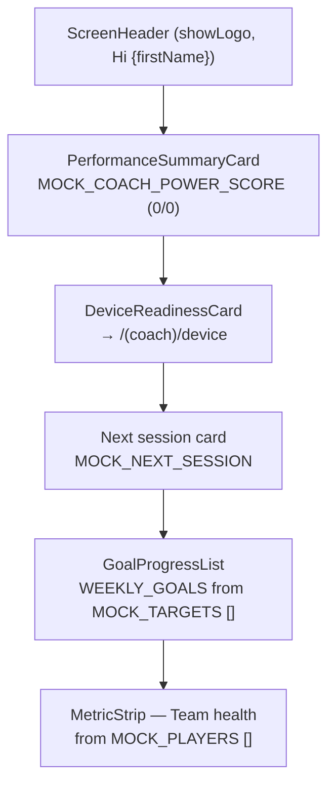
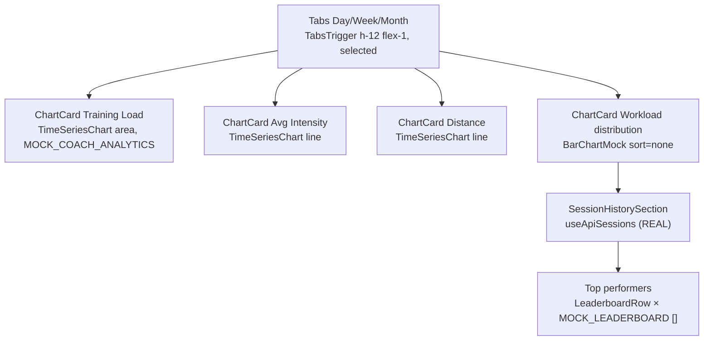

# Dashboard & Analytics

The dashboard and analytics surfaces live in [`src/components/dashboard/`](https://github.com/IzandlaSystems/SSP-Mobile-App/blob/main/src/components/dashboard) and are composed by the Coach Home, Player "Home" (Dashboard), Analytics, and Session Detail routes. This page documents the screen shells, the component catalog, the hand-rolled SVG charts, the football-pitch heatmap, and the session history/detail flow.

::: warning Mock-first — read this first
**Most dashboard data is mocked and empty.** Every `MOCK_*` array in `src/components/dashboard/mock-data.ts` is `[]` (or an empty-object placeholder for the singletons), so screens render **empty states by default**. Charts are fed from these empty `MOCK_*` ranges, **not** from the API.

The only real data on these screens flows through three hooks:

| Hook | Source | Used by |
| :--- | :--- | :--- |
| `useApiMe` | `api.getMe()` | Profile identity (name on Home/Profile) |
| `useApiSessions` | `api.listSessions(limit 100)` → `apiSessionToTrainingSession` | Analytics → "Recorded sessions" list |
| `useApiSession` | `api.getSession` + `getMetrics` + `getTelemetry(limit 5000)` | Session Detail screen |

`FIXTURE_*` constants (`FIXTURE_COACH_ANALYTICS`, `FIXTURE_PLAYER_ANALYTICS`, `FIXTURE_COACH_FEEDBACK`, `FIXTURE_TRAINING_SESSIONS`) hold sample data but are **imported only by tests**, never by screens. Never describe the charts as API-fed. See [API Client](./api-client) for the fetch client and adapter.
:::

See also: [Architecture](./architecture) for the route tree and role guards, [Design System](./design-system) for the brand palette enforced across these components, and the backend [Analytics API](../backend/routes/analytics) and [Sessions API](../backend/routes/sessions) the mobile client calls.

---

## 1. Screen shells

### `DashboardScreen.tsx`

`src/components/dashboard/DashboardScreen.tsx` is the standard shell for every dashboard screen: a `SafeAreaView` + a single vertical `ScrollView`, wrapped in a `ReduceMotionProvider`.

| Property | Value |
| :--- | :--- |
| Horizontal padding | `paddingHorizontal: 16` (`px-4`) |
| Push-screen bottom padding | `PUSH_SCREEN_BOTTOM_PADDING = 24` |
| Tab-screen bottom padding | `TAB_SCREEN_BOTTOM_PADDING = 112` |
| Background | `SEMANTIC_COLORS[resolvedScheme].background` (no `const BACKGROUND =`) |
| `edges` default | `["top", "bottom"]` (push/detail); tab screens pass `["top"]` |
| Motion | `ReduceMotionProvider` honors `AccessibilityInfo.isReduceMotionEnabled()` |

The 112 px tab clearance is test-enforced (`ux-truth-source.test.mjs`) so scroll content clears the native tab bar. The optional `header` renders **inside** the `ScrollView` (large-title scrolling behavior) and inside the `ReduceMotionProvider`, so a `FadeIn` header is gated by the OS reduce-motion setting. The shell intentionally does **not** wrap children in `FadeIn` — screens compose their own per-card staggered entrances.

### `ScreenHeader.tsx`

`src/components/dashboard/ScreenHeader.tsx` — title + optional muted subtitle, optional SSP brand mark, optional back affordance, and an optional right-side icon button.

| Slot | Control | Touch target |
| :--- | :--- | :--- |
| Left back | `ChevronLeft` Pressable (`accessibilityLabel="Go back"`) | `min-h-12 min-w-12` (48 dp) |
| Logo | `assets/brand/ssp-mark.png` (no ShieldCheck) | `size="xs"` |
| Title | `Heading size="xl"` | `maxFontSizeMultiplier={DASHBOARD_MAX_FONT_SIZE_MULTIPLIER}` |
| Subtitle | `Text size="sm"` (muted) | same multiplier |
| Right icon | `Pressable` + `LucideIcon` | `min-h-12 min-w-12` (48 dp) |

Source: `src/components/dashboard/ScreenHeader.tsx`.

---

## 2. Per-role screen composition

Both Home screens share the same shell and the same top-of-page order: **PerformanceSummaryCard → DeviceReadinessCard → role-specific card → GoalProgressList → MetricStrip**. This order is enforced by `ux-truth-source.test.mjs` (Performance before DeviceReadiness before Goals).

### Coach Home — `src/app/(coach)/(tabs)/home.tsx`

`CoachHomeScreen` uses `useDeviceDemo` + `selectDeviceReadiness`, `useApiMe`, and the Supabase user for the first-name greeting.

| Card | Data | Notes |
| :--- | :--- | :--- |
| PerformanceSummaryCard | `MOCK_COACH_POWER_SCORE` `{score:0, delta:"0"}` | status "On track"; supporting metric = active player count from `MOCK_PLAYERS` (0) |
| DeviceReadinessCard | `selectDeviceReadiness(devices)` | routes to `/(coach)/device` |
| Next session | `MOCK_NEXT_SESSION` | singleton `{when:"No upcoming session", focus:"No active plan scheduled", squadCount:0}` |
| GoalProgressList | `MOCK_TARGETS` (empty) | weekly goals |
| MetricStrip | `MOCK_PLAYERS` (empty) | Average weekly load + Need attention |

### Player Home — `src/app/(player)/(tabs)/dashboard.tsx`

`PlayerDashboardScreen` mirrors the coach shell with player-scoped data.

| Card | Data | Notes |
| :--- | :--- | :--- |
| PerformanceSummaryCard | `MOCK_PLAYER_POWER_SCORE` `{score:0, delta:"0"}` | status "Weekly overview" |
| DeviceReadinessCard | `selectDeviceReadiness(devices)` | routes to `/(player)/device` |
| Today's Plan | `MOCK_TODAY_PLAN` | singleton `{title:"No session scheduled", meta:"0 min", focus:"No active exercise target"}` |
| GoalProgressList | `MOCK_PLAYER_TARGETS` (empty) | weekly goals |
| MetricStrip | `MOCK_PLAYER_METRICS` filtered to Top Speed/Calories/Active Time (empty) | personal metrics |

Source: `src/app/(coach)/(tabs)/home.tsx`, `src/app/(player)/(tabs)/dashboard.tsx`.

---

## 3. Component catalog

The barrel `src/components/dashboard/index.ts` re-exports the full catalog. The components are grouped by role below.

### Summary & identity

| Component | File | What it does |
| :--- | :--- | :--- |
| `PerformanceSummaryCard` | `PerformanceSummaryCard.tsx` | `accessibilityRole="summary"` with `accessibilityLabel={buildPerformanceSummaryAccessibilityLabel(props)}`, `bg-primary`, **no** `PowerScoreRing` (decorative ring forbidden). Stacks at large font: `usesLargeTextLayout(fontScale)` → `isLargeText ? "3xl" : "5xl"`, `MetricsStack = isLargeText ? VStack : HStack`, `summaryFontMultiplier` via `DASHBOARD_MAX_FONT_SIZE_MULTIPLIER` (≥7 `maxFontSizeMultiplier`), no `numberOfLines`. |
| `PowerScoreRing` | `PowerScoreRing.tsx` | SVG ring (`stroke={colors.border}` / `stroke={colors.primary}`), optional trend `Badge` (TrendingUpDown icon, "{delta} vs last week"). **Not** used by `PerformanceSummaryCard` — kept for compact contexts. `accessibilityRole="image"`. |
| `DeviceReadinessCard` | `DeviceReadinessCard.tsx` | **Presentational only** — no `expo-router`/`useDeviceDemo` import. Props `readiness: DeviceReadiness`, `onPress: () => void`. Rows: Connection / Battery / "Uploads pending" / status. `HStack` aligns values at the trailing edge. Status icons via `STATUS_PRESENTATION[readiness.state]`: attention `CircleAlert` `text-destructive`, disconnected `WifiOff`, ready `CheckCircle2` `text-primary`, empty `PackagePlus`, syncing `RefreshCw`. Footer button "Open Device Hub" (`min-h-12`). |
| `StatCard` | `StatCard.tsx` | Single statistic tile. |
| `TargetProgressCard` | `TargetProgressCard.tsx` | Weekly-goal progress card (player Trainer tab). |

### Lists & rows

| Component | File | What it does |
| :--- | :--- | :--- |
| `GoalProgressList` | `GoalProgressList.tsx` | Weekly goals with `Progress` bars; `getProgressPercentage` clamps 0–100; `accessibilityRole="progressbar"`. |
| `MetricStrip` | `MetricStrip.tsx` | Wrapping row of metric cells (`min-w-32`); each cell accessible. |
| `InfoRow` | `InfoRow.tsx` | Label + value row (SettingsGroup member). |
| `RowLeading` | `RowLeading.tsx` | Leading icon chip + label used by `SettingsRow`. |
| `PlayerRow` | `PlayerRow.tsx` | Squad row, `role="listitem"`, status active → "Available" else "Resting". **No `onPress`** on the squad screen (test-enforced — no fake detail actions). |
| `LeaderboardRow` | `LeaderboardRow.tsx` | Top-performer row. |
| `EmptyState` | `EmptyState.tsx` | Empty-state block (icon + title + subtitle). |

### Structure & settings

| Component | File | What it does |
| :--- | :--- | :--- |
| `SectionHeader` | `SectionHeader.tsx` | `min-h-12 min-w-12` Pressable header. |
| `ChartCard` | `ChartCard.tsx` | Card wrapper: title + subtitle + optional `rightMeta` + chart children. |
| `SettingsGroup` | `SettingsGroup.tsx` | Grouping container for `InfoRow`/`SettingsRow`. |
| `SettingsRow` | `SettingsRow.tsx` | `min-h-12` Pressable + optional trailing `Switch` (`min-h-12 min-w-12`); `trailing: "chevron" \| "switch" \| "none"`, `tone: "default" \| "destructive"`. |
| `LogoutSettingsRow` | `LogoutSettingsRow.tsx` | AlertDialog "Sign out of SSP?", `variant="destructive"`, `signOut: () => supabase.auth.signOut({ scope: "local" })`, `navigateToAuth: () => router.replace("/auth")`. See [Auth & Onboarding](./auth-and-onboarding). |
| `DevRoleSwitcher` | `DevRoleSwitcher.tsx` | **Returns `null`** — disabled to enforce role separation (test-enforced). |

### Feedback & history

| Component | File | What it does |
| :--- | :--- | :--- |
| `CoachFeedbackFeed` | `CoachFeedbackFeed.tsx` | `accessibilityRole="list"`; empty → `EmptyState` "No coach feedback yet". Formats dates via `formatFeedbackDate`. |
| `SessionHistorySection` | `SessionHistorySection.tsx` | Expandable "Recorded sessions" — see [§5](#_5-session-history-detail). |
| `FootballPitchHeatmap` | `FootballPitchHeatmap.tsx` | GPS density heatmap — see [§6](#_6-football-pitch-heatmap). |

Source: `src/components/dashboard/index.ts`.

---

## 4. Charts

All charts are hand-rolled SVG (`react-native-svg`) — no charting library. They are fed from the empty `MOCK_*` ranges, so on a real device they currently render their empty state ("No chart data" for `TimeSeriesChart`).

### `TimeSeriesChart.tsx`

`src/components/dashboard/charts/TimeSeriesChart.tsx` renders an SVG area or line chart from `TimeSeriesDatum[]`.

- Resolves colors from `SEMANTIC_COLORS[resolvedScheme]`; stroke and point fills use `colors.primary`.
- Area variant fills with a vertical `LinearGradient` (`colors.primary`, opacity 0.22 → 0.02).
- Width clamped to `max(240, min(600, screenWidth - 64))`, default height 180.
- Three y-axis ticks, grid lines at `colors.border` (opacity 0.3), x-axis labels anchored start/middle/end.
- `accessibilityRole="image"` with `accessibilityLabel` from `buildTimeSeriesAccessibilityLabel`; a visible comparison caption from `buildLatestComparisonLabel` is rendered below the chart.
- Empty data → "No chart data" placeholder plus the comparison label.

### `time-series-geometry.ts`

`src/components/dashboard/charts/time-series-geometry.ts` is the pure geometry/helper module.

| Export | Purpose |
| :--- | :--- |
| `TimeSeriesDatum` | `{ label: string; value: number }` |
| `buildTimeSeriesGeometry(data, width, height)` | Plot bounds `left 44 / right-8 / top 8 / bottom-28`; cubic-bezier segments (control points at segment midpoint X, endpoint Y); flat series padded by `max(|min|*0.1, 1)`; single point centered; `yTicks` = 3 (max, mid, min). |
| `buildTimeSeriesAccessibilityLabel(data, unit, formatter, selectedRange?)` | "Time series for {range}. Range {first} to {last}. Minimum {min} {unit}. Maximum {max} {unit}. Latest {latest} {unit}. Overall direction {up\|down\|unchanged}." Empty → "Time series. No data. Unit {unit}." |
| `buildLatestComparisonLabel(data, unit, formatter)` | "Up/Down {Δ}{unit} vs {previous.label}", "Unchanged vs {label}", "Previous sample unavailable" (<2 points), "Comparison unavailable" (empty). |

All geometry is kept finite for empty/one-point/flat/negative/normal inputs (test-enforced).

### `BarChartMock.tsx`

`src/components/dashboard/charts/BarChartMock.tsx` — a **flexbox** horizontal bar chart (no SVG). Bars are `bg-primary` widths proportional to `value/max`.

| Prop | Default | Notes |
| :--- | :--- | :--- |
| `data` | — | `{ label, value }[]` |
| `sort` | `"desc"` | `"none"` preserves input order (used for ordinal workload zones Low → Med → High → Max) |
| `unit` | `"%"` | Suffix on value and accessibility label |

Each row is an accessible `VStack` with `accessibilityLabel="{label}: {value}{unit}"`.

Source: `src/components/dashboard/charts/TimeSeriesChart.tsx`, `time-series-geometry.ts`, `BarChartMock.tsx`.

---

## 5. Session history & detail

The session history list and the session detail screen are the **only** dashboard surfaces carrying real API data.

### `SessionHistorySection.tsx`

`src/components/dashboard/SessionHistorySection.tsx` — an expandable card labelled "Recorded sessions".

| Behavior | Detail |
| :--- | :--- |
| Header | `accessibilityRole="button"`, <code v-pre>accessibilityState=&#123;&#123; expanded &#125;&#125;</code>, `accessibilityLabel="Recorded sessions"` |
| Sort | `sortSessionsNewestFirst(sessions)` |
| Chevrons | Rotates a **wrapper** (`transform: rotate: expanded ? "180deg" : "0deg"`), not the icon — avoids an Android SVG `rotate-180` bug (test-enforced) |
| States | Empty → "No recorded sessions yet"; loading → "Loading sessions"; error → header subtitle "Unable to load sessions" (muted) and body renders the `{error}` string in `text-destructive` |
| Row | `accessibilityRole="button"`, label "{name}. {date} at {time}. {duration} minutes. {venue}. {intensity} intensity." (the visible row text abbreviates duration to "min") |

### `SessionDetailScreen.tsx`

`src/components/dashboard/SessionDetailScreen.tsx` — `useApiSession(sessionId)` + `useApiSessions()` for adjacent navigation.

| Behavior | Detail |
| :--- | :--- |
| Loading / missing | "Loading session" / "This session could not be found or is not available to your account." |
| Navigation | Previous/Next `Button`s bounded via `isDisabled={!previousId}` / `isDisabled={!nextId}`; `onNavigate(sessionId)` replaces the route |
| Metrics | `getSessionMetrics(session, role)` — coach → `teamMetrics`, player → `playerMetrics` — rendered in a `MetricStrip` |
| Heatmap | `FootballPitchHeatmap session={session}` |
| Truthfulness | No `MOCK_TRAINING_SESSIONS` / `getSessionById` — preserves the real API UUID (test-enforced) |
| Detail | `SettingsGroup` with Date/Start/End/Duration/Type/Venue/Coach (+ Attendance for coach) |

### Routes — `src/app/(role)/session/[id].tsx`

Both role routes are thin wrappers using `useLocalSearchParams` and `router.replace` (**no** `router.back`).

| Route | `role` | `onBack` | `onNavigate` |
| :--- | :--- | :--- | :--- |
| `(coach)/session/[id].tsx` | `"coach"` | `router.replace("/(coach)/(tabs)/analytics")` | `router.replace({ pathname: "/(coach)/session/[id]", params: { id } })` |
| `(player)/session/[id].tsx` | `"player"` | `router.replace("/(player)/(tabs)/analytics")` | `router.replace({ pathname: "/(player)/session/[id]", params: { id } })` |

Both import via relative paths (`../../../components/dashboard`) and `router.replace` the next session so the back stack stays bounded.

### `session-history.ts`

`src/components/dashboard/session-history.ts` — shared helpers and the `MockTrainingSession` shape used by both the adapter output and the fixture data.

| Export | Purpose |
| :--- | :--- |
| `MockTrainingSession` | Session shape (`id`, `name`, `type`, `startsAt`, `endsAt`, `coach`, `venue`, `intensity`, `attendance`, `gpsPoints`, `teamMetrics`, `playerMetrics`) |
| `sortSessionsChronologically` / `sortSessionsNewestFirst` | Order by `Date.parse(startsAt)` |
| `getAdjacentSessionIds(sessions, id)` | `{ previousId, nextId }` from chronological order |
| `getSessionMetrics(session, role)` | coach → `teamMetrics`, player → `playerMetrics` |
| `getSessionById` | Lookup helper (exported; **not** used by `SessionDetailScreen` — test-enforced) |
| `getSessionDurationMinutes` | `max(0, (endsAt - startsAt) / 60_000)` |
| `formatSessionDate` / `formatSessionTime` | `Intl.DateTimeFormat("en-ZA", …)` |

### `coach-feedback.ts`

`src/components/dashboard/coach-feedback.ts` — deterministic, locale-stable date formatting (no `Intl` timezone drift).

| Export | Purpose |
| :--- | :--- |
| `areFeedbackDatesNewestFirst(entries)` | Validates ISO-8601 UTC timestamps (`...Z`) are strictly newest-first |
| `formatFeedbackDate(createdAt)` | Deterministic absolute date using `getUTCDate/getUTCMonth/getUTCFullYear` → e.g. `"18 Jul 2026"` |

### `dashboard-helpers.ts`

`src/components/dashboard/dashboard-helpers.ts` — small shared helpers.

| Export | Purpose |
| :--- | :--- |
| `DASHBOARD_MAX_FONT_SIZE_MULTIPLIER` | `1.5` — applied across dashboard screens |
| `finiteOrZero(value)` | `Number.isFinite(value) ? value : 0` |
| `usesLargeTextLayout(fontScale)` | `Number.isFinite(fontScale) && fontScale >= 1.5` |
| `getProgressPercentage(value, target)` | Clamps to 0–100; 0 for non-finite or `target <= 0` |
| `buildPerformanceSummaryAccessibilityLabel(props)` | "{label}. Score {score} out of 100. {Up\|Down {Δ}\|No change} versus last week. {status}. {supportingMetric.label}: {supportingMetric.value}." |

---

## 6. Football-pitch heatmap

`FootballPitchHeatmap.tsx` renders an SVG pitch (viewBox `0 0 100 64`) with kernel-density blobs and a legend. It is shown on the Session Detail screen.

### Rendering

- `useId()` instance-scopes every SVG definition so multiple heatmaps on one screen never collide: `${svgId}-pitch-clip`, `${svgId}-density-${index}`, `${svgId}-density-legend`.
- `ClipPath` masks the density kernels to the pitch rectangle.
- Each kernel is an `Ellipse` filled with a `RadialGradient` whose stops are chosen by `innerStops(band, colors)`:
  - `peak` → core/inner `destructive`, middle `primary`
  - `high` → core `destructive`, inner/middle `primary`
  - `low`/`moderate` → all `primary`
- `LinearGradient` legend runs `colors.primary` → `colors.destructive`, labelled "Lower density" … "Peak density".
- **Pitch markings render ON TOP of the kernels** (`<PitchMarkings>` after the kernel group) so the pitch frame stays visible through the density.
- Empty kernels → "GPS density unavailable" placeholder.
- `accessibilityRole="image"` with `accessibilityLabel={buildHeatmapAccessibilityLabel(session.name, kernels)}`.
- A `buildDensityInsight(kernels)` sentence sits below the pitch ("Highest activity was concentrated in the {third} third." / "GPS density unavailable.").

### Color rule (test-enforced)

Density uses **only** `colors.primary` → `colors.destructive`. Green, yellow, and orange are explicitly forbidden — `session-history-source.test.mjs` asserts the heatmap source does not match `#34D399|#FACC15|#F59E0B|#EF4444|green|yellow|orange`, and `ux-truth-source.test.mjs` asserts no legacy green across the 16 dashboard grammar files. See [Design System](./design-system).

### `heatmap-density.ts`

`src/components/dashboard/heatmap-density.ts` — pure density math.

| Export | Purpose |
| :--- | :--- |
| `DensityBand` | `"low" \| "moderate" \| "high" \| "peak"` |
| `BANDWIDTH` | `0.18` (Gaussian kernel bandwidth) |
| `prepareDensityKernels(points)` | Filters out non-finite `x`/`y`/`intensity`, clamps to 0–1, computes Gaussian-kernel density per point, normalizes against the strongest, scales `visualStrength` by a confidence factor `min(1, 0.35 + (n-1)*0.22)`. Returns `{x, y, density, visualStrength, radius: 11 + vs*9, opacity: 0.28 + vs*0.52, band}`. |
| `getDominantPitchThird(kernels)` | Density-weighted average X: `<0.4` left, `>0.6` right, else central |
| `buildDensityInsight(kernels)` | "Highest activity was concentrated in the {third} third." |
| `getRelativePeakPercent(kernels)` | `round(max(visualStrength) * 100)` |
| `buildHeatmapAccessibilityLabel(sessionName, kernels)` | "GPS activity heatmap for {name}. Highest activity is concentrated in the {third} third of the pitch. Relative peak intensity {peak} percent." |

Source: `src/components/dashboard/FootballPitchHeatmap.tsx`, `heatmap-density.ts`.

---

## 7. Analytics screens

Both Analytics tabs are identical in chart structure and differ only in the data source (`MOCK_COACH_ANALYTICS` vs `MOCK_PLAYER_ANALYTICS`) and the player-only feedback feed. Charts use the empty `MOCK_*` ranges; **only** the `SessionHistorySection` is API-fed (`useApiSessions`).

### Coach — `src/app/(coach)/(tabs)/analytics.tsx`

- `TimeRange` tabs (day/week/month) with <code v-pre>accessibilityState=&#123;&#123; selected: range === r.value &#125;&#125;</code>, `TabsTrigger className="h-12 flex-1"`, and `rangeLabel={analytics.meta}` on all three charts.
- Three `TimeSeriesChart`s (trainingLoad area / intensity line / distance line) + one `BarChartMock` (workload zones, `sort="none"`).
- `SessionHistorySection` wired to `useApiSessions()` — loading/error passed through; `onSelect` pushes `/(coach)/session/[id]`.
- "Top performers" renders `MOCK_LEADERBOARD` (empty) via `LeaderboardRow`.

### Player — `src/app/(player)/(tabs)/analytics.tsx`

Mirrors the coach screen using `MOCK_PLAYER_ANALYTICS`, default range `week`, and adds a trailing `CoachFeedbackFeed` bound to `MOCK_COACH_FEEDBACK` (empty → "No coach feedback yet"). `onSelect` pushes `/(player)/session/[id]`.

Source: `src/app/(coach)/(tabs)/analytics.tsx`, `src/app/(player)/(tabs)/analytics.tsx`.

---

## 8. Tests

The dashboard suite runs under `node --test` (legacy source-contract tests). See [Testing](./testing) for the dual-runner setup.

| Test file | What it asserts |
| :--- | :--- |
| `charts/time-series-chart.test.mjs` | Geometry stays finite for empty/one-point/flat/negative/normal series; cubic controls stay within each segment's endpoint range; `yTicks.length === 3`; accessibility label names range/unit/extrema/latest/direction; latest-comparison label covers up/down/unchanged/previous-unavailable/comparison-unavailable; both roles' `FIXTURE_*` day/week/month datasets are 4–7 finite points with distinct ranges and `month` workload zones summing to 100. |
| `heatmap-density.test.mjs` | Invalid samples removed and finite values clamped; nearby samples produce stronger density than isolated ones; empty/single inputs are stable; dominant third / insight / peak percent use density output; accessibility label includes session name, third, and peak percent. |
| `session-history-source.test.mjs` | Both analytics screens expose `SessionHistorySection` + `useApiSessions` + `sessions.data`; expansion + row accessibility; rotates wrapper not icon (`rotate:` not `rotate-180`); detail has bounded nav + heatmap legend + role metrics; heatmap SVG defs are instance-scoped and markings render on top; role routes use `role=` + `router.replace` + relative imports, no `router.back`; heatmap uses semantic blue-to-red density (no green/yellow/orange); analytics ranges are selected `h-12 flex-1` controls with `rangeLabel={analytics.meta}` ×3; session detail preserves API UUID + truthful missing states (no `MOCK_TRAINING_SESSIONS`/`getSessionById`). |
| `session-history.test.mjs` | `FIXTURE_TRAINING_SESSIONS` length 4, ordered earliest→latest, valid ISO timestamps, duration > 0, `gpsPoints` normalized 0–1, adjacent-navigation boundaries, newest-first sort, role metric selection (coach=teamMetrics, player=playerMetrics). |
| `coach-feedback.test.mjs` | `FIXTURE_COACH_FEEDBACK` length 3, dates newest-first, `formatFeedbackDate("2026-07-18T14:30:00.000Z") === "18 Jul 2026"`. |
| `dashboard-helpers.test.mjs` | `getProgressPercentage` clamps; `usesLargeTextLayout` switches at 1.5 and rejects NaN/Infinity; `buildPerformanceSummaryAccessibilityLabel` covers score/delta/status/supportingMetric up/down/no-change with NaN/Infinity fallback. |
| `ux-truth-source.test.mjs` | Dashboard semantic canvas + SVG colors; 112 px tab clearance; performance summary is one accessible summary with no decorative ring and stacks at font scales (≥7 `maxFontSizeMultiplier`); `DeviceReadinessCard` presentational with aligned rows + status icons; coach/player Home order (Performance → DeviceReadiness → Goals) + route truth; 48 dp headers/rows; `PowerScoreRing` trend badge; no legacy green across 16 dashboard files; squad/trainer truthful searchable lists; people rows one status with no fake actions; team/organisation non-interactive; logout failure-tolerant local; role boundaries + `DevRoleSwitcher` returns null. |
| `brand-contract.test.mjs` | CSS + `SEMANTIC_COLORS` brand alignment (all 14 token triples), no `34 197 94` / `#22C55E`; gluestack system-mode clearing; Lato loaded once (4 faces, no Figtree); shared primitives brand typography + 48 dp + no palette utilities; auth Switch `min-h-12`; avatar `bg-primary` (no `bg-green-`); `NativeTabs tintColor="#003399"`; `ssp-mark.png` sha256 pin. |

Source: `src/components/dashboard/*.test.mjs`, `src/components/dashboard/charts/time-series-chart.test.mjs`.