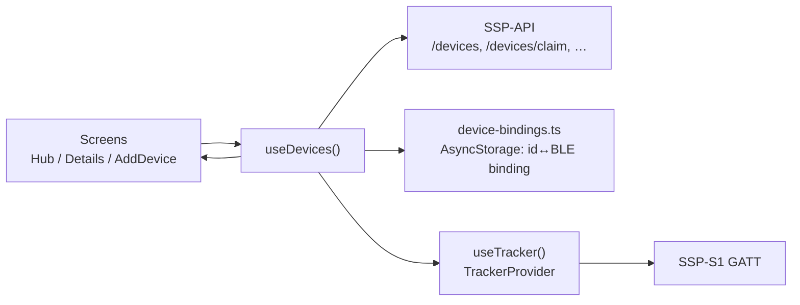

# Device Management

The Devices feature is a **real, BLE-backed** feature — it is no longer Demo/mock. It lets coaches and athletes see their registered SSP-S1 trackers, pair a new tracker over Bluetooth, connect/disconnect/rename/assign/unpair it, watch its live position while connected, and browse its recorded sessions (synced to SSP-API in the background, on a phone with the tracker switched off or out of range).

This is enforced by a source-contract test (`device-ui-source.test.mjs`): the `src/features/devices/**` tree must **not** reference `DeviceDemoProvider`, `useDeviceDemo`, "Demo mode", "simulated scan", or "No hardware was contacted" — the opposite of the old mock feature's contract. It must, instead, reference `useDevices()`; and both role Stacks must render `<DeviceProvider role="coach">` / `<DeviceProvider role="player">`, never a Demo provider.

`DeviceProvider` is a thin, backend-and-bindings layer that sits **on top of** `TrackerProvider` (`src/features/tracker/TrackerProvider.tsx`) — it never touches BLE itself. `TrackerProvider` owns the one GATT connection, live sample streams, session download/upload, and the background sync engine; see [Live Tracking & Sync](./tracker-and-sync) for that layer in full and [BLE GATT Protocol](./ble-protocol) for the wire format. Both role layouts nest the providers as `<TrackerProvider><DeviceProvider role="…">…</DeviceProvider></TrackerProvider>` (`src/app/(coach)/_layout.tsx`, `src/app/(player)/_layout.tsx`).

The backend [Devices API](../backend/routes/devices) (`/devices`, `/devices/mine`, `/devices/claim`, `/devices/:id/name`, `/devices/:id/pair`, `/devices/:id/unpair`, `/devices/:id/assign`) is the server contract this feature actually calls — pairing is a live `POST /devices/claim`, not a local mock. `GET /athletes` supplies the assignment roster for coaches.

---

## 1. Provider: `DeviceProvider`

**Source:** `src/features/devices/DeviceProvider.tsx`

`DeviceProvider` wraps each role group's Stack and holds device state in plain `useState`, fed by `refresh()` on mount and after every mutation. It is a local React context; nothing here is a reducer/store.

| Concern | Implementation |
| :--- | :--- |
| Load | `refresh()` calls `api.getMe()`, then in parallel: `api.listMyDevices()` (player) or `api.listDevices()` (coach), `api.listAthletes()` (coach only; player gets `[]`), and `loadBleBindings(profile.id)`. Runs once on mount via a `void refresh()` effect. |
| BLE bindings | A **local, per-phone** map of backend device id → BLE peripheral id (`device-bindings.ts`, AsyncStorage-backed), not part of the backend record. A device only shows connect/disconnect controls when this phone holds a binding for it (`isBoundOnThisPhone`). |
| Live truth | `devices` is derived with `useMemo` from `apiDevices` + `bindings` + `tracker.connectedDevice` + `tracker.status` via `mapApiDevice()` — connection status and (while connected) battery come from the live tracker, not a cached backend field. |
| Auto-connect target | `selectAutoConnectBinding(bindings, lastConnectedDeviceId)` picks the one binding to keep connected (see §3) and is pushed to `tracker.setAutoConnectTarget()` in an effect — this is the single hook that arms `TrackerProvider`'s foreground auto-reconnect (§7.1). |
| One label per action | `runDeviceOperation(kind, deviceId, message, fn)` sets `activeOperation` before the call and clears it in a `finally`, catching and re-throwing so the screen can react locally. |

Context value (`DeviceContextValue`):

| Field | Behavior |
| :--- | :--- |
| `devices` | Backend inventory mapped through `mapApiDevice` (see §1 above). |
| `discoveredDevices` | `tracker.discoveredDevices` mapped through `mapDiscoveredTracker` — real BLE scan results, signal-bucketed by RSSI. |
| `players` | Roster from `api.listAthletes()` for a coach; `[]` for a player. |
| `activeOperation` | Current `DeviceOperation` with kind, device ids, and message, or `undefined`. |
| `getDevice(id)` | Lookup in `devices`. |
| `refresh()` | Re-runs the load described above. |
| `scan()` / `stopScan()` | Delegate straight to `tracker.scan()` / `tracker.stopScan()` (real BLE scan). |
| `verifyDiscoveredDevice(bleDeviceId)` | Connects to a scanned-but-unclaimed peripheral to confirm it's alive before pairing (`tracker.connect`), under a `"connect"` operation. |
| `claimDevice(input)` | `POST /devices/claim` with BLE id, name, optional player id, and a persisted `app_instance_id`; then saves the returned device id ↔ BLE id binding locally and refreshes. Throws if not signed in. |
| `connectDevice` / `disconnectDevice` | Require an existing binding (throw "Pair this tracker on this phone before connecting." otherwise); `connectDevice` also remembers the id as `lastConnectedDeviceId` (AsyncStorage), so a phone with several paired trackers reconnects to the same one next launch. |
| `renameDevice` / `assignDevice` / `unlinkDevice` | Call the matching API route, then `refresh()`. `assignDevice` throws for `role !== "coach"`. `unlinkDevice` also disconnects the tracker first if it's the one currently connected, and deletes the local binding. |
| `clearDeviceSession()` | Stops scanning, disconnects, and empties `apiDevices`/`players`/`error` — used on sign-out. |

`useDevices()` throws if used outside the provider.

---

## 2. Local bindings: `device-bindings.ts`

**Source:** `src/features/devices/device-bindings.ts`

AsyncStorage-only module, no network. Three concerns, each namespaced separately so one phone can hold bindings for several signed-in accounts without collision:

| Key | Holds |
| :--- | :--- |
| `ssp-device-app-instance-v1` | A locally generated, persisted `app_instance_id` (`getOrCreateAppInstanceId`) sent on every claim so the backend can recognize repeat pairings from this install. |
| `ssp-device-bindings-v1:<userId>` | `BleBinding[]` entries containing backend device id and BLE id for that signed-in user; created by `saveBleBinding`, read by `loadBleBindings`, and pruned by `removeBleBinding`. |
| `ssp-device-last-connected-v1` | The backend device id last explicitly connected to, used only to break a tie when a phone holds more than one binding. |

All reads fail closed (`try`/`catch` → `[]` / `undefined`) rather than throwing into the provider.

---

## 3. Mapping and selectors: `device-state.ts`

**Source:** `src/features/devices/device-state.ts`

Pure functions — no reducer, no fixtures. All values come from either the backend record or the live tracker; nothing is fabricated.

| Symbol | Purpose |
| :--- | :--- |
| `mapApiDevice(device, live?)` | Backend `ApiDevice` → `RegisteredDevice`. `connectionStatus` is `"connected"` only when this phone's binding's BLE id matches `tracker.connectedDevice.id`; battery then comes from `tracker.status.batteryPercent` (live), otherwise falls back to the backend's `last_battery_pct`. |
| `mapDiscoveredTracker(tracker, bindings)` | BLE scan result → `DiscoveredDevice`. `signal`: `strong` (RSSI ≥ -60), `nearby` (≥ -80), else `weak`. `bleIdentifierSuffix` is the last 8 alphanumeric/colon characters of the BLE id, shown instead of a serial number since a discovered-but-unclaimed peripheral has no backend record yet. `registered` is true if any local binding already points at that BLE id. |
| `selectAutoConnectBinding(bindings, lastConnectedDeviceId?)` | The tracker the app should hold a connection to. Zero bindings → `undefined`. One binding → that one, unconditionally. Two or more → only the one matching `lastConnectedDeviceId`, or `undefined` if there's no match — the app deliberately never *guesses* between several paired trackers. |
| `describeLastSeen(input)` | The “Last seen” row's text, most-direct-evidence first: connected now; this app's last packet; backend `last_seen_at`; then not seen yet. There is no bare “Not reported” state. |
| `getAssignmentLabel(device, players)` | `"Unassigned"`, the matched player's name, or `"Player unavailable"` for a stale/removed roster id. |
| `selectDeviceReadiness(devices)` | Dashboard-card roll-up. `empty` (no devices) → `attention` (any known battery ≤ 20%) → `disconnected` (not all connected) → `ready`. Battery is `Math.min` across devices that report one; devices with no battery reading don't block a `ready` state. |
| `validateDeviceName(value)` | `"Enter a device name"` (blank) / `"Use 100 characters or fewer"` / `undefined`. |

---

## 4. Types: `types.ts`

**Source:** `src/features/devices/types.ts`

| Type | Values / Shape |
| :--- | :--- |
| `DeviceRole` | `"coach" \| "player"` |
| `ConnectionStatus` | `"connected" \| "disconnected" \| "connecting"` |
| `RegisteredDevice` | Backend identity plus display/model/inventory, assignment, connection/battery/firmware/last-seen facts, and this-phone binding fields. |
| `DiscoveredDevice` | BLE id/name, SSP-S1 model, coarse signal label, non-serial identifier suffix, and registration flag. |
| `DevicePlayerOption` | Player id and display name. |
| `DeviceOperation` | Operation kind, affected device ids, and message. `load` is declared but not currently dispatched. |

There is no session-slots/warranty/pending-uploads/lifetime-sessions shape any more — asserted directly by `device-state.test.mjs` (`"warrantyExpiresAt" in device` is `false`). `inventoryId` is the backend's `serial_number`, renamed for the UI; `firmwareVersion` here is the backend's last-known string, distinct from the tracker's own MCUmgr image versions shown on the Firmware update panel (§6.5).

---

## 5. Screens

All screens import dashboard primitives via **checkout-relative** paths (`../../components/dashboard`), never `@/components/dashboard`, and device routes import the feature via `../../features/devices` / `../../../features/devices`, never `@/features/devices` (both asserted by `device-ui-source.test.mjs`).

### 5.1 `DeviceHubScreen`

**Source:** `src/features/devices/DeviceHubScreen.tsx` · Props: `role`, `onBack`, `onAdd`, `onOpenDevice`, `highlightedDeviceId?`, `isLoading?`

Layout, top to bottom:

1. **Error banner** (if `error`): destructive `Alert` with a `Retry` button that calls `refresh()`.
2. **Readiness card**: “connected count of total connected” plus one `device-hub-priority-action` **Add device** button. There is no bulk sync/update action.
3. **Device list**: `DeviceRow` per device, or an `EmptyState` ("No devices yet") when there are none.

A loading state (`isLoading` prop or the provider's own `loading`) renders a header-only screen with a spinner row instead of the list.

`highlightedDeviceId` (passed through route params after successful pairing) clears after 1800 ms; the matching row gets a primary highlight and selected accessibility state.

Both role route wrappers (`src/app/(coach)/device.tsx`, `src/app/(player)/device.tsx`) also pass an `onOpenFirmware` prop pointing at `/(role)/device/firmware` (`FirmwareTrackerScreen.tsx`, a standalone tracker screen) — `DeviceHubScreenProps` does not currently declare or use that prop, so it has no effect from this screen today. That route is still reachable directly; it just isn't linked from Device Hub.

### 5.2 `DeviceDetailsScreen`

**Source:** `src/features/devices/DeviceDetailsScreen.tsx` · Props: `role`, `deviceId`, `onBack`, `onMissingDevice`, `onOpenSession`, `onPairOnThisPhone`

Sections render in this order — asserted by `device-ui-source.test.mjs` ("orders sections by how actionable they are, registration last") — and the two connection-only sections are gated on `connected`, never on whether the device merely exists:

1. **Device health**: `DeviceStatusBadge` + Battery + **Last seen** (`describeLastSeen`, §3). There is deliberately **no Firmware row here** — no BLE characteristic in this protocol carries a firmware version string usable at the device-list level, so the row was dropped rather than showing "Not reported" (asserted: `assert.doesNotMatch(source, /label="Firmware"/)`). The device's real, tracker-reported firmware version instead appears next to the Firmware update section below, sourced from `tracker.dfuImages` (the active, image-0 MCUmgr slot).
2. **Connection**: Connect/Disconnect (only if `isBoundOnThisPhone`, else "Pair on this phone"); a note that a connected tracker reconnects on its own while the app is open; a re-pair prompt if the saved binding can't be reached.
3. **Live telemetry** *(connected only)*: `LiveTelemetryPanel` (§6.4).
4. **Recorded sessions** *(always rendered, not gated on connection)*: a "Sync now" button (`tracker.syncNow()`, disabled while a sync is running or this device isn't the tracker's active one) and the session list (§6.3), or an `EmptyState`. This section stays visible and populated while disconnected because it reads from the local session index/cache, not a live BLE call — see §7.
5. **Firmware update** *(connected only)*: `FirmwareUpdatePanel` (§6.5), with the running app-core version text above it when known.
6. **Registration** *(last, least actionable)*: Registered date, "Organisation" (hardcoded `"Izandla Academy"` for a coach) or "Account" (`"Personal account"` for a player), and — coach only — an "Assigned player" row opening a `RadioGroup` modal.
7. **Rename** / **Unpair** buttons below a divider.

A device page only ever shows **its own** tracker's sessions: `showsThisTracker = device.bleDeviceId === tracker.activeBleDeviceId` gates `sessions`, so a phone holding two paired trackers can't show one tracker's history under the other's page (`tracker.activeBleDeviceId` is the connected device, or — while disconnected — the auto-reconnect target; see §7.1).

### 5.3 `AddDeviceScreen`

**Source:** `src/features/devices/AddDeviceScreen.tsx` · Props: `role`, `onCancel`, `onComplete`

A real, three-step Bluetooth pairing flow with a visible step counter:

| Step | Content |
| :--- | :--- |
| 1: Power on | "Switch on your tracker" + a collapsible "Tracker not switching on?" troubleshoot (mentions Bluetooth + Android location permission). "Next" starts the scan and moves to step 2. |
| 2: Choose a nearby tracker | Calls `scan()` (real BLE scan via `TrackerProvider`) and runs for `LIVE_SCAN_WINDOW_MS = 10_000` ms, or until stopped. States: `scanning` (spinner) → `results` (as soon as the first device is found; already-registered rows are disabled) or, after the window elapses with nothing found, `empty` ("No SSP trackers found" + Rescan); `failed` on a scan error, with an "Open settings" button when the message looks permission-related (`/permission/i`) and a "Retry scan" button. Selecting a row calls `verifyDiscoveredDevice(device.id)` to confirm the peripheral is reachable before advancing. |
| 3: Confirm device | Selected device summary (name defaults to `"SSP-S1"`, editable) + `Device name` input (`validateDeviceName`) + coach: a `Select` for "Assign to player (optional)"; player: "This tracker will be registered to your account". "Add device" calls `claimDevice(...)`. |

Exit handling uses `usePreventRemove` from `expo-router/react-navigation`. Stepping back goes 3→2→1; from step 1, in-progress pairing shows a discard dialog. Success shows a paired toast, announces it for accessibility, then calls `onComplete(deviceId)`.

Add-route wrappers call `router.dismissTo` with the role's Device Hub pathname and the new device id; they do not replace or pop. Detail routes normalize array ids, fall back to Hub when missing, wire re-pairing to Add, and open the role-scoped device/session route.

### 5.4 `DeviceSessionDetailScreen`

**Source:** `src/features/devices/DeviceSessionDetailScreen.tsx` · Props: `deviceId` (backend id — resolves its own `bleDeviceId` via `useDevices().getDevice`, so the page works with the tracker disconnected), `sessionId`, `onBack`

Route: `/(role)/device/[id]/session/[sessionId]` (`src/app/(coach|player)/device/[id]/session/[sessionId].tsx`), which normalizes params and calls `tracker.downloadSession(sessionId)` on mount if not already downloaded.

- **Overview**: recorded time (`sessionRecordedLabel`, shared with `SessionRow`), step count, record count — from the session-list summary, available even before the full payload downloads.
- **Upload**: "Upload to SSP" button, disabled once uploaded; opens already in its true state (`summary.syncState === "uploaded"`) rather than inviting a redundant re-upload, since the background sync engine may have already pushed it. On success it calls `markSessionUploaded` and `tracker.refreshSessionIndex()`.
- **Route**: a MapLibre map of the session's own GNSS fixes (`extractTrack`/`trackBounds`) with start/end markers, once the full payload is downloaded; "No GPS track" if fewer than 2 valid fixes; "Not downloaded" if the download hasn't completed and didn't error.
- **Motion & GNSS**: duration, peak acceleration, IMU sample count, GNSS fix count, max speed, max satellites — computed client-side from the session's own raw records (`computeSessionStats`), never fabricated metrics.
- **Analytics** *(only once the session has a `backendSessionId`)*: distance, server-computed duration, max speed, sprint count, impact count from `api.getSummary`/`api.getMetrics`. A 404 is treated as `"pending"` (the backend parses telemetry asynchronously after upload), not an error.

---

## 6. Components

### 6.1 `DeviceRow`

**Source:** `src/features/devices/components/DeviceRow.tsx`

One `Pressable` per device with a full `accessibilityLabel` concatenating name, model, inventory id, connection status, battery (if known), firmware (if known), assignment (if passed), a "Pair on this phone to connect" note when unbound, and ", newly added" when highlighted. `assignedPlayerName` is only passed by the Hub for a coach.

### 6.2 `DeviceStatusBadge`

**Source:** `src/features/devices/components/DeviceStatusBadge.tsx`

Unchanged in shape from before: Connected/Connecting use `bg-primary` (Connecting adds a `Spinner`); Disconnected uses `variant="outline"` + muted colors. An optional "Update available" outline badge. Wrapper: `accessibilityRole="text"` + `accessibilityLiveRegion="polite"`.

### 6.3 `SessionRow` / `SessionThumbnail`

**Source:** `src/features/devices/components/SessionRow.tsx`, `SessionThumbnail.tsx`

A session is titled with a sequential, per-device, 1-based ordinal computed by `buildSessionOrdinals()` over qualifying sessions sorted oldest-first, never the raw firmware storage id. The badge is `On tracker`, `Saved`, or `Synced`, reflecting where the session currently lives. `SessionThumbnail` draws the actual route as an SVG sparkline when available; otherwise it shows no-GPS or tracker-only state.

### 6.4 `LiveTelemetryPanel` / `LivePulse`

**Source:** `src/features/devices/components/LiveTelemetryPanel.tsx`, `LivePulse.tsx`

Replaces what used to be a raw IMU-acceleration-in-mg readout with a live position map — a number in mg isn't actionable, a map answers what the user actually wants to know. Shown only while connected (§5.2).

- **Recording badge**: “Recording · session ID” (`bg-primary`) or “Idle” (`outline`, muted), from `tracker.status.isRecording`.
- **Map**: a MapLibre map centered on the last valid GNSS fix, with a rolling trail (last up to `MAX_TRAIL_POINTS = 300` fixes, cleared on disconnect or a fresh recording so it never draws a straight line across a gap). When there's no fix yet, an `EmptyState` explains the tracker's actual reported GNSS state rather than a generic "no data":

  | `gnssState` | Copy |
  | :--- | :--- |
  | `undefined` | "Waiting for the tracker" |
  | `0` (Off) | "GPS is off" |
  | `1` (Searching) | "Searching for GPS" |
  | `3` (Timeout) | "No GPS fix" (stopped searching without one) |
  | `2` (Fix) but no live sample yet | "Getting the first position" |
  | anything else | "No live position" + the raw `gnssStateLabel(gnssState)` |

- **Metric strip**: GNSS state label, satellite count (from the last sample, `—` if none), and live step count (client-side `LiveStepDetector` estimate, resets on `startSession()` — not the authoritative `totalSteps` used elsewhere).
- **`LivePulse`**: a quiet sensor-health indicator below the map, replacing the same raw-mg readout for the IMU stream specifically. Polls `tracker.getImuSampleCount()` (a getter, deliberately not React state — the IMU stream runs at ~50 Hz) once a second; if the count moved since the last poll it shows a pulsing "Sensors live" dot (respecting reduced-motion), otherwise a static "No sensor data" dot. `active` is tied to `tracker.connectedDevice !== null`.
- **Start/Stop session** button at the bottom.

### 6.5 `FirmwareUpdatePanel`

**Source:** `src/features/devices/components/FirmwareUpdatePanel.tsx`

Manual MCUmgr image flow against the tracker's dual-core (nRF5340 app core / network core) partition layout — not an automatic "check for update" sheet. "Check firmware images" lists `tracker.dfuImages` (image/slot/version/active/pending/confirmed). Picking a local file (`expo-document-picker`) and choosing image 0 or 1, then "Upload & mark for test" calls `tracker.uploadFirmwareImage` followed by `tracker.setFirmwareImageState(hash, false)`, showing live upload progress via `tracker.dfuProgress`. A separate "Retry mark for test" button re-sends just the state-write (matched by hash, from this session's upload or a device-reported unmarked slot) without re-uploading. "Reboot now to apply" and, once a slot comes back pending-and-unconfirmed, "Confirm pending firmware (make permanent)" round out the flow. This panel is a mostly self-contained wrapper over `TrackerProvider`'s DFU methods; see [Live Tracking & Sync](./tracker-and-sync) for the underlying MCUmgr/DFU characteristic details.

---

## 7. Background session sync

The pieces below live in `src/features/tracker/` (not `devices/`), but they're what make §5.2's "Recorded sessions" section work while disconnected and what feeds `SessionRow`'s ordinals and sync badges. This section covers only what's relevant to the Devices feature's own behavior; see [Live Tracking & Sync](./tracker-and-sync) for the full tracker-service/BLE picture.

### 7.1 Foreground auto-reconnect

**Source:** `src/features/tracker/use-auto-reconnect.ts`, `auto-connect-policy.ts`

Deliberately **foreground-only** — `app.json` has no BLE background mode, so there is no OS-level background BLE to lean on. `useAutoReconnect` fires a connect attempt on mount, whenever `AppState` returns to `"active"` (resetting its backoff — a foreground return is a fresh chance, not a continuation), and after any unexpected drop, and cancels the pending attempt while backgrounded. It stays stood down while `isSuspended` (set by an explicit user Disconnect, cleared by an explicit Connect) or while there's no `targetBleDeviceId` (from `DeviceProvider`'s `selectAutoConnectBinding`, §1/§3).

Backoff (`RECONNECT_BACKOFF_MS`, `reconnectDelayMs(attempt)`): **0 ms, 3 s, 8 s, 15 s, 30 s, 60 s** — immediate on the first attempt (so opening the app next to a powered-on tracker connects with no visible wait), the last value repeating indefinitely for a tracker that stays out of range. A successful connect resets the counter to 0.

### 7.2 Sync engine

**Source:** `src/features/tracker/sync-engine.ts` (`runSessionSync`)

Runs whenever there is a target tracker and no recording in progress (an active BLE download would pause the live data stream mid-session) — triggered by an effect in `TrackerProvider` keyed on `activeBleDeviceId`/`isRecording`, and also callable on demand via `syncNow()` (the Details screen's "Sync now" button). It is silent: it never touches the user-facing `busy`/`error` state; progress surfaces only through `TrackerProvider`'s `sync: SyncState` (phase/completed/total/message), which `DeviceDetailsScreen` renders as one quiet, non-blocking line of text (`describeSync`), never a spinner that disables anything.

Each run: **list → diff against the local index → download what's new → upload what SSP-API hasn't accepted yet**, strictly sequential (one BLE operation at a time, oldest session first) via the shared operation queue (§7.3), so an interruption (tracker walks out of range) leaves a contiguous, consistent local history rather than a scattered one. The work list is the union of (a) every tracker-reported session meeting `MIN_SESSION_STEPS = 100` and (b) every already-downloaded-but-not-yet-uploaded index entry — so a run that died between download and upload on a previous pass still finishes the upload leg. One session's failure never stops the others. An auth failure on an upload (401/403, or a message matching `must sign in|unauthor|forbidden|not authenticated|token expired`) sets `authBlocked` and skips the remaining uploads in that run rather than retrying a dead token repeatedly; the Details screen then shows "Sign in again to finish uploading sessions." Reverse geocoding a session's first valid fix into a place label (§7.5) is best-effort and never fails the sync.

While disconnected, a run still executes with an empty `listSessions`, so it can flush anything downloaded-but-unuploaded from an earlier run without needing the BLE link.

### 7.3 Operation queue

**Source:** `src/features/tracker/operation-queue.ts`

A single FIFO promise chain per `TrackerProvider` instance. Because the firmware exposes one GATT connection and `tracker-service.ts` allows only one in-flight list/download/reference-location call, every BLE-touching call — user-initiated and background sync alike — goes through this queue so they can never interleave. A task always runs whether the previous one resolved or rejected, so one failed sync step can't wedge the queue for later callers. `connect`/`disconnect` deliberately bypass the queue so they can pre-empt whatever's running.

### 7.4 Session index and instant loads

**Source:** `src/features/tracker/session-index.ts`, `session-list.ts`

`CachedSessionEntry` is a small, list-only row per session (record count, step count, timestamp, file size, `hasTrack`, `sparkline`, `placeLabel`, `backendSessionId`/`uploadedAt`) held in AsyncStorage per BLE device id — deliberately **not** the full downloaded payload (which can run to megabytes), so rendering the sessions list never has to parse a full session file. `TrackerProvider` loads this index the moment it knows which tracker is active (`activeBleDeviceId`, connected or the auto-reconnect target), so the list renders instantly and works fully offline; the heavy payload (`session-cache.ts`) is only read when a session detail page is opened.

`mergeSessionSources()` (`session-list.ts`) is the single function both the sessions list and the session detail screen read from, so an ordinal or sync badge can never disagree between the two: the tracker's live list is authoritative for firmware metadata while connected, the local index supplies everything the tracker itself can't know (download/upload state, sparkline, place label) and keeps sessions visible while disconnected. `buildSessionOrdinals()` numbers only qualifying sessions (`totalSteps >= MIN_SESSION_STEPS`), sorted oldest-first by recorded time (falling back to firmware session id when neither side has a GPS/UTC anchor), so the user-visible sequence has no gaps even though the underlying firmware ids do.

### 7.5 Reverse geocoding

**Source:** `src/features/tracker/geocode-cache.ts`

On-device reverse geocoding only (no separate geocoding backend), memoized in AsyncStorage keyed by the fix rounded to 3 decimal places (~110 m) so repeated sessions at the same field are geocoded once. It only ever *checks* location permission (`getForegroundPermissionsAsync`) — never requests it, since this can run from background sync where a permission prompt would appear with no context. A label is the most specific locality available plus its town (e.g. "Marks Park, Johannesburg") — no street number. A bucket with no usable answer is cached as an empty string so it isn't re-queried every sync.

### 7.6 Auto-A-GPS assist

**Source:** `src/features/tracker/use-auto-assist-gps.ts`, `auto-connect-policy.ts`

Silently offers the tracker a phone-derived reference location `AUTO_ASSIST_DELAY_MS = 6_000` ms after connecting, if its GNSS is still `Searching` (1) or has `Timeout`'d (3) — giving the tracker's own cold start a chance first. Fires at most once per connection, uses already-granted location permission only (never prompts), and stands down while a session is recording (a reference-location write would compete with the recording for the same BLE link).

---

## 8. Tests

`device-state.test.mjs` and `device-ui-source.test.mjs` are node `--test` source-contract tests (`npm run test:legacy`); the tracker-layer modules in §7 (`sync-engine.ts`, `operation-queue.ts`, `session-index.ts`, `session-list.ts`, `session-track.ts`, `geocode-cache.ts`, `auto-connect-policy.ts`, `tracker-runtime-store.ts`) have Vitest unit tests (`*.test.ts`, run via `npm test`). All of the above were run against this checkout while writing this page and passed (31 node tests in the two device files; 68 Vitest tests across the eight tracker-layer files listed).

### 8.1 `device-state.test.mjs`

**Source:** `src/features/devices/device-state.test.mjs`. Covers `mapApiDevice` (maps backend + live BLE truth, never invents a warranty/session-slot field), `selectAutoConnectBinding` (never guesses between several bindings), `mapDiscoveredTracker` (signal bucketing, BLE-suffix naming), `describeLastSeen` (evidence precedence, never "Not reported"), `selectDeviceReadiness`, and `validateDeviceName`.

### 8.2 `device-ui-source.test.mjs`

**Source:** `src/features/devices/device-ui-source.test.mjs`. Grep-based source contracts, notably: no `DeviceDemoProvider`/Demo-mode strings anywhere in `src/features/devices/**`, `useDevices` present, both layouts render live `DeviceProvider`s; live scan/claim/rename/assign/unlink calls actually present in the screens; 48 dp buttons; checkout-relative feature and dashboard imports; Device Details' section order and connection-gating (per §5.2); the dropped Firmware row (`label="Firmware"` must be absent) alongside `describeLastSeen`/`tracker.dfuImages.find`; a device page never showing another tracker's sessions; `LiveTelemetryPanel` covering all four no-fix GNSS copy strings and never a `unit: "mg"` readout; `SessionRow` carrying an ordinal and all three sync-badge labels; maps/sparklines using `colors.primary` (never a hardcoded brand hex); and the AddDevice wizard's exit-guard, discard dialog, and accessibility wiring.

---

## 9. Where this fits

| Concern | This feature (`src/features/devices/`) | Tracker layer (`src/features/tracker/`) |
| :--- | :--- | :--- |
| Backend device record, pairing, assignment | `DeviceProvider` ↔ [Devices API](../backend/routes/devices) | — |
| Local BLE binding (this phone ↔ this tracker) | `device-bindings.ts` | — |
| BLE connect/scan/GATT, live samples, DFU | — | `TrackerProvider`, `tracker-service.ts` |
| Background session sync (list/download/upload) | Surfaced as one status line in Device Details | `sync-engine.ts`, driven from `TrackerProvider` |
| Local session cache/index (instant, offline list) | Read via `useTracker().sessions` | `session-index.ts`, `session-cache.ts`, `session-list.ts` |

For the full BLE lifecycle, DFU details, and `TrackerProvider` internals, see [Live Tracking & Sync](./tracker-and-sync) and [BLE GATT Protocol](./ble-protocol). For the server-side device/pairing/assignment contract this feature actually calls, see the backend [Devices API](../backend/routes/devices).
