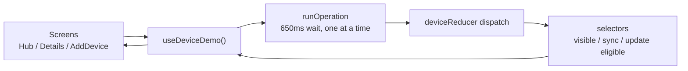

# Device Management (Demo)

The Devices feature is **Demo/mock only**. It lets coaches and athletes browse a simulated SSP-S1 tracker inventory, pair/rename/assign trackers, sync sessions, and check for firmware updates, all without contacting any hardware.

This is enforced by a source-contract test (`device-ui-source.test.mjs`, `forbiddenDeviceImport` regex): the `src/features/devices/**` tree must **not** import `react-native-ble-plx`, Supabase, AsyncStorage, or any BLE/DFU service. Every Bluetooth-style action is simulated with a fixed `DEMO_DELAY_MS = 650` timer and a truthfulness disclosure ("Demo complete — no hardware was contacted.") Real device BLE (GATT connect, session record/download, A-GPS assist, signed-URL upload) lives in the Tracker feature; see [Live Tracking & Sync](./tracker-and-sync). The "Open hardware connection" banner in Device Hub links to the real firmware flow at `/(role)/device/firmware`.

The backend [Devices API](../backend/routes/devices) (`/devices`, `/devices/:id/pair`, `/devices/:id/assign`, `/devices/:id/firmware-update`) is the server contract for tracker registration, pairing bonds, and OTA offers. The mobile Devices feature does **not** call that API; it is self-contained mock state. The Tracker feature calls session/ingestion gateway routes, but it does not implement the Devices API or an OTA/DFU client.

---

## 1. Provider — `DeviceDemoProvider`

**Source:** `src/features/devices/DeviceDemoProvider.tsx`

`DeviceDemoProvider` wraps each role group's Stack (`src/app/(coach)/_layout.tsx`, `src/app/(player)/_layout.tsx`) and holds all device state in a `useReducer(deviceReducer, undefined, createInitialDeviceState)` store. It is a local React context; nothing is persisted.

| Concern | Implementation |
| :--- | :--- |
| Demo delay | `DEMO_DELAY_MS = 650`. Every simulated BLE operation waits this long via a single shared `wait()` promise. |
| One operation at a time | `operationLocked` ref gates `runOperation`; a second connect/sync/update is a no-op while one is running. |
| Unmount safety | `mountedRef` + `pendingTimerRef` + `pendingResolveRef` cancel the pending Demo timer and resolve the promise on unmount, so a completed operation never dispatches into an unmounted provider. |
| Coach-only assignment | `assignDevice` early-returns when `role !== "coach"`. The reducer re-checks this (`deviceAssigned` ignores non-coach). |
| Player roster | `players: selectRolePlayers(state, role)`: coach sees `MOCK_DEVICE_PLAYERS`, player gets `[]`. |

Context value (`DeviceDemoContextValue`):

| Field | Behavior |
| :--- | :--- |
| `devices` | `selectVisibleDevices(state, role)`: coach by org, player by `ownerPlayerId`. |
| `discoveredDevices` | `selectDiscoveredDevices(state)`: mock scan results with `registered` flag recomputed. |
| `players` | `selectRolePlayers(state, role)`: roster for coach, empty for player. |
| `activeOperation` | Current `DeviceOperation` (running/succeeded/failed) or `undefined`. |
| `getDevice(id)` | Lookup in visible devices. |
| `addDevice(input)` | Synchronous; runs `getDeviceAddResult` against `stateRef.current`, applies `deviceReducer`, returns `AddDeviceResult` (ok/failure reason). |
| `renameDevice` / `assignDevice` / `unlinkDevice` | Synchronous dispatches, guarded by `operationLocked`. |
| `connectDevice` / `disconnectDevice` / `syncDevice` / `updateDevice` | Async; go through `runOperation` (650 ms wait, `operationStarted` → `operationFinished`). |
| `syncAll` / `pushUpdates` | Async bulk over `selectSyncEligibleIds` / `selectUpdateEligibleIds`. |
| `clearDevices` | Dispatches `sessionCleared` (empties devices/discoveredDevices/players). |

`useDeviceDemo()` throws if used outside the provider.

---

## 2. State — `device-state.ts`

**Source:** `src/features/devices/device-state.ts`

A pure reducer + selector module. It imports `mock-devices.ts` with an explicit `.ts` extension under a `@ts-expect-error` (Node's native test runner requires the extension; this is asserted by `device-ui-source.test.mjs`).

### Reducer actions

| Action | Effect |
| :--- | :--- |
| `deviceAdded` | Registers a discovered device; player-owned (ownerPlayerId + personal account org), coach-org-owned otherwise. Rejects duplicates via `getDeviceAddResult`. |
| `deviceAssigned` | Coach-only; sets `assignedPlayerId` + appends an "assigned" activity. Ignored for player. |
| `deviceRenamed` | Trims + validates name (≤40 chars), updates name + "renamed" activity. |
| `connectionChanged` | Sets `connectionStatus` + "connected" activity labelled "Demo connection {status} — no hardware contacted". |
| `deviceSynced` | Clears `pendingSessionUploads` and `sessionSlotsUsed`, sets `lastSyncedAt`, "synced" activity. |
| `deviceUpdated` | Sets `firmwareVersion` to `availableFirmwareVersion`, "updated" activity. |
| `deviceUnlinked` | Removes the device (unknown ids leave state unchanged). |
| `operationStarted` / `operationFinished` | Set `activeOperation`. |
| `sessionCleared` | Wipes devices/discoveredDevices/players. |

### Selectors and helpers

| Symbol | Purpose |
| :--- | :--- |
| `createInitialDeviceState(devices?)` | Clones mock devices/discovered/players into fresh state. |
| `selectVisibleDevices(state, role)` | Coach → devices where `organisationId === ACTIVE_ORGANISATION_ID`; player → `ownerPlayerId === ACTIVE_PLAYER_ID`. |
| `selectDiscoveredDevices(state)` | Mock scan list with `registered` re-derived from serial-number presence. |
| `selectRolePlayers(state, role)` | `state.players` for coach, `[]` for player. |
| `selectSyncEligibleIds(state, role)` | Visible + `connectionStatus === "connected"`. |
| `selectUpdateEligibleIds(state, role)` | Visible + connected + `availableFirmwareVersion` set and ≠ `firmwareVersion`. |
| `selectDeviceHubPriority(state, role)` | One truthful next action: `add` / `update` / `sync` / `review` / `busy`. |
| `selectDeviceReadiness(devices)` | Roll-up for the dashboard card: state `empty` / `attention` / `disconnected` / `ready`, with `label`, `detail`, `batteryPercent`, `pendingUploads`. |
| `getAssignmentLabel(device, players)` | `"Unassigned"`, player name, or `"Player unavailable"` for a stale id. |
| `getDeviceOperationLabel(deviceId, op)` | `"Syncing"` / `"Updating"` / `undefined` for a targeted running op. |
| `getDeviceAttentionReason(device)` | `"Critical battery"` / `"Storage full"` / `undefined`. |
| `getWarrantyStatus(expiresAt, now)` | `expired` / `expiring-soon` (≤30 days) / `active`. |
| `getRemainingSessionSlots(device)` | Clamped `total − used`, floored at 0. |
| `clampBatteryPercent(percent)` | Clamps to 0–100. |
| `getBatteryLevel(percent)` | `critical` (≤10) / `warning` (≤20) / `healthy`. |
| `validateDeviceName(value)` | `"Enter a device name"` (blank) / `"Use 40 characters or fewer"` / `undefined`. |
| `getDeviceAddResult(state, input)` | `device-not-found` / `already-registered` / `invalid-name` / `{ ok, deviceId }`. |
| `deviceReducer(state, action)` | The reducer itself. |

`selectDeviceReadiness` precedence (highest first): empty → firmware-update-available → low battery → pending uploads → disconnected → ready. Activity entries are prepended (newest-first) and carry unique ids (e.g. `${deviceId}-synced-${at}`), so repeated operations keep distinct keys.

---

## 3. Types — `types.ts`

**Source:** `src/features/devices/types.ts`

| Type | Values / Shape |
| :--- | :--- |
| `DeviceRole` | `"coach" \| "player"` |
| `ConnectionStatus` | `"connected" \| "disconnected" \| "connecting"` |
| `OperationKind` | `"connect" \| "disconnect" \| "sync" \| "update" \| "sync-all" \| "update-all"` |
| `WarrantyStatus` | `"active" \| "expiring-soon" \| "expired"` |
| `DeviceActivity` | `{ id; kind: "registered"\|"assigned"\|"renamed"\|"connected"\|"synced"\|"updated"; label; occurredAt }` |
| `RegisteredDevice` | Full tracker row (id, name, model `"SSP-S1"`, serialNumber, organisationId, ownerPlayerId?, assignedPlayerId?, connectionStatus, batteryPercent, lifetimeSessionsRecorded, pendingSessionUploads, sessionSlotsUsed/Total, firmwareVersion, availableFirmwareVersion?, registeredAt, lastSyncedAt?, warrantyExpiresAt, activity) |
| `DiscoveredDevice` | `{ id; model "SSP-S1"; serialNumber; signal "strong"\|"nearby"\|"weak"; registered }` |
| `MockPlayerOption` | `{ id; name }` |
| `AddDeviceInput` | `{ discoveryId; name; role; playerId? }` |
| `AddDeviceResult` | `{ ok: true; deviceId } \| { ok: false; reason }` |
| `DeviceOperation` | `{ kind; deviceIds; status "running"\|"succeeded"\|"failed"; message }` |
| `DeviceState` | `{ devices; discoveredDevices; players; activeOperation? }` |
| `DeviceAction` | Discriminated union of all reducer actions. |

---

## 4. Fixtures — `mock-devices.ts`

**Source:** `src/features/devices/mock-devices.ts`

| Constant | Value |
| :--- | :--- |
| `ACTIVE_ORGANISATION_ID` | `"org-izandla"` |
| `ACTIVE_PLAYER_ID` | `"p1"` |
| `PERSONAL_ACCOUNT_ID` | `"account-personal"` |
| `MOCK_DEVICE_PLAYERS` | 4 players: S. Mokoena (`p1`), L. Adams (`p2`), T. Nkosi (`p3`), J. Pieterse (`p4`) |
| `FIXTURE_REGISTERED_DEVICES` | 5 devices (see below), used only by tests |
| `MOCK_REGISTERED_DEVICES` | `[]` (empty); the provider starts with **no** devices |
| `MOCK_DISCOVERED_DEVICES` | 3 simulated scan results (`nearby-1`/`-2`/`-3`, signals strong/nearby/weak) |

`MOCK_REGISTERED_DEVICES` is empty by design: the Hub renders its empty state ("No devices yet") until the user pairs a tracker through AddDevice. `FIXTURE_REGISTERED_DEVICES` is the deterministic sample inventory used exclusively by the node tests.

### Fixture coverage (`FIXTURE_REGISTERED_DEVICES`)

| id | name | connection | battery | slots used/total | firmware / available | warranty |
| :--- | :--- | :--- | :--- | :--- | :--- | :--- |
| `device-1` | Sipho Match Unit | connected | 78% | 8/20 | v1.4.2 → v1.5.0 | 2027-04-30 |
| `device-2` | Midfield Unit 02 | disconnected | 20% | 17/20 | v1.5.0 | 2026-08-01 |
| `device-3` | Defence Unit 03 | connected | 92% | 3/20 | v1.5.0 | 2027-05-12 |
| `device-4` | Unassigned Tracker | disconnected | 10% | 20/20 | v1.4.2 → v1.5.0 | 2026-01-20 |
| `device-player-2` | Personal Training Unit | disconnected | 66% | 5/20 | v1.5.0 | 2027-05-08 |

This set covers: connected vs disconnected, warning (20%) vs critical (10%) battery, near-full (17/20) vs full (20/20) storage, active vs expiring-soon (2026-08-01) vs expired (2026-01-20) warranty, update-available vs up-to-date, unassigned, and player-owned personal-account devices. Seeded "connected"/"synced" activity is labelled with "Demo" + "no hardware contacted" (asserted by `device-state.test.mjs`).

---

## 5. Screens

All three screens import dashboard primitives via **checkout-relative** paths (`../../components/dashboard`), never `@/components/dashboard` (asserted by `device-ui-source.test.mjs`). Each renders a `DemoModeBanner`.

### 5.1 `DeviceHubScreen`

**Source:** `src/features/devices/DeviceHubScreen.tsx` · Props: `role`, `onBack`, `onAdd`, `onOpenFirmware`, `onOpenDevice`, `highlightedDeviceId?`, `isLoading?`

Layout, top to bottom:

1. **Firmware connection banner**: `RadioTower` + "Current SSP-S1 firmware" + "Open hardware connection" button → `onOpenFirmware` (the real Tracker flow).
2. `DemoModeBanner`.
3. **Readiness summary**: "{connectedCount} of {devices.length} connected" + "{pendingUploadCount} uploads pending".
4. **One priority action**: `selectDeviceHubPriority(state, role)` rendered as a single button with `testID="device-hub-priority-action"`. Kinds: `add` / `update` / `sync` / `review` / `busy`. Disabled when `busy` or `review`. Exactly one `testID` instance (asserted).
5. **Active operation banner**: `activeOperation.message` with a `Spinner` while running, `accessibilityLiveRegion="polite"`.
6. **Preview bulk states** (collapsed disclosure): `PreviewBulkOutcome = "none" | "partial" | "failed"`. The `Add device` / `Sync all` / `Push updates` buttons inside are real (they route through `handleSyncAll`/`handlePushUpdates`, which call the provider), but the `partial`/`failed` `Alert` previews are cosmetic (keyed by `previewBulkRevision`); "Demo operation failed. No hardware was contacted." with Retry/Dismiss. The raw `syncAll(`/`pushUpdates(` invocations are defined above the disclosure title, so none appear after it (asserted).
7. **Device list**: `DeviceRow` per visible device, or `EmptyState` "No devices yet" (the test explicitly forbids "Add your first device").

`highlightedDeviceId` (passed from the add route via `useLocalSearchParams`) is cleared after 1800 ms via `setTimeout`/`clearTimeout`; the matched row gets `border border-primary bg-primary/10` and <code v-pre>accessibilityState=&#123;&#123; selected: true &#125;&#125;</code>.

### 5.2 `DeviceDetailsScreen`

**Source:** `src/features/devices/DeviceDetailsScreen.tsx` · Props: `role`, `deviceId`, `onBack`, `onMissingDevice`

Sections: Device health (Battery / Connection / Last sync / Firmware) · Device statistics (Sessions recorded / Pending sync "Demo sessions") · Session storage (`SessionCapacity`) · Registration (registered date; coach: "Organisation" + assigned player + "Assign player" button opening a RadioGroup modal; player: "Account" = "Personal account") · Warranty (date + badge) · Software update ("Check for Software Update" → opens `FirmwareUpdateSheet`) · Demo device actions (Connect/Disconnect, Sync device, Push update, with a collapsed "Preview connection failure" disclosure showing "Demo connection failed. No hardware was contacted." + Retry) · Recent activity (newest-first) · Rename (Modal, `nativeID="rename-dialog-title"`) · Unlink (AlertDialog, `nativeID="unlink-dialog-title"`, `variant="destructive"`).

Truthfulness: assignment states use `getAssignmentLabel` ("Player unavailable" with an explanatory line if the roster id is stale); the assignment confirmation announces "Demo assignment saved. No hardware was contacted." via `AccessibilityInfo.announceForAccessibility`. `busy` (`operationRunning`) disables **≥5** controls (asserted: `isDisabled={busy}` count ≥ 5). Dialogs use `nativeID` + `accessibilityLabelledBy` pairs and `initialFocusRef={cancelUnlinkRef}` (no `leastDestructiveRef`).

### 5.3 `AddDeviceScreen`

**Source:** `src/features/devices/AddDeviceScreen.tsx` · Props: `role`, `onCancel`, `onComplete`

Three steps ("Step {step} of 3"):

| Step | Content |
| :--- | :--- |
| 1: Power on | "Switch on your tracker" + a collapsible "Tracker not switching on?" troubleshoot. "Next" → step 2. |
| 2: Scan | "Choose a nearby tracker" + "Simulated scan" badge. `ScanState`: `scanning` (650 ms via `SCAN_DELAY_MS = 650`, then `results`) / `results` (renders `DiscoveryRow`s; already-registered rows are disabled) / `empty` / `failed` (both reachable from the "Preview scan states" disclosure). |
| 3: Confirm | Selected device summary + `Device name` input (validated by `validateDeviceName`) + coach: `Select` for "Assign to player (optional)" (Unassigned + roster); player: "This tracker will be registered to your account". "Add device". |

Exit handling: `usePreventRemove(!allowRemoval, …)` imported from **`expo-router/react-navigation`** (not `expo-router/build/`, not a manual `beforeRemove` listener; asserted). `ExitIntent = "idle" | "cancel" | "navigation" | "complete"`. Stepping back from step 3 → 2 → 1; from step 1, a dirty form opens a discard `AlertDialog` ("Discard pairing changes?", "Keep pairing" / "Discard and exit"). On success: a Toast ("Device added in Demo mode" / "Device added in Demo mode. No Bluetooth connection was made."), `announceForAccessibility`, then `onComplete(deviceId)`. Duplicate registration returns `{ ok: false, reason: "already-registered" }` and shows "Already registered. Choose another tracker before adding." **before** any toast/announcement (ordering asserted).

Route wrappers (`src/app/(coach)/device/add.tsx`, `src/app/(player)/device/add.tsx`) call `router.dismissTo({ pathname: "/(role)/device", params: { addedDeviceId: deviceId } })`; they never use `router.replace`/`router.back`/`router.canGoBack` (asserted). Detail routes (`device/[id].tsx`) normalize array `id` params and `router.dismissTo("/(role)/device")` for `onBack`/`onMissingDevice`.

---

## 6. Components

### 6.1 `FirmwareUpdateSheet`

**Source:** `src/features/devices/components/FirmwareUpdateSheet.tsx`

An `Actionsheet` state machine. Constants: `CHECK_DELAY_MS = 1500`, `UPDATE_DURATION_MS = 3000`, `PROGRESS_INTERVAL_MS = 50`, `MIN_BATTERY_PERCENT = 60`.

| Step | Trigger / Display |
| :--- | :--- |
| `checking` | On open, 1500 ms spinner. |
| `low-battery` | `batteryPercent < 60` → destructive alert "Battery Too Low", charge to ≥60%. |
| `up-to-date` | No update available → "Firmware Up to Date" + current version badge. |
| `ready` | Update available → current/available badges + "Do not turn off the device" warning + "Update Now". |
| `updating` | `startUpdate`: cosmetic `Progress` (`accessibilityRole="progressbar"`, `accessibilityValue={min:0,max:100,now}`) advancing over 3000 ms, "Do not turn off the device" alert. |
| `success` / `failure` | After `onUpdate()` resolves/rejects. Failure offers "Retry update" / "Close". |

Concurrency guards: `updatingRef` rejects a second `startUpdate` while one is in flight (guard runs **before** `await onUpdate()`); `updateRunRef` is bumped on close/unmount/open so a stale completion cannot flip the step; `latestCheckRef` snapshots `{ batteryPercent, hasUpdate }` so a success view is not replaced when props change mid-check. `dismissable = step !== "updating"` (asserted).

### 6.2 `DemoModeBanner`

**Source:** `src/features/devices/components/DemoModeBanner.tsx`

An `Alert` (no `action`, no `variant="outline"`) with `AlertIcon as={Info}` and `text-foreground`: "Demo mode — Bluetooth actions are simulated in this preview. Device inventory and actions below are simulated. Hardware connection opens the live firmware flow." Supports a `compact` variant used by Details/AddDevice.

### 6.3 `DeviceRow`

**Source:** `src/features/devices/components/DeviceRow.tsx`

Exactly one `<Pressable>` (`min-h-12`, `accessibilityRole="button"`). The close/close-pressable counts are asserted to be 1 each. Wraps content in a `VStack` (no `numberOfLines`/`ellipsizeMode`/`line-clamp`/`isTruncated`; truncation is forbidden). Shows name, `DeviceStatusBadge`, model · serial, optional assignment, operation label (`Syncing`/`Updating`, `text-primary`), attention reason (`text-destructive`), and a labelled hierarchy: Battery / Pending uploads / Session capacity / Firmware / Last contact. The `accessibilityLabel` concatenates all of these (including ", newly added" when highlighted).

### 6.4 `DeviceStatusBadge`

**Source:** `src/features/devices/components/DeviceStatusBadge.tsx`

Labels: Connected / Disconnected / Connecting. Connected and Connecting use `bg-primary` + `text-primary-foreground` (Connecting shows a `Spinner`); Disconnected uses `variant="outline"` + `bg-muted` + `text-muted-foreground`. An "Update available" outline badge (`text-destructive`, `CircleAlert`) appears when `hasUpdate`. Wrapper: `accessibilityRole="text"` + `accessibilityLiveRegion="polite"` (never `accessibilityRole="status"`; asserted).

### 6.5 `SessionCapacity`

**Source:** `src/features/devices/components/SessionCapacity.tsx`

"{remaining} of {total} session slots available" + a `Progress` (`accessibilityRole="progressbar"`, `accessibilityLabel="Session storage"`, `accessibilityValue={min:0,max:total,now:remaining}`). `total === 0` guards a divide-by-zero. Storage messages: "Storage nearly full" (≤3 remaining) / "Storage full" (0 remaining), both `text-destructive`.

---

## 7. Tests

Both are node `--test` source-contract tests (`npm run test:legacy`).

### 7.1 `device-state.test.mjs`

**Source:** `src/features/devices/device-state.test.mjs`. Exhaustive reducer/selector coverage using `FIXTURE_REGISTERED_DEVICES`. Covers: coach (4 visible) vs player (2 visible) scoping; readiness states (empty/ready/attention-precedence/disconnected); seeded Demo activity disclosures; deterministic add → assign → rename → connect → sync → update → unlink; duplicate-pairing returns input state unchanged; `sessionCleared` empties everything; hub priority (`add`/`update`/`sync`/`review`/`busy`) and label plurals; `getDeviceAddResult` ok + `already-registered`; capacity/battery/warranty/name-validation boundaries; bulk selectors (`selectSyncEligibleIds = [device-1, device-3]`, `selectUpdateEligibleIds = [device-1]`); player add uses personal-account ownership; player cannot assign; assignment labels (named / "Player unavailable" / "Unassigned"); operation labels only for targeted running devices; attention reasons (critical battery / storage full); disconnect/reconnect activity newest-first with unique ids; repeated rename/assignment keeps unique activity ids.

### 7.2 `device-ui-source.test.mjs`

**Source:** `src/features/devices/device-ui-source.test.mjs`. Grep-based source contracts. Covers: `forbiddenDeviceImport` regex across `src/features/devices/**` (no ble-plx/supabase/async-storage/ble-service/dfu-service) and the specifier self-test; 48dp buttons on Hub/Add/Details; accessibility props on status badge, details, row, capacity (no `accessibilityRole="status"`); `@ts-expect-error` + `.ts` extension import in `device-state.ts` and no `.ts`-extension import in `mock-devices.ts`; `DemoModeBanner` present on Hub/Add/Details; role wrappers pin `role="coach"`/`"player"` and never cross; checkout-relative imports for routes (`../../features/devices` etc., no `@/features/devices`) and dashboard (`../../components/dashboard`, no `@/`); fixture coverage (connected/disconnected, 78/20/10, slots 8/17/20, warranty dates, `availableFirmwareVersion: "v1.5.0"`, `"Unassigned Tracker"`); bulk-preview disclosure + non-mutating after-title; `DemoModeBanner` disclosure text + local `Alert` props; status-badge mapping + `gap-1` spacing (4 badges); `DeviceRow` single `Pressable` + assignment/update detail + no truncation; Hub coach assignment vs player omission; `SessionCapacity` guards; hub priority single `testID`; empty/loading truthful states (no "Add your first device"); DeviceRow label hierarchy; AddDevice three steps + `usePreventRemove` + `ExitIntent` + discard dialog + stale-action guards + public `expo-router/react-navigation` import; completion → `params: { addedDeviceId }` → Hub highlight (`bg-primary/10`, `selected`); Add/Details routes use `router.dismissTo` (no replace/back/canGoBack); Details requested info + confirmed actions + `isDisabled={busy}` ≥5 + dialogs `nativeID`/`accessibilityLabelledBy` + `initialFocusRef`; FirmwareUpdateSheet all seven steps + battery guard + progressbar + catch→failure + `dismissable = step !== "updating"` + duplicate/stale rejection + `latestCheckRef`; provider timer cancellation (`mountedRef`, `clearTimeout`, `if (!mountedRef.current)`) + coach-only assignment + `operationLocked` on unlink.

---

## 8. Where real hardware lives

| Concern | Demo (this feature) | Current non-Demo mobile status |
| :--- | :--- | :--- |
| BLE connect/scan | Simulated, 650 ms | `NativeTrackerService`: 15 s connect, real GATT |
| Session record/download | `deviceSynced` clears counters | `tracker.startSession`/`downloadSession`, `protocol.ts` |
| Firmware update | `FirmwareUpdateSheet` cosmetic 3000 ms | **Not implemented in mobile.** The backend exposes offer metadata, but this app has no 0x07 DFU characteristic, download/install transport, or post-reset verification. |
| Sync to backend | None | `uploadFirmwareSession` → signed URL → `completeIngest` |
| A-GPS assist | None | `assistGps` (expo-location) |

For the source-implemented BLE lifecycle, see [Live Tracking & Sync](./tracker-and-sync) and [BLE GATT Protocol](./ble-protocol). For the server-side device/pairing/assignment/OTA-offer contract that is not yet consumed here, see the backend [Devices API](../backend/routes/devices).
