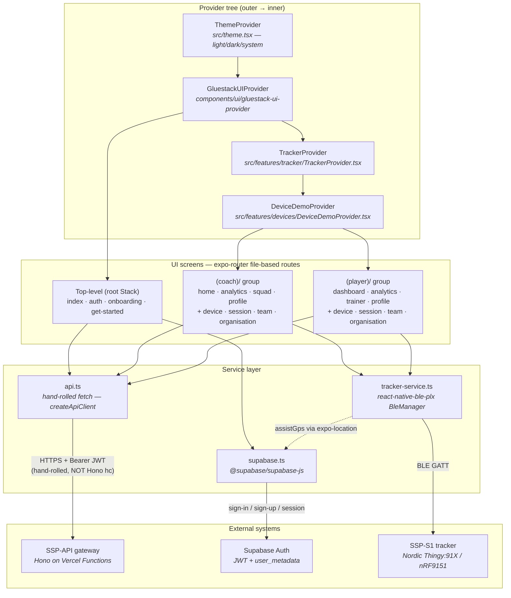

# Mobile App Overview

**SSP-Mobile-App** is the Expo / React Native companion app for the **SSP-S1** sports tracker (Nordic Thingy:91X / nRF9151). It serves **coaches** and **athletes** with equal priority as a single, connected workflow: performance dashboards, live BLE tracking, device management, and firmware maintenance.

The app talks to two backends: **Supabase Auth** for sign-in / sign-up / session (direct), and the **SSP-API** gateway for all data reads and writes (via a hand-rolled `fetch` client — see [API Client](./api-client)). Hardware (`SSP-S1`) is reached over BLE from the mobile app only, never from the gateway. See the backend [Architecture](../backend/architecture) for the gateway topology this app calls.

> The repo's `CLAUDE.md` is **stale** and contradicts the actual working tree (it claims a "minimal scaffold", "BLE app deleted", "Figtree font", a "green CTA", and "no test runner" — none of which are true). This documentation cites actual source files, not `CLAUDE.md`.

---

## Technology Stack

Source: `package.json`, `app.json`, `tsconfig.json`, `metro.config.js`, `babel.config.js`, `postcss.config.mjs`.

| Layer | Technology | Version | Notes |
| :--- | :--- | :--- | :--- |
| Framework | Expo SDK | ~56.0.12 | `expo-router` entry |
| Runtime | React Native | 0.85.3 | |
| UI library | React | 19.2.3 | |
| Language | TypeScript | ~6.0.3 | `strict: true`, extends `expo/tsconfig.base` |
| Routing | `expo-router` | ~56.2.11 | `experiments.typedRoutes: true`, file-based, `NativeTabs` |
| Styling | NativeWind v5 | ^5.0.0-preview.2 | Tailwind v4 via `@tailwindcss/postcss` + `react-native-css` |
| Component lib | gluestack-ui v5 | ^5.0.15 | Generated components in `components/ui/*` at repo root |
| Auth | `@supabase/supabase-js` | ^2.110.8 | `src/lib/supabase.ts` |
| BLE | `react-native-ble-plx` | ^3.5.1 | `src/features/tracker/tracker-service.ts` |
| Location | `expo-location` | ~56.0.22 | A-GPS assist in `TrackerProvider.tsx` |
| Charts / SVG | `react-native-svg` | 15.15.4 | Hand-rolled SVG charts in `src/components/dashboard/charts/` |
| Animation | `@legendapp/motion` | ^2.5.3 | FadeIn pattern, reduce-motion aware |
| Icons | `lucide-react-native` | ^1.25.0 | |
| Fonts | `@expo-google-fonts/lato` | ^0.4.1 | Lato_300Light / 400Regular / 700Bold / 900Black (Figtree is forbidden) |
| Test runners | `vitest` + `node --test` | ^4.1.10 | Dual runner — `.test.ts` (vitest) + `.test.mjs` (node source-contract tests) |

See [Configuration & Build](./configuration) for `app.json`, `eas.json`, env vars, and the BLE-requires-dev-build note.

---

## What's Implemented vs Mocked

The app is a full, role-gated application — not a scaffold. The honest current state, per the actual working tree:

| Area | State | Detail |
| :--- | :--- | :--- |
| Role-gated routing | **Implemented** | `src/app/index.tsx` entry gate resolves role (athlete→player, else coach) via `api.getMe()`; `(coach)/` and `(player)/` groups each guarded by `useRoleGuard`. |
| Auth | **Implemented** | Supabase `signInWithPassword` (`src/app/auth.tsx`), `signUp` in get-started (`src/app/get-started.tsx`), session gate, logout. |
| Onboarding + get-started wizard | **Implemented** | 3-page onboarding carousel (`src/app/onboarding.tsx`) + multi-step get-started wizard (`src/app/get-started.tsx` + `src/components/get-started/*Step.tsx`). |
| Live BLE tracking | **Implemented** | `src/features/tracker/protocol.ts` (GATT service + characteristics), `tracker-service.ts` (BleManager), `TrackerProvider.tsx`, `sync.ts` upload, `FirmwareTrackerScreen.tsx`. Requires a development build — **not** Expo Go. |
| Session history & detail | **Real API data** | `useApiSessions` / `useApiSession` (`src/hooks/use-api-sessions.ts`) carry real data from the SSP-API. |
| Profile identity | **Real API data** | `useApiMe` (`src/hooks/use-api-me.ts`) via `api.getMe()`. |
| Dashboards & analytics charts | **Mocked / empty** | All `MOCK_*` arrays in `src/components/dashboard/mock-data.ts` are `[]`; screens render empty states. Analytics charts use empty `MOCK_*`, **not** API-fed. `FIXTURE_*` constants hold sample data but are **not** imported by screens (tests only). |
| Device management | **Demo / mock only** | `src/features/devices/**` simulates all BLE actions with `DEMO_DELAY_MS = 650` and "no hardware was contacted" disclosures. No `react-native-ble-plx` / supabase / async-storage imports in that tree (test-enforced). Real device BLE lives in `src/features/tracker/` — see [Tracker & Sync](./tracker-and-sync). |
| Team / organisation screens | **Read-only / empty** | `team.tsx` and `organisation.tsx` render non-interactive explanatory content with empty `MOCK_*` data. |

See [Dashboard & Analytics](./dashboard-and-analytics) for the mock-vs-real data boundary and [Devices](./devices) for the demo-only device feature.

---

## Two Role Experiences

The app exposes two parallel role experiences, each with its own route group, role guard, and four-tab bottom navigation (`NativeTabs`, `tintColor="#003399"`, `labelVisibilityMode="labeled"`).

| Role | Route group | Tabs (in order) | Tab icons |
| :--- | :--- | :--- | :--- |
| **Coach** | `src/app/(coach)/` | Home · Analytics · Squad · Profile | house · chart.bar · person.3 · person.crop.circle |
| **Player** | `src/app/(player)/` | Home (dashboard) · Analytics · Trainer · Profile | house · chart.bar · dumbbell · person.crop.circle |

Both groups wrap their screens in `TrackerProvider` > `DeviceDemoProvider role="<role>"` and set `unstable_settings = { initialRouteName: "(tabs)" }`. The `ApiRole` model on the backend is `athlete / coach / sub_coach / organisation_admin / ssp_super_admin`; the app's UI role is `coach` or `player`, mapped by `src/lib/session.ts` `getUserRole` (`athlete → player`, default `coach`) and confirmed at launch by `api.getMe()`.

See [Architecture & Navigation](./architecture) for the full route tree, provider hierarchy, and entry-gate decision flow.

---

## App Layering

The app is structured as four layers: UI screens (expo-router file-based routes) sit above a provider tree, which sits above the service layer, which talks to external systems. The root layout (`src/app/_layout.tsx`) assembles `ThemeProvider → SafeAreaProvider → GluestackUIProvider(mode) → StatusBar → Stack`; each role group adds `TrackerProvider` and `DeviceDemoProvider` inside its `Stack`.

The API client is a **hand-rolled `fetch`** wrapper (`src/lib/api.ts`, `createApiClient`) — it is **not** Hono `hc()`, **not** `hono/client`, and there is **no** `AppType` contract import. The backend publishes an `AppType` contract; the mobile app does not currently consume it. See [API Client](./api-client) and the backend [Client Contract](../backend/client-contract).

---

## Documentation Index

| Document | What it covers |
| :--- | :--- |
| [Architecture & Navigation](./architecture) | App shell, provider hierarchy, expo-router file-based route tree, role guards, the `src/app/index.tsx` entry-gate decision flow, navigation conventions. |
| [BLE GATT Protocol](./ble-protocol) | `protocol.ts` constants, characteristic table, parsers/builders, and the implemented-vs-spec divergences. |
| [Live Tracking & Sync](./tracker-and-sync) | `TrackerService` / `NativeTrackerService`, real timeouts, `TrackerProvider`, `sync.ts` upload flow, `FirmwareTrackerScreen` UI, dev-build requirement. |
| [API Client & Data Layer](./api-client) | Hand-rolled `fetch` client, 28-method endpoint table, `api-session-adapter`, Supabase client, data hooks. |
| [Auth, Onboarding & Get-Started](./auth-and-onboarding) | Supabase auth, session gate, onboarding carousel, get-started wizard, logout. |
| [Device Management (Demo/Mock)](./devices) | The demo-only devices feature, `DeviceDemoProvider`, reducer/selectors, mock fixtures, screens, firmware update sheet. |
| [Dashboard & Analytics](./dashboard-and-analytics) | Mock-vs-real data boundary, dashboard components, SVG charts, heatmap, session history/detail, analytics screens. |
| [Design System](./design-system) | Brand colors (blue `#003399`, red `#C70000`/`#FF0000`, grey `#B2B2B2`; green forbidden), Lato typography, radii/spacing, semantic colors, gluestack/NativeWind, motion & accessibility. |
| [Testing](./testing) | Dual runner (vitest + node --test), the 4 `.test.ts` and 14 `.test.mjs` files, brand-contract and ux-truth enforcement. |
| [Configuration & Build](./configuration) | `app.json`, `eas.json`, env vars, `.npmrc`, `tsconfig.json`, toolchain config, dev-build vs Expo Go. |

### Related backend docs

The mobile app's `api.ts` methods map onto the SSP-API gateway route contract. Cross-references into the backend docs:

- [Backend Architecture](../backend/architecture) — gateway topology and route mount chain.
- [Backend API Reference](../backend/api-reference) — the endpoint surface this app calls.
- [Backend Auth & Security](../backend/auth-and-security) — the JWT the mobile Supabase token becomes once verified by the gateway.
- [Backend Client Contract](../backend/client-contract) — the `AppType` the backend publishes (mobile does not currently consume it).
- [Backend Ingestion Pipeline](../backend/ingestion-pipeline) — the signed-URL upload + `completeIngest` flow used by `sync.ts`.