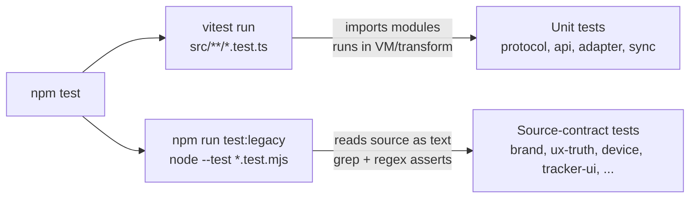

# Testing

The **SSP-Mobile-App** runs **two test runners in one command**. `npm test`
executes `vitest run` first, then `npm run test:legacy` (`node --test` over every
`.test.mjs` file). The split is deliberate, not legacy baggage: the two runners
guard two different kinds of truth about the codebase.



Source: `package.json` (`scripts.test`, `scripts.test:legacy`),
`vitest.config.ts`.

> **Stale-CLAUDE.md note.** The mobile repo's `CLAUDE.md` claims there is "No
> test runner". That is wrong. The dual runner below is wired in `package.json`
> and `vitest.config.ts` and covers 33 test files. Cite those files, not
> `CLAUDE.md`.

---

## Why two runners

| Runner | Files | What it asserts | Why it needs its own runner |
| :--- | :--- | :--- | :--- |
| `vitest run` | `src/**/*.test.ts` (16 files) | **Unit behavior**: protocol/API plus device bindings, queue/reconnect policy, cache/index/list/track, step detector, sync engine/runtime store, and MCUmgr CBOR/SMP. | Needs ESM/TS transform and mockable native/network boundaries. |
| `node --test` | `src/**/*.test.mjs` (17 files) | **Source contracts + pure helpers**: source wiring, brand/UX truth, device/tracker UI, dashboard bucketing/geometry/history. | Plain Node can read source as text and import pure helpers without mounting React Native. |

The `.test.mjs` suite is named "legacy" in the npm script only because it predates
the vitest addition. It is not deprecated: it carries the highest-value
enforcement tests in the repo (brand-contract and ux-truth-source, below).

### Vitest configuration

`vitest.config.ts` is minimal and explicit:

```ts
import { defineConfig } from "vitest/config";
export default defineConfig({
  test: {
    include: ["src/**/*.test.ts"],
    exclude: [".worktrees/**", "node_modules/**"],
  },
});
```

The glob `src/**/*.test.ts` scopes vitest to the 16 unit-test files; the
`.mjs` source-contract files are never picked up by vitest because they do not
match the `include` pattern. The `.worktrees/**` exclusion keeps agent worktree
copies out of the run.

---

## Vitest files (16)

These files import the module under test and assert on return values or controlled collaborators.

| File | Scope |
| :--- | :--- |
| `src/lib/api.test.ts` | Bearer/auth errors, signed upload, claim payload, and a 32-method path/verb map. The newer athlete analytics/goals methods are not yet in that map. |
| `src/lib/api-session-adapter.test.ts` | Unit conversions (m→km, mps→kmh×3.6), `intensity` thresholds (`Max` ≥85, `High` ≥65, `Moderate` ≥35), `totalMetrics`, and `telemetryToHeatPoints` normalization. |
| `src/features/tracker/protocol.test.ts` | Every BLE parser: `parseStatus`, `parseLiveSample` (IMU 21B / GNSS), `parseSessionListEntry` (15B + null), `parseSessionDownloadEvent`, `parseFirmwareSession` (v2 magic `0x53535031`), `buildReferenceLocationRequest` (23B), `parseReferenceLocationResult`, and `toTelemetryEnvelope` including the refusal of a no-GPS anchor (`unixEpochSeconds === 0`). |
| `src/features/tracker/sync.test.ts` | `uploadFirmwareSession`: `createIngestUrl` → `uploadToSignedUrl` (no bearer) → `completeIngest`, returns point count. |
| `src/features/tracker/dfu/{cbor,smp}.test.ts` | Minimal CBOR and MCUmgr SMP framing, image list/upload/state/reset request/response contracts. |
| `src/features/tracker/{operation-queue,auto-connect-policy,tracker-runtime-store}.test.ts` | Serialized work, reconnect/A-GPS policy, download dedupe and connection-scoped runtime state. |
| `src/features/tracker/{session-index,session-list,session-track,geocode-cache}.test.ts` | Persistent session metadata, merged lists, map tracks and cached place labels. |
| `src/features/tracker/{step-detector,sync-engine}.test.ts` | Live step estimation and the background firmware-download/API-upload state machine. |
| `src/features/devices/device-bindings.test.ts` | Per-user BLE bindings, app instance id and last-connected target persistence. |

---

## node --test files (17)

Each `.test.mjs` file is a Node test suite that reads source as text and/or
imports pure modules. One-line summaries below; full descriptions live in the
relevant sibling doc.

| File | One-line summary |
| :--- | :--- |
| `src/app/index-source.test.mjs` | `FORCE_DASHBOARD` routes coach home; otherwise the onboarding/remember/supabase session gate resolves role. |
| `src/components/dashboard/brand-contract.test.mjs` | Brand tokens, Lato, shared primitives, 48dp controls, semantic colors, floating tab bar, and the pinned SSP mark. |
| `src/components/dashboard/athlete-analytics-bucketing.test.mjs` | Day/week/month athlete metric buckets, missing values, zone distribution and bucket-window inversion. |
| `src/components/dashboard/charts/session-telemetry-bucketing.test.mjs` | Telemetry range filtering, intensity/load/distance buckets and drill-down window resolution. |
| `src/components/dashboard/charts/time-series-chart.test.mjs` | Plot geometry finite for empty/one-point/flat/negative/normal data, cubic controls in-segment range, accessibility label (range/unit/extrema/latest/direction), latest comparison, both roles day/week/month datasets. |
| `src/components/dashboard/coach-feedback.test.mjs` | Fixture length 3, dates newest-first, deterministic absolute dates (`"18 Jul 2026"`). |
| `src/components/dashboard/dashboard-helpers.test.mjs` | `getProgressPercentage` clamps, `usesLargeTextLayout` at 1.5 + rejects NaN/Infinity, `buildPerformanceSummaryAccessibilityLabel` up/down/no-change with NaN/Infinity fallback. |
| `src/components/dashboard/heatmap-density.test.mjs` | Invalid samples removed/clamped, nearby greater than isolated density, empty/single stable, dominant third / insight / peak percent, accessibility label. |
| `src/components/dashboard/session-history-source.test.mjs` | Both analytics screens expose `SessionHistorySection` + `useApiSessions`, expansion/row accessibility, wrapper-rotation (not icon), detail bounded nav + heatmap legend + role metrics, SVG instance-scoped defs + markings on top, role routes stable + `router.replace` (no `router.back`), semantic blue→red density, session detail preserves API UUID + truthful missing states. |
| `src/components/dashboard/session-history.test.mjs` | Fixture length 4, ordered earliest to latest, valid ISO timestamps, duration greater than 0, gpsPoints 0 to 1 normalized, adjacent-nav boundaries, newest-first sort, role metric selection (coach=teamMetrics, player=playerMetrics). |
| `src/components/dashboard/ux-truth-source.test.mjs` | Truthful actions/data, API-backed auth and player analytics, accessibility, floating-tab clearance, logout ordering, and role boundaries. |
| `src/components/dashboard/weekly-performance.test.mjs` | Current-vs-prior week score, missing workload handling and zero-session behavior. |
| `src/components/onboarding/onboarding-brand-source.test.mjs` | Entry + auth use `ssp-mark` (no ShieldCheck), auth guards concurrent sign-in + truthful copy, onboarding header SSP identity once, primary/secondary actions wired + dashboard bypass dev-only, carousel replaces legacy icon hero, form labels/errors/password accessible, motion bounded + ReduceMotion (duration 0.2, no spring), choice cards + progress dots 48dp. |
| `src/features/devices/device-state.test.mjs` | Exhaustive reducer/selector coverage: coach vs player visibility, readiness states, priority, add/assign/rename/sync/update/connect/disconnect/unlink determinism, duplicate-pairing failure, `sessionCleared`, capacity/battery clamps, bulk selectors, assignment labels, operation labels, attention reasons, activity uniqueness/newest-first. |
| `src/features/devices/device-ui-source.test.mjs` | Live provider/claim/scan/actions, no Demo provider, role-safe routes, pairing wizard, 48dp/accessibility, disconnected session visibility, telemetry/session rows/maps, and firmware-panel truth. |
| `src/features/tracker/tracker-ui-source.test.mjs` | Live tracking state labels + elapsed + connection quality + one primary action, brand red non-text only (`backgroundColor: "#FF0000"`, no `text-[#FF0000]` / `color:`), secondary ops disabled + motion-free, elapsed resets on connection/recording loss, device/API Pressables expose blocked state. |
| `src/lib/logout.test.mjs` | Logout attempts every cleanup, navigate LAST (`allSettled`, even if `signOut` throws). |

---

## Enforcement highlights

Two of the `.test.mjs` files do disproportionate work. They are the reason the
source-contract suite exists.

### `brand-contract.test.mjs`: the forbidden-green / Figtree / ssp-mark / 48dp gate

This single file pins the visual identity of the app by reading source as
text. If any of the following regress, `npm test` fails:

- **Forbidden green.** `assert.doesNotMatch(css, /34 197 94/)` and
  `assert.doesNotMatch(theme, /#22C55E/i)`: the Tailwind v4 RGB triple and the
  hex form of `#22C55E` are both blocked across `global.css` and `src/theme.tsx`.
- **Forbidden Figtree.** `assert.doesNotMatch(packageJson, /@expo-google-fonts\/figtree/)`
  and `assert.doesNotMatch(layout, /Figtree/)`; only `@expo-google-fonts/lato`
  is allowed, and all four faces (`Lato_300Light/400Regular/700Bold/900Black`)
  must be loaded.
- **`ssp-mark.png` sha256 pin.**
  `285d48c68c00ec1060f4cc0c0cd0c4694bada2522766c0ccb9c4eec9995bd3f5`: the
  brand mark asset is hashed and compared exactly, so a swapped or recompressed
  PNG fails the suite.
- **48dp touch targets.** `min-h-12` on the auth RememberMe `<Switch>`,
  `min-h-12 rounded-lg ring-ring` on the shared `button` primitive, and
  `min-h-12 min-w-12` enforced across headers/rows throughout the suite.
- **Semantic tokens.** All 14 light + dark CSS triples are matched, the
  `SEMANTIC_COLORS` object is matched by a single multi-line regex, and the
  gluestack provider's `mode === "system" ? "unspecified" : mode` +
  `Appearance.setColorScheme(resolvedMode)` clearing behavior is pinned.
- **Floating navigation brand.** Both role layouts must use `FloatingTabBar`,
  with the SSP mark and semantic colors pinned. Shared primitives must use brand typography
  classes and must NOT contain hardcoded hex or palette utilities
  (`bg-green-`, `bg-white`, `bg-black`, etc.).

See [Design System](./design-system) for the full brand spec these tests guard.

### `ux-truth-source.test.mjs`: the truthfulness gate

Where `brand-contract` guards the *look*, `ux-truth-source` guards *what the UI
claims to do*. It asserts that screens only surface actions that are
wired and only show data that is fetched: no fake buttons, no mocked
data presented as real, no demo actions presented as live hardware. Highlights:

- **No fake actions.** People rows (`PlayerRow`) have one status and no
  `onPress`; team/organisation screens are non-interactive and explanatory
  ("Team settings are read-only in SSP", "Not available in SSP"); the squad
  weekly-goals modal is read-only with no Save button; `DevRoleSwitcher` returns
  `null` (disabled).
- **Real hardware claims only where wired.** Device screens must use the live
  provider, scan/claim/actions and cannot contain the old Demo disclosures.
- **Real API data only where claimed.** Session history/profile and player
  analytics/goals are API-backed. Coach analytics and the remaining placeholder
  cards remain explicitly mock/empty.
- **Auth + logout wiring.** `supabase.auth.signInWithPassword` +
  `api.getMe()` + shared `LogoutSettingsRow`; `logoutLocalSession` runs
  `Promise.allSettled` and navigates to `/auth` LAST, even if `signOut` throws.
- **Accessibility + motion.** 48dp across headers/rows/dots, motion bounded
  (`duration: 0.2`, no spring, `ReduceMotionProvider`), `accessibilityRole`
  set correctly on summary/alert/listitem, 112px tab bottom clearance,
  `DASHBOARD_MAX_FONT_SIZE_MULTIPLIER` enforced on player home.

---

## Commands

All commands run from the mobile repo root
(`/Users/nduzi/Documents/IzandlaSystems/SSP-Mobile-App`). Scripts are defined in
`package.json`; `tsc --noEmit` is invoked via `npx` (there is no dedicated
typecheck script).

| Command | What it does | When to use it |
| :--- | :--- | :--- |
| `npm run lint` | `expo lint` (ESLint via `eslint-config-expo`). | After any source change. |
| `npx tsc --noEmit` | Typecheck the whole project against `tsconfig.json` (`strict: true`, paths `@/* → [./src/*, ./*]`). | Before commit; catches type drift the unit tests do not. |
| `npm test` | `vitest run && npm run test:legacy`, runs all 4 vitest files then all 14 `node --test` files. | The full gate. CI should run this. |
| `npm run test:legacy` | `node --test $(find src -name '*.test.mjs' -print)`, only the 14 source-contract files. | Iterate on a single `.mjs` suite without waiting for vitest. |
| `npx expo start` | Start the Metro bundler / Expo dev server (web + Expo Go). | Non-BLE development; BLE is **not** available in Expo Go (falls back to `FallbackTrackerService`). |
| `npx expo run:ios` | Build + launch an iOS **development build** on a simulator or connected device. | Required for real BLE (`react-native-ble-plx` native module). See [Configuration & Build](./configuration). |
| `npx expo run:android` | Build + launch an Android **development build** on an emulator or connected device. | Required for real BLE on Android. |

### Verified baseline: 2026-08-28

Checked in the `worktree-live-ble` worktree at commit `6814766`, including its current uncommitted mobile changes documented on the [Overview](./):

| Gate | Result | Evidence |
| :--- | :--- | :--- |
| `npm test` | **Pass** | 16 Vitest files / 107 tests; 17 Node files / 128 tests. Node emitted non-fatal `MODULE_TYPELESS_PACKAGE_JSON` warnings for imported `.ts` helpers. |
| `npx tsc --noEmit` | **Fail** | 12 errors: ten generated Gluestack primitive typing errors and two route-to-prop errors where coach/player Device Hub routes still pass removed `onOpenFirmware` props. |
| `npm run lint` | **Fail** | 145 problems: 72 errors and 73 warnings. Most are generated `components/ui` imports/hooks/compiler findings; app-source warnings also remain in `DeviceProvider`, device session detail, athlete analytics, and `DevRoleSwitcher`. |
| Simulator / signed build | **Not run** | No iOS/Android runtime, navigation, permission, or packaging proof in this audit. |
| Live Supabase / SSP-API | **Not run** | No authenticated environment, live database, storage upload, or deployment smoke test. |
| Physical SSP-S1 BLE | **Not run** | No scan, bond, GATT operation, recording, download, A-GPS acknowledgement, or device reboot proof. |

A passing `npm test` therefore proves the documented unit/source contracts only. It does not make the checkout release-ready while TypeScript and ESLint remain red, and it does not replace the three runtime gates above.

> **BLE and the dev build.** The tracker subsystem needs the
> `react-native-ble-plx` native module, which Expo Go does not bundle. Run a
> development build (`npx expo run:ios` / `run:android`) to exercise real BLE; in
> Expo Go the app falls back to `FallbackTrackerService` and every tracker
> operation throws. This is covered in [Live Tracking & Sync](./tracker-and-sync).

---

## Cross-references

- [Design System](./design-system): the brand tokens, Lato typography, and 48dp
  rules that `brand-contract.test.mjs` enforces.
- [Dashboard & Analytics](./dashboard-and-analytics): the mock-vs-real data
  distinction that `ux-truth-source.test.mjs` guards.
- [Device Management](./devices): the live provider, action and truthfulness contracts enforced by
  `device-ui-source.test.mjs`.
- [Live Tracking & Sync](./tracker-and-sync): the tracker UI labels and
  brand-red recording dot enforced by `tracker-ui-source.test.mjs`.
- [API Client](./api-client): the current fetch surface and the endpoint-map coverage gap in
  `src/lib/api.test.ts`.
- [Configuration & Build](./configuration): env vars, EAS build profiles, and
  the dev-build requirement for BLE.
