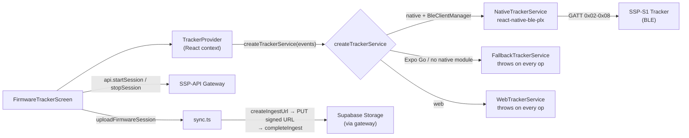
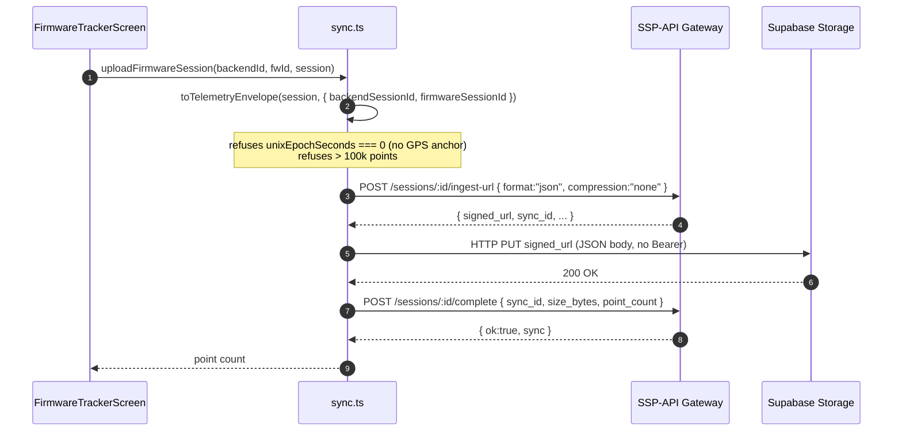

# Live Tracking & Sync

The tracker subsystem is the only part of the mobile app that talks to real
**SSP-S1** hardware. It scans for a `"SportTracker"` device over BLE, connects,
drives recording, downloads stored firmware sessions, and uploads the decoded
telemetry to the backend's ingestion pipeline. The GATT characteristic layout,
parsers, and command bytes that this layer consumes are defined in
[BLE GATT Protocol](./ble-protocol); this page covers the service, provider,
sync, and UI built on top of them.



> **Build requirement.** BLE is only available in an **iOS or Android
> development build** (`npx expo run:ios` / `run:android`). Expo Go does not
> bundle `react-native-ble-plx`'s native module, so the app falls back to
> `FallbackTrackerService` and every tracker operation throws. Web builds get a
> dedicated `WebTrackerService` stub that throws the same way. See
> [Configuration & Build](./configuration) for the build modes.

---

## Service layer

Source: `src/features/tracker/tracker-service.types.ts`,
`src/features/tracker/tracker-service.ts`,
`src/features/tracker/tracker-service.web.ts`.

### `TrackerService` interface

`tracker-service.types.ts` defines the contract every implementation satisfies.

| Member | Signature | Notes |
| :--- | :--- | :--- |
| `DiscoveredTracker` | `{ id; name; rssi: number \| null }` | One scan result. |
| `TrackerServiceEvents` | `onConnectionChange`, `onStatus`, `onLiveSample`, `onError` | Callbacks the provider wires to React state. |
| `TrackerService` | `startScan`, `stopScan`, `connect`, `disconnect`, `startSession`, `stopSession`, `sendReferenceLocation`, `listSessions`, `downloadSession`, `destroy` | The full tracker surface. |
| `TrackerServiceFactory` | `(events: TrackerServiceEvents) => TrackerService` | What the provider calls. |

### `NativeTrackerService`

`tracker-service.ts` — the real implementation, backed by
`react-native-ble-plx`.

- **BleManager singleton** — lazily constructed (`new BleManager()`), reused
  across scans/connects, and destroyed in `destroy()`.
- **Scan** — `startScan` requests Android permissions (BLUETOOTH_SCAN/CONNECT
  on API ≥ 31, else ACCESS_FINE_LOCATION), verifies Bluetooth is `PoweredOn`,
  then filters for `device.name ?? device.localName` equal to `TRACKER_NAME`
  (`"SportTracker"`).
- **Connect** — `manager.connectToDevice(deviceId, { timeout: 15_000 })`, then
  `discoverAllServicesAndCharacteristics`, then on Android
  `device.requestMTU(65)`. After connect it reads the STATUS characteristic
  once and subscribes to the four notify characteristics.
- **Subscriptions** — on connect the service subscribes to `0x02` STATUS,
  `0x08` LIVE_DATA, `0x03` SESSION_LIST, and `0x05` SESSION_DATA, and registers a
  `manager.onDeviceDisconnected` handler (`disconnectSubscription`) that tears
  down the connection and fails any in-flight operation.
- **Sequential operations** — one list, one download, and one reference request
  may run at a time. Each occupies a single slot (`listOperation`,
  `downloadOperation`, `referenceOperation`); starting a second of the same
  kind throws (e.g. `"A session download is already running."`).
- **Status confirmation** — `startSession`/`stopSession` write a control byte
  then `waitForStatus(predicate)` resolves once a matching STATUS notify
  arrives (or rejects on timeout).

#### Real timeouts

The timeouts below are the values actually in `tracker-service.ts`. There is
no "5 s / 6 s" convention — that prose only appears in the stale `CLAUDE.md`.

| Operation | Timeout | Where |
| :--- | :--- | :--- |
| Connect to device | 15 s | `connectToDevice({ timeout: 15_000 })` |
| Status confirm (start/stop) | 10 s | `waitForStatus` timer |
| Reference location (A-GPS) | 10 s | `sendReferenceLocation` timer |
| List firmware sessions | 30 s | `listSessions` timer |
| Download one session | 90 s | `downloadSession` timer |

### Fallback and Web stubs

`createTrackerService` selects the implementation:

```mermaid
flowchart TD
    Start["createTrackerService(events)"] --> Web{Platform.OS === "web"?}
    Web -->|"yes (uses tracker-service.web.ts)"| WebStub["WebTrackerService<br/>throws on every op"]
    Web -->|"no"| NativeMod{NativeModules.BleClientManager?}
    NativeMod -->|"missing (Expo Go)"| Fallback["FallbackTrackerService<br/>\"only available in a native development build (not Expo Go)\""]
    NativeMod -->|"present"| Try["new NativeTrackerService()"]
    Try -->|"BleManager throws"| Fallback2["FallbackTrackerService<br/>with init error"]
    Try -->|"ok"| Native["NativeTrackerService"]
```

- **`FallbackTrackerService`** — every method throws with a fixed reason
  (`"Bluetooth tracker access is only available in a native development build
  (not Expo Go)."` by default, or the `BleManager` init error). `stopScan`,
  `disconnect`, and `destroy` are no-ops. Used when `Platform.OS !== "web"` **and**
  `!NativeModules.BleClientManager`, or when constructing
  `NativeTrackerService` throws.
- **`WebTrackerService`** (`tracker-service.web.ts`) — a separate stub for web
  builds. Every operation throws `"Bluetooth tracker access is only available in
  an iOS or Android development build."`; `stopScan`, `disconnect`, and
  `destroy` are no-ops. This is the file Metro selects on web; it is not a
  functional implementation.

---

## TrackerProvider

Source: `src/features/tracker/TrackerProvider.tsx`.

`TrackerProvider` constructs one `TrackerService` (via `createTrackerService`,
memoised) and exposes its events as React state. It wraps both the coach and
player role groups (see [Architecture](./architecture)). The `run` helper sets a
`busy` label and clears `error` around every async operation so the UI can show
a single in-progress string and surface failures.

### Context state

| Field | Type | Source |
| :--- | :--- | :--- |
| `scanning` | `boolean` | `startScan`/`stopScan` toggle. |
| `connectedDevice` | `DiscoveredTracker \| null` | `onConnectionChange`. |
| `discoveredDevices` | `DiscoveredTracker[]` | Scan results, de-duped and sorted by RSSI desc. |
| `status` | `TrackerStatus \| null` | `onStatus` (parsed `0x02`). |
| `liveSample` | `LiveSample \| null` | `onLiveSample` (parsed `0x08`). |
| `firmwareSessions` | `StoredSessionInfo[]` | Set after `listSessions`. |
| `downloads` | `Record<number, ParsedFirmwareSession>` | Keyed by firmware session id. |
| `busy` | `string \| null` | Label of the running operation. |
| `error` | `string \| null` | Last error message. |

### Methods

| Method | What it does |
| :--- | :--- |
| `scan()` / `stopScan()` | Start/stop BLE scan; discovered devices accumulate sorted by RSSI. |
| `connect(deviceId)` | Stop scan, then `service.connect`. |
| `disconnect()` | `service.disconnect`. |
| `startSession()` | `service.startSession` (writes `0x01`, waits for recording status). |
| `stopSession()` | `service.stopSession` (writes `0x02`, waits for idle status). |
| `assistGps()` | `expo-location` `requestForegroundPermissionsAsync` → `getCurrentPositionAsync({ accuracy: Balanced })` → `service.sendReferenceLocation`. Builds a `PhoneReferenceLocation` from the phone fix (altitude defaults to 0, accuracy to 100 m, `unixEpochSeconds` from the location timestamp, `timeUncertaintyMs: 1000`). |
| `listSessions()` | `service.listSessions` → stores result in `firmwareSessions`. |
| `downloadSession(sessionId)` | `service.downloadSession` → stores parsed session in `downloads[sessionId]`. |
| `clearError()` | Clears the `error` field. |

`useTracker()` reads the context and throws if used outside `TrackerProvider`.

---

## Sync flow

Source: `src/features/tracker/sync.ts`.

`uploadFirmwareSession(backendSessionId, firmwareSessionId, session, client?)`
turns a downloaded `ParsedFirmwareSession` into telemetry points and pushes
them through the backend's direct-to-storage ingestion pipeline. It accepts an
optional `client` (a `Pick<ApiClient, "createIngestUrl" | "uploadToSignedUrl" |
"completeIngest">`) so tests can stub the API; when omitted it lazy-imports the
default `api` client.



The three steps map onto the backend's [Ingestion Pipeline](../backend/ingestion-pipeline):

1. **`createIngestUrl(backendSessionId, { format: "json", compression: "none" })`**
   — mints a presigned upload URL and inserts a `pending` `sync_records` row.
   The mobile app uploads **uncompressed JSON** (`compression: "none"`), unlike
   the backend's gzip default.
2. **`uploadToSignedUrl(signed_url, body, "application/json")`** — PUTs the JSON
   envelope straight to Supabase Storage. The signed URL carries its own token;
   **no Bearer header** is sent (see [API Client](./api-client)).
3. **`completeIngest(backendSessionId, { sync_id, size_bytes, point_count })`**
   — flips the sync row to `in_progress` and the session to `syncing`, which
   the backend's CRON parser later picks up to decode, aggregate, and persist.

`toTelemetryEnvelope` (in `protocol.ts`) does the conversion. It refuses a
session with `unixEpochSeconds === 0` (no GPS/UTC anchor) **even if it is empty**,
so an invalid file can never be marked synced, and caps at 100,000 points. IMU
records become points with `accel_magnitude` (mg → m/s² via `* 0.00980665`);
GNSS records become points with `lat`/`lng`/`speed_mps` only when `valid`.
Timestamps are reconstructed from the session's `unixEpochSeconds` anchor plus
per-record uptime.

`uploadFirmwareSession` returns the point count and throws if the envelope has
zero points (`"The downloaded firmware session contains no uploadable
points."`).

---

## FirmwareTrackerScreen

Source: `src/features/tracker/FirmwareTrackerScreen.tsx`. Mounted at
`(coach)/device/firmware` and `(player)/device/firmware` (see
[Architecture](./architecture)).

The screen is the one place where BLE hardware, the tracker provider, and the
backend API meet. It is **motion-free** — there is no `Motion.*`, `Animated.*`,
`withRepeat`, or `withTiming` anywhere in the file (enforced by
`tracker-ui-source.test.mjs`).

### Startup

On mount it loads `api.listSessions({ limit: 100 })` and filters to sessions
whose status is `ready`, `recording`, or `ended`. The user picks one `ready`
API session to link to the next firmware session before starting a recording.

### Record / stop / upload

| Action | Flow |
| :--- | :--- |
| **Start recording** | Require a selected `ready` API session → `tracker.startSession()` → on success `api.startSession(selectedApiSession.id, { firmware_session_id: String(status.firmwareSessionId) })`. If the API call fails, the tracker is already recording and the error explains the mismatch. |
| **Stop recording** | `tracker.stopSession()` → find the API session with `status === "recording"` and matching `firmware_session_id` → `api.stopSession(mapped.id, { actual_end_at: new Date().toISOString() })` → reload API sessions + `tracker.listSessions()`. |
| **Upload** | Require the firmware session to be downloaded (`tracker.downloads[id]`) → `uploadFirmwareSession(backendSessionId, firmwareSessionId, downloaded)` → reports the uploaded point count. |

A single `blocked` flag (`tracker.busy !== null || apiBusy !== null`) disables
every secondary control while any operation is in flight, and every
session/device `Pressable` exposes `disabled={blocked}` plus an
`accessibilityState.disabled` for assistive tech.

### State labels

`stateLabel` is computed in a fixed priority order (the order matters and is
verified by `tracker-ui-source.test.mjs`):

| Label | Condition (first match wins) |
| :--- | :--- |
| `Stopping` | `tracker.busy === "Stopping recording"` **or** `apiBusy === "Stopping"` |
| `Recording live` | `tracker.status?.isRecording` |
| `Connecting` | `tracker.busy === "Connecting"` |
| `Requesting phone location` | `tracker.busy === "Assisting GPS"` |
| `Uploading` | `apiBusy` starts with `"Uploading"` |
| `Needs attention` | `tracker.error \|\| apiError` |
| `Ready` | `tracker.connectedDevice` is set |
| `Offline` | none of the above (no device) |

When recording, the label is preceded by a small live mark — a
<code v-pre>&lt;Box style=&#123;&#123; backgroundColor: "#FF0000" &#125;&#125; accessible=&#123;false&#125; /&gt;</code> — plus a
`Square` icon in `text-destructive`. The exact brand red (`#FF0000`) is used
**only on this non-text dot**; the test suite explicitly forbids
`text-[#FF0000]` and `color: "#FF0000"` so red is never applied to text (see
[Design System](./design-system)).

### Live data display

While connected, the screen renders the latest `liveSample`:

- **GNSS** — `GPS fix` / `No GPS fix`, satellite count, and speed in m/s.
- **IMU** — acceleration magnitude `Math.hypot(x, y, z)` in mg.

It also shows elapsed time (`formatElapsed`, `HH:MM:SS`, resetting to
`00:00:00` and clearing `recordingStartedAt` when the connection or recording
drops) and connection quality (`connectionQuality`: Strong ≥ −60 dBm, Fair ≥
−75 dBm, Weak below, Unavailable when RSSI is null).

### Stored firmware sessions

Below the live section, a "Stored firmware sessions" list lets the user
refresh (`tracker.listSessions`), download each session
(`tracker.downloadSession`), and — once downloaded and matched to an API
session — upload it. The Upload button is disabled when there is no matching API
session ("No matching API session") or when the downloaded session has no
GPS/UTC anchor (`unixEpochSeconds === 0`, "GPS/UTC time required").

---

## Tests

The tracker feature has three test files, split across the two runners (see
[Testing](./testing)).

| File | Runner | Covers |
| :--- | :--- | :--- |
| `src/features/tracker/protocol.test.ts` | vitest | All parsers, the v2 firmware file parse (magic `0x53535031`, 32-byte header, 17-byte records), `toTelemetryEnvelope`, and the refusal of a no-GPS-anchor session. |
| `src/features/tracker/sync.test.ts` | vitest | The signed-upload flow: `createIngestUrl` → `uploadToSignedUrl` (with `firmware_session_id` in the body) → `completeIngest` with `sync_id` + `point_count`; returns 1 for a single-IMU-record session. |
| `src/features/tracker/tracker-ui-source.test.mjs` | `node --test` | Source-contract: the eight state labels all appear, `formatElapsed` + connection quality + one primary action, `Session control` precedes `Live data`, brand red is confined to `backgroundColor: "#FF0000"` (no `text-[#FF0000]`/`color:`), secondary ops are explicit + disabled while busy + motion-free, elapsed resets on connection/recording loss, and device/API Pressables expose `blocked`. |

---

## Cross-references

- [BLE GATT Protocol](./ble-protocol) — characteristic table, parsers/builders,
  and the implemented-vs-spec divergences (download `0x11` u16, no `0x03`
  DELETE, no `0x07` DFU, 15-byte list entries).
- [API Client](./api-client) — the hand-rolled `fetch` client
  (`createIngestUrl`, `uploadToSignedUrl` with no Bearer, `completeIngest`,
  `startSession`, `stopSession`, `listSessions`).
- [Backend: Ingestion Pipeline](../backend/ingestion-pipeline) — the gateway
  side of the three-step upload (presigned URL, direct-to-storage PUT, async
  parse worker).
- [Configuration & Build](./configuration) — why BLE needs a development build
  and how Expo Go falls back.