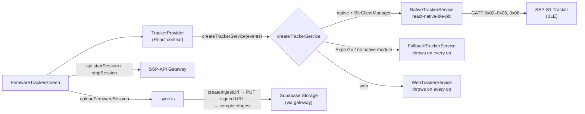
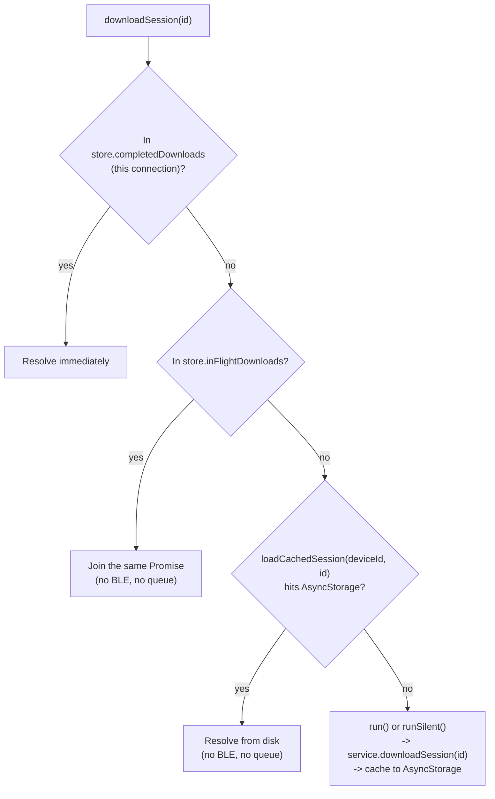
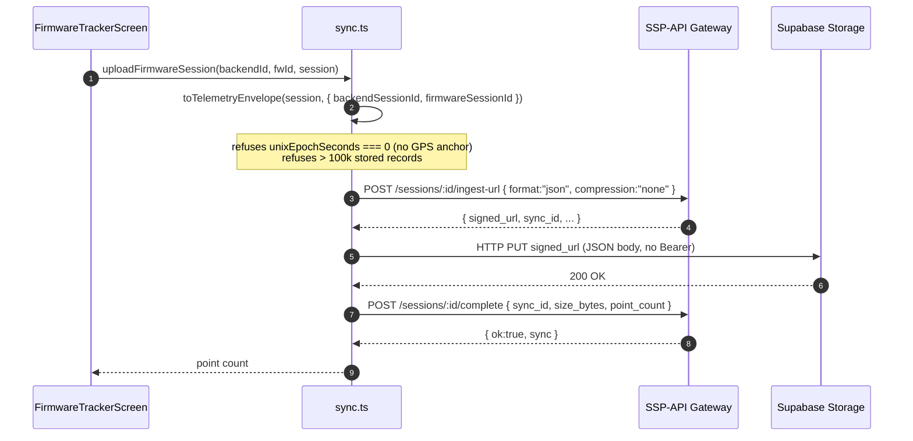

# Live Tracking & Sync

The tracker subsystem is the only part of the mobile app that talks to real
**SSP-S1** hardware. It scans for a `"SportTracker"` device over BLE, connects,
drives recording, downloads stored firmware sessions, and uploads the decoded
telemetry to the backend's ingestion pipeline. The GATT characteristic layout,
parsers, and command bytes that this layer consumes are defined in
[BLE GATT Protocol](./ble-protocol); this page covers the service, provider,
sync, and UI built on top of them.



> **Build requirement.** BLE is only available in an **iOS or Android
> development build** (`npx expo run:ios` / `run:android`). Expo Go does not
> bundle `react-native-ble-plx`'s native module, so the app falls back to
> `FallbackTrackerService` and every tracker operation throws. Web builds get a
> dedicated `WebTrackerService` stub that throws the same way. See
> [Configuration & Build](./configuration) for the build modes.

> **Evidence boundary.** The service, parser, sync, and UI contracts are source- and unit-test verified. This audit did not establish a BLE connection, confirm the exact firmware revision, upload to a live backend, or validate a post-reset device. Treat those as runtime gates, not implied outcomes of the passing source tests.

`TrackerProvider` no longer just relays the service's events into React state:
it also serializes every BLE-touching call through a single **operation
queue** (`operation-queue.ts`), runs background work — reconnect, session
sync, A-GPS assist — through a **silent lane** that never surfaces as a
user-facing error, and drives a **background sync engine**
(`sync-engine.ts`) that keeps this phone's local session history and
SSP-API in step with whatever the tracker is holding. See
[TrackerProvider](#trackerprovider) and
[Session history & background sync](#session-history-background-sync)
below.

---

## Service layer

Source: `src/features/tracker/tracker-service.types.ts`,
`src/features/tracker/tracker-service.ts`,
`src/features/tracker/tracker-service.web.ts`.

### `TrackerService` interface

`tracker-service.types.ts` defines the contract every implementation satisfies.

| Member | Signature | Notes |
| :--- | :--- | :--- |
| `DiscoveredTracker` | `{ id; name; rssi: number \| null }` | One scan result. |
| `TrackerServiceEvents` | `onConnectionChange`, `onStatus`, `onLiveSample`, `onError` | Callbacks the provider wires to React state. |
| `TrackerService` | `startScan`, `stopScan`, `connect`, `disconnect`, `startSession`, `stopSession`, `sendReferenceLocation`, `listSessions`, `downloadSession`, `listFirmwareImages`, `uploadFirmwareImage`, `setFirmwareImageState`, `resetDevice`, `destroy` | The full tracker surface. The four `*Firmware*`/`resetDevice` members are the MCUmgr/SMP DFU surface (`tracker-service.ts` now imports `SmpClient` from `./dfu/smp-client`); see [BLE GATT Protocol](./ble-protocol) for the DFU characteristic layer. |
| `TrackerServiceFactory` | `(events: TrackerServiceEvents) => TrackerService` | What the provider calls. |

### `NativeTrackerService`

`tracker-service.ts` is the real implementation, backed by
`react-native-ble-plx`.

- **Per-service BleManager**: each `NativeTrackerService` lazily constructs one
  manager (`new BleManager()`), reuses it across that service's scans/connects,
  and destroys it in `destroy()`.
- **Scan**: `startScan` requests Android permissions (BLUETOOTH_SCAN/CONNECT
  on API ≥ 31, else ACCESS_FINE_LOCATION), verifies Bluetooth is `PoweredOn`,
  then filters for `device.name ?? device.localName` equal to `TRACKER_NAME`
  (`"SportTracker"`).
- **Connect**: `manager.connectToDevice(deviceId, { timeout: 15_000 })`, then
  `discoverAllServicesAndCharacteristics`, then on Android
  `device.requestMTU(65)`. After connect it reads the STATUS characteristic
  once and subscribes to the four notify characteristics.
- **Subscriptions**: on connect the service subscribes to `0x02` STATUS,
  `0x08` LIVE_DATA, `0x03` SESSION_LIST, and `0x05` SESSION_DATA, and registers a
  `manager.onDeviceDisconnected` handler (`disconnectSubscription`) that tears
  down the connection and fails any in-flight operation. The 0x05 handler also
  recognizes subtype `0x20` as the acknowledgement for a reference-location
  request written to 0x06.
- **Sequential operations**: one list, one download, and one reference request
  may run at a time. Each occupies a single slot (`listOperation`,
  `downloadOperation`, `referenceOperation`); starting a second of the same
  kind throws (e.g. `"A session download is already running."`).
- **Status confirmation**: `startSession`/`stopSession` write a control byte
  then `waitForStatus(predicate)` resolves once a matching STATUS notify
  arrives (or rejects on timeout).

#### Real timeouts

The timeouts below match `tracker-service.ts`. There is
no "5 s / 6 s" convention; that prose only appears in the stale `CLAUDE.md`.

| Operation | Timeout | Where |
| :--- | :--- | :--- |
| Connect to device | 15 s | `connectToDevice({ timeout: 15_000 })` |
| Status confirm (start/stop) | 10 s | `waitForStatus` timer |
| Reference location (A-GPS) | 10 s | `sendReferenceLocation` timer |
| List firmware sessions | 30 s | `listSessions` timer |
| Download one session | 90 s | `downloadSession` timer |

### Fallback and Web stubs

`createTrackerService` selects the implementation:

```mermaid
flowchart TD
    Start["createTrackerService(events)"] --> Web{Platform.OS === "web"?}
    Web -->|"yes (uses tracker-service.web.ts)"| WebStub["WebTrackerService<br/>throws on every op"]
    Web -->|"no"| NativeMod{NativeModules.BleClientManager?}
    NativeMod -->|"missing (Expo Go)"| Fallback["FallbackTrackerService<br/>\"only available in a native development build (not Expo Go)\""]
    NativeMod -->|"present"| Try["new NativeTrackerService()"]
    Try -->|"BleManager throws"| Fallback2["FallbackTrackerService<br/>with init error"]
    Try -->|"ok"| Native["NativeTrackerService"]
```

- **`FallbackTrackerService`**: every method throws with a fixed reason
  (`"Bluetooth tracker access is only available in a native development build
  (not Expo Go)."` by default, or the `BleManager` init error). `stopScan`,
  `disconnect`, and `destroy` are no-ops. Used when `Platform.OS !== "web"` **and**
  `!NativeModules.BleClientManager`, or when constructing
  `NativeTrackerService` throws.
- **`WebTrackerService`** (`tracker-service.web.ts`): a separate stub for web
  builds. Every operation throws `"Bluetooth tracker access is only available in
  an iOS or Android development build."`; `stopScan`, `disconnect`, and
  `destroy` are no-ops. This is the file Metro selects on web; it is not a
  functional implementation.

---

## TrackerProvider

Source: `src/features/tracker/TrackerProvider.tsx`, `operation-queue.ts`,
`tracker-runtime-store.ts`, `use-auto-reconnect.ts`, `use-auto-assist-gps.ts`,
`auto-connect-policy.ts`.

`TrackerProvider` constructs one `TrackerService` (via `createTrackerService`,
memoised) and exposes its events as React state. It wraps both the coach and
player role groups (see [Architecture](./architecture)). Three things now run
concurrently against that one service instance — a user tapping buttons, a
background session-sync engine, and foreground auto-reconnect/auto-A-GPS — so
the provider centers on making that safe rather than on the events-to-state
mapping alone.

### The BLE operation queue

`tracker-service.ts` allows exactly one in-flight list/download/reference
operation at a time and throws on a second concurrent call (see
[Sequential operations](#nativetrackerservice) above). Once background sync
can run at the same time as a user tap, two callers can reach the service at
once, so `TrackerProvider` funnels every BLE-touching call through one
`OperationQueue` (`createOperationQueue()`, memoised per provider instance):

- `queue.run(task)` chains `task` onto a private promise tail; whatever the
  previous task did — resolve or reject — the next task still runs, so one
  failed sync step can never wedge the queue for everything queued behind it.
- `connect()` and `disconnect()` deliberately **bypass** the queue (see
  `runUnqueued` below): they must be able to pre-empt a slow queued download
  rather than wait behind it.

### Three execution lanes

| Lane | Helper | Touches `busy`/`error`? | Goes through the queue? | Used by |
| :--- | :--- | :--- | :--- | :--- |
| User-facing, queued | `run(label, op)` | Yes — sets `busy`, clears then reports `error` | Yes | `startSession`, `stopSession`, `assistGps`, `listSessions`, non-silent `downloadSession`, the DFU methods |
| Background, queued | `runSilent(op)` | **No** | Yes | Auto-reconnect's session-sync path, silent `downloadSession` calls, `assistGpsSilent` |
| User-facing, unqueued | `runUnqueued(label, op)` | Yes | **No** | `scan`, `connect`, `disconnect` |

`busy` and `error` are single global slots the UI treats as user-facing
(buttons disable on `busy`; `error` renders as a destructive alert). Auto
reconnect, background sync, and auto-A-GPS all call through `runSilent` (or,
for auto-A-GPS's own permission/location step, run outside any lane) so a
tracker that's merely out of range, or a background sync retry, never pops an
error the user didn't ask about. Callers on the silent lane own their own
failure handling — `runSync` records failures into the `sync` state, not
`error`.

### Context state

| Field | Type | Source |
| :--- | :--- | :--- |
| `scanning` | `boolean` | `startScan`/`stopScan` toggle. |
| `connectedDevice` | `DiscoveredTracker \| null` | `onConnectionChange`. |
| `discoveredDevices` | `DiscoveredTracker[]` | Scan results, de-duped and sorted by RSSI desc. |
| `status` | `TrackerStatus \| null` | `onStatus` (parsed `0x02`). |
| `liveSample` | `LiveSample \| null` | `onLiveSample` (parsed `0x08`); GNSS mirrors immediately, IMU is throttled (see below). |
| `lastImuSample` | `LiveImuSample \| null` | Last IMU sample, held separately so a fast IMU stream can't drown out the last GNSS fix. |
| `lastGnssSample` | `LiveGnssSample \| null` | Last GNSS fix, held separately from the IMU stream. |
| `liveSteps` | `number` | Running total from `LiveStepDetector`, fed every IMU packet; resets to 0 on `startSession()`. An estimate for live feedback, not the authoritative count (see `StoredSessionInfo.totalSteps`). |
| `firmwareSessions` | `StoredSessionInfo[]` | Set after `listSessions`. |
| `sessions` | `SessionListItem[]` | `mergeSessionSources(sessionIndex, firmwareSessions)` — the local index merged with the tracker's live list; see [Session history & background sync](#session-history-background-sync). Available while disconnected. |
| `downloads` | `Record<number, ParsedFirmwareSession>` | Keyed by firmware session id. |
| `dfuImages` | `DfuImageSlot[]` | MCUmgr image slots, refreshed by `listFirmwareImages()`; not cached client state. |
| `dfuProgress` | `{ sent: number; total: number } \| null` | Set only while a firmware image upload is in flight. |
| `busy` | `string \| null` | Label of the running user-facing operation (`run`/`runUnqueued` lanes only). |
| `error` | `string \| null` | Last user-facing error message. |
| `sync` | `SyncState` (`phase`, `completed`, `total`, `firmwareSessionId?`, `message?`, `lastRunAt?`) | Background sync-engine progress; never surfaced through `error`. |
| `autoConnectTarget` | `string \| null` | BLE id `DeviceProvider` wants kept connected while the app is foregrounded; set via `setAutoConnectTarget`. |
| `activeBleDeviceId` | `string \| null` | `connectedDevice?.id ?? autoConnectTarget` — the tracker whose `sessions`/`downloads` are currently in scope: the connected one, or the reconnect target while offline. Screens must check this before showing session data. |

### Methods

| Method | What it does |
| :--- | :--- |
| `scan()` / `stopScan()` | Start/stop BLE scan (unqueued); discovered devices accumulate sorted by RSSI. |
| `connect(deviceId)` | Unqueued. Clears `reconnectSuspended`, stops scan, then `service.connect`. |
| `disconnect()` | Unqueued. Sets `reconnectSuspended = true` (see [Auto-reconnect](#auto-reconnect)), then `service.disconnect`. |
| `startSession()` | Queued, user-facing. Resets the step detector, then `service.startSession` (writes `0x01`, waits for recording status). |
| `stopSession()` | Queued, user-facing. `service.stopSession` (writes `0x02`, waits for idle status). |
| `assistGps()` | Queued, user-facing. `expo-location` `requestForegroundPermissionsAsync` → `getCurrentPositionAsync({ accuracy: Balanced })` → `sendReferenceLocation`, which builds a `PhoneReferenceLocation` from the phone fix (altitude defaults to 0, accuracy defaults to 100 m and is floored at 1 m, `unixEpochSeconds` from the location timestamp, `timeUncertaintyMs: 1000`). |
| `listSessions()` | Queued, user-facing. `service.listSessions` → stores result in `firmwareSessions`. |
| `downloadSession(sessionId, { silent? })` | See [Download dedupe](#download-dedupe) below; queued (silent or user-facing depending on the flag) unless the answer comes from memory or disk, in which case it never touches the queue at all. |
| `listFirmwareImages()` / `uploadFirmwareImage()` / `setFirmwareImageState()` / `resetDevice()` | Queued, user-facing. Thin wrappers over the matching `TrackerService` DFU methods; see [BLE GATT Protocol](./ble-protocol). |
| `clearError()` | Clears the `error` field. |
| `syncNow()` | Runs the background sync engine immediately; resolves when the run finishes. Same function the automatic trigger calls (see [Session history & background sync](#session-history-background-sync)). |
| `refreshSessionIndex()` | Re-reads the local session index from AsyncStorage, e.g. after a manual upload wrote to it. |
| `setAutoConnectTarget(bleDeviceId)` | Called by `DeviceProvider` with the one BLE id auto-reconnect, background sync, and auto-A-GPS should key off. |
| `getImuSampleCount()` | Reads `TrackerRuntimeStore`'s raw IMU packet counter directly — deliberately **not** React state, so a 50 Hz stream can drive a live "pulse" indicator (`LivePulse.tsx`) without re-rendering the screen 50×/sec. |
| `getLastActivityAt()` | Epoch ms of the last status or live packet, or `null`; same non-React-state rationale. |

`useTracker()` reads the context and throws if used outside `TrackerProvider`.

### Download dedupe

`downloadSession(sessionId, { silent })` is shared by the user (opening a
session row) and the background sync engine (downloading whatever's new), so
the same session can be requested from two places within milliseconds of each
other. `TrackerRuntimeStore` (`tracker-runtime-store.ts`) resolves it in a
fixed order, checked once per call:



A fresh attempt is registered in `inFlightDownloads` *before* it awaits
anything, so a second caller that arrives while the first is still resolving
the disk cache — not just while it's mid-BLE-transfer — joins the same
promise instead of hitting `tracker-service.ts`'s `"A session download is
already running."` guard. The map entry is cleared on both success and
failure. `completedDownloads` and `inFlightDownloads` are cleared whenever a
*different* tracker connects (`TrackerRuntimeStore.attach()` reports the
change), since firmware session ids are per-device.

### Auto-reconnect

Source: `use-auto-reconnect.ts`, backoff table in `auto-connect-policy.ts`.

Foreground-only: `app.json` keeps BLE background mode off, so there's no
OS-level background BLE to lean on. `useAutoReconnect` fires an attempt when
**all** of these hold: a `targetBleDeviceId` is set (from `autoConnectTarget`),
the tracker isn't already connected, reconnect isn't suspended, and the app is
in the foreground (`AppState.currentState === "active"`). Delays come from
`RECONNECT_BACKOFF_MS = [0, 3_000, 8_000, 15_000, 30_000, 60_000]` — the first
attempt after a target appears is immediate, later attempts back off, and the
last value repeats indefinitely for as long as the tracker stays unreachable.
A successful connect resets the counter to 0; a failed attempt increments it
(the tracker being out of range is the expected case, not an error). Returning
to the foreground also resets the counter — a backlog built up while
backgrounded shouldn't make the next attempt wait longer.

**A user-initiated `disconnect()` suppresses this entirely**: it sets
`reconnectSuspended = true` in `TrackerProvider`, and the effect's guard
clause bails out while that flag is set. The suspension is cleared by any
subsequent call to `connect()` — a manual reconnect, or `DeviceProvider`
verifying a discovered device before pairing — so "Disconnect" means it until
the user (or a pairing flow) explicitly connects again.

### Auto-A-GPS

Source: `use-auto-assist-gps.ts`, `shouldAssistGnss`/`AUTO_ASSIST_DELAY_MS` in
`auto-connect-policy.ts`.

`useAutoAssistGps` waits `AUTO_ASSIST_DELAY_MS` (6 s) after a connection
appears, then silently sends a phone-derived reference location if the
tracker's own GNSS is still working on a fix. It fires when: a device is
connected, nothing is recording, this connection hasn't already been assisted
(tracked per `connectedBleDeviceId` in a ref, reset on disconnect), and
`gnssState` is `1` (Searching) or `3` (Timeout) — not `0` (Off, nothing to
help) and not `2` (Fix, already has one). The 6 s delay exists so a tracker
that's about to get a fix from its own recent ephemeris isn't pre-empted for
no reason. `assistGpsSilent()` only uses **already-granted** location
permission (`getForegroundPermissionsAsync`, never `requestForeground...`) and
is a no-op if it isn't granted; it stays off `busy`/`error` and runs through
`runSilent`. It fires at most once per connection.

---

## Sync flow

Source: `src/features/tracker/sync.ts`.

`uploadFirmwareSession(backendSessionId, firmwareSessionId, session, client?)`
turns a downloaded `ParsedFirmwareSession` into telemetry points and pushes
them through the backend's direct-to-storage ingestion pipeline. It accepts an
optional `client` (a `Pick<ApiClient, "createIngestUrl" | "uploadToSignedUrl" |
"completeIngest">`) so tests can stub the API; when omitted it lazy-imports the
default `api` client.



The three steps map onto the backend's [Ingestion Pipeline](../backend/ingestion-pipeline):

1. **`createIngestUrl(backendSessionId, { format: "json", compression: "none" })`**:
   mints a presigned upload URL and inserts a `pending` `sync_records` row.
   The mobile app uploads **uncompressed JSON** (`compression: "none"`), unlike
   the backend's gzip default.
2. **`uploadToSignedUrl(signed_url, body, "application/json")`**: PUTs the JSON
   envelope straight to Supabase Storage. The signed URL carries its own token;
   **no Bearer header** is sent (see [API Client](./api-client)).
3. **`completeIngest(backendSessionId, { sync_id, size_bytes, point_count })`**:
   flips the sync row to `in_progress` and the session to `syncing`, which
   the backend's CRON parser later picks up to decode, aggregate, and persist.

`toTelemetryEnvelope` (in `protocol.ts`) does the conversion. It refuses a
session with `unixEpochSeconds === 0` (no GPS/UTC anchor) **even if it is empty**,
so an invalid file can never be marked synced, and rejects more than 100,000
stored records before filtering invalid GNSS records. IMU
records become points with `accel_magnitude` (mg → m/s² via `* 0.00980665`);
GNSS records become points with `lat`/`lng`/`speed_mps` only when `valid`.
Timestamps are reconstructed from the session's `unixEpochSeconds` anchor plus
per-record uptime.

`uploadFirmwareSession` returns the point count and throws if the envelope has
zero points (`"The downloaded firmware session contains no uploadable
points."`).

---

## FirmwareTrackerScreen

Source: `src/features/tracker/FirmwareTrackerScreen.tsx`. Mounted at
`(coach)/device/firmware` and `(player)/device/firmware` (see
[Architecture](./architecture)).

The screen is the one place where BLE hardware, the tracker provider, and the
backend API meet. It is **motion-free**: there is no `Motion.*`, `Animated.*`,
`withRepeat`, or `withTiming` anywhere in the file (enforced by
`tracker-ui-source.test.mjs`).

### Startup

On mount it loads `api.listSessions({ limit: 100 })` and filters to sessions
whose status is `ready`, `recording`, or `ended`. The user picks one `ready`
API session to link to the next firmware session before starting a recording.

### Record / stop / upload

| Action | Flow |
| :--- | :--- |
| **Start recording** | Require a selected `ready` API session → `tracker.startSession()` → on success `api.startSession(selectedApiSession.id, { firmware_session_id: String(status.firmwareSessionId) })`. If the API call fails, the tracker is already recording and the error explains the mismatch. |
| **Stop recording** | `tracker.stopSession()` → find the API session with `status === "recording"` and matching `firmware_session_id` → `api.stopSession(mapped.id, { actual_end_at: new Date().toISOString() })` → reload API sessions + `tracker.listSessions()`. |
| **Upload** | Require the firmware session to be downloaded (`tracker.downloads[id]`) → `uploadFirmwareSession(backendSessionId, firmwareSessionId, downloaded)` → reports the uploaded point count. |

A single `blocked` flag (`tracker.busy !== null || apiBusy !== null`) disables
every secondary control while any operation is in flight, and every
session/device `Pressable` exposes `disabled={blocked}` plus an
`accessibilityState.disabled` for assistive tech.

### State labels

`stateLabel` is computed in a fixed priority order (the order matters and is
verified by `tracker-ui-source.test.mjs`):

| Label | Condition (first match wins) |
| :--- | :--- |
| `Stopping` | `tracker.busy === "Stopping recording"` **or** `apiBusy === "Stopping"` |
| `Recording live` | `tracker.status?.isRecording` |
| `Connecting` | `tracker.busy === "Connecting"` |
| `Requesting phone location` | `tracker.busy === "Assisting GPS"` |
| `Uploading` | `apiBusy` starts with `"Uploading"` |
| `Needs attention` | `tracker.error \|\| apiError` |
| `Ready` | `tracker.connectedDevice` is set |
| `Offline` | none of the above (no device) |

When recording, the label is preceded by a small live mark:
<code v-pre>&lt;Box style=&#123;&#123; backgroundColor: "#FF0000" &#125;&#125; accessible=&#123;false&#125; /&gt;</code>, plus a
`Square` icon in `text-destructive`. The exact brand red (`#FF0000`) is used
**only on this non-text dot**; the test suite explicitly forbids
`text-[#FF0000]` and `color: "#FF0000"` so red is never applied to text (see
[Design System](./design-system)).

### Live data display

While connected, the screen renders the latest `liveSample`:

- **GNSS**: `GPS fix` / `No GPS fix`, satellite count, and speed in m/s.
- **IMU**: acceleration magnitude `Math.hypot(x, y, z)` in mg.

It also shows elapsed time (`formatElapsed`, `HH:MM:SS`, resetting to
`00:00:00` and clearing `recordingStartedAt` when the connection or recording
drops) and connection quality (`connectionQuality`: Strong ≥ −60 dBm, Fair ≥
−75 dBm, Weak below, Unavailable when RSSI is null).

### Stored firmware sessions

Below the live section, a "Stored firmware sessions" list lets the user
refresh (`tracker.listSessions`), download each session
(`tracker.downloadSession`) and upload it once downloaded and matched to an API
session. The Upload button is disabled when there is no matching API
session ("No matching API session") or when the downloaded session has no
GPS/UTC anchor (`unixEpochSeconds === 0`, "GPS/UTC time required").

---

## Tests

The tracker feature has 15 focused test files across the two runners (see
[Testing](./testing)). The groups below summarize the coverage rather than
duplicating every test case.

| File | Runner | Covers |
| :--- | :--- | :--- |
| `protocol.test.ts`, `sync.test.ts` | vitest | Custom GATT parsers/file format/telemetry conversion and the signed-upload flow. |
| `dfu/{cbor,smp}.test.ts` | vitest | CBOR and MCUmgr frame/image/reset contracts. |
| `operation-queue`, `auto-connect-policy`, `tracker-runtime-store` | vitest | Serialized operations, reconnect/A-GPS decisions, dedupe and connection-scoped state. |
| `session-index`, `session-list`, `session-track`, `geocode-cache`, `step-detector`, `sync-engine` | vitest | Cache/index/list/map behavior, step estimation, and background sync. |
| `tracker-ui-source.test.mjs` | `node --test` | User-facing state truth, accessibility, busy/error lane separation, download joining, IMU throttling and status-verified connect. |

---

## Cross-references

- [BLE GATT Protocol](./ble-protocol): custom characteristic formats and
  divergences (download `0x11` u16, no DELETE, 15-byte list entries), plus the
  separate standard MCUmgr/SMP firmware-update transport.
- [API Client](./api-client): the hand-rolled `fetch` client
  (`createIngestUrl`, `uploadToSignedUrl` with no Bearer, `completeIngest`,
  `startSession`, `stopSession`, `listSessions`).
- [Backend: Ingestion Pipeline](../backend/ingestion-pipeline): the gateway
  side of the three-step upload (presigned URL, direct-to-storage PUT, async
  parse worker).
- [Configuration & Build](./configuration): why BLE needs a development build
  and how Expo Go falls back.
